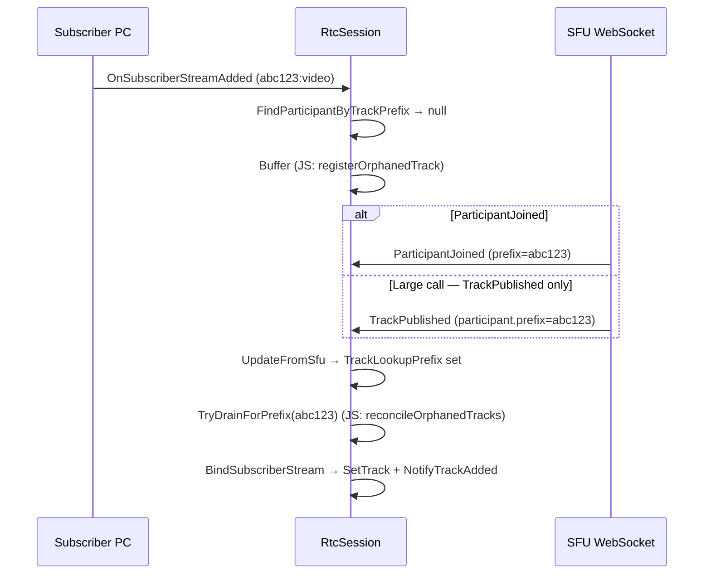

# Spec: `fix/pending-remote-track-buffer`

Branch name suggestion: `fix/pending-remote-track-buffer`  
Rollout plan item: **Branch 5**  
Depends on: nothing (independent of Branches 1–4)  
Primary file: `Packages/StreamVideo/Runtime/Core/LowLevelClient/RtcSession.cs`  
**Parity target:** JS SDK **orphaned tracks** pattern (explicit buffer + reconcile). Swift achieves the same outcome implicitly.

---

## 1. Problem statement

When the subscriber peer receives a remote track, Unity WebRTC fires `PeerConnectionBase.OnTrack` → `StreamAdded` → `RtcSession.OnSubscriberStreamAdded`.

Stream IDs are `{trackPrefix}:{trackTypeKey}` (e.g. `abc123:TRACK_TYPE_VIDEO`). Binding requires:

```csharp
ActiveCall.Participants.SingleOrDefault(p => p.TrackLookupPrefix == trackPrefix)
```

**Race:** WebRTC can deliver the media stream **before** SFU metadata makes the participant matchable by prefix. This happens in two sub-cases:

| Sub-case | State when stream arrives | Typical cause |
|----------|----------------------------|---------------|
| **A — participant missing** | No participant in `ActiveCall.Participants` yet | `ParticipantJoined` not received |
| **B — prefix not hydrated** | Participant exists but `TrackLookupPrefix` is empty/null | Join/coordinator event arrived before SFU prefix; or prefix arrives only in `TrackPublished.participant` (large-call SFU optimization) |

**When it happens:** Primarily a **mid-call / renegotiation race** (track arrives during or right after subscriber offer processing). Initial-join races are less common because mature SDKs hydrate participants before subscriber media can bind — but Unity does not guarantee that ordering today.

**Current Unity behavior** (`RtcSession.cs` ~2277–2283): log a warning and `return`. The stream is never bound; `SetTrack` / `NotifyTrackAdded` never run. No recovery even when the prefix arrives milliseconds later.

**Symptom:** remote video/audio missing with log:

> Failed to find participant with trackPrefix: …

**Unity gap vs sibling SDKs:** Both JS and Swift retain the media and bind later. Unity is the outlier — it drops permanently.

---

## 2. Cross-SDK reference (battle-tested approaches)

Use these as the primary design inspiration. Unity should match **JS semantics** with an explicit buffer; Swift confirms the approach works but uses a different architecture.

### 2.1 JavaScript — explicit **orphaned tracks** (primary parity target)

**Files:**
- `stream-video-js/packages/client/src/rtc/Subscriber.ts` — `handleOnTrack`
- `stream-video-js/packages/client/src/store/CallState.ts` — `orphanedTracks`, `registerOrphanedTrack`, `takeOrphanedTracks`, `removeOrphanedTrack`
- `stream-video-js/packages/client/src/events/participant.ts` — `reconcileOrphanedTracks`

**Flow:**

1. **`onTrack`** parses `primaryStream.id` as `{trackLookupPrefix}:{TRACK_TYPE_*}`.
2. Lookup: `participants.find(p => p.trackLookupPrefix === trackId)`.
3. **Miss:** log warning `"Received track for unknown participant"`, call `registerOrphanedTrack({ id, trackLookupPrefix, track: MediaStream, trackType })`, return.
4. **Hit:** bind immediately via `updateParticipant`.
5. **Reconcile** (drain): `reconcileOrphanedTracks(state, participant)` calls `takeOrphanedTracks(participant.trackLookupPrefix)` and merges streams into the participant patch.

**Drain triggers (all call `reconcileOrphanedTracks`):**

| SFU event | Why |
|-----------|-----|
| `participantJoined` | Participant + prefix arrive |
| `trackPublished` **with `participant` DTO** | Large calls: SFU may skip `participantJoined` and only embed participant info on first publish |
| `trackUnpublished` **with `participant` DTO** | Same large-call path; also refreshes prefix |

**Cleanup:** `removeOrphanedTrack(streamId)` on track `ended` event only. **No TTL, no cap.**

**Other JS details worth noting:**
- Track event listeners (`mute`, `unmute`, `ended`) are attached **before** the orphan check — orphaned tracks still get lifecycle hooks.
- `interruptedTracks` state is deferred until participant exists.
- **Known JS gap:** `updateFromSfuCallState` (join snapshot) does **not** reconcile orphans — orphans are treated mainly as a mid-call race. Unity should still drain after `DoJoin`/`UpdateFromSfu(joinResponse)` to cover join edge cases.

**JS tests:** `Subscriber.test.ts` (orphan registration), `participant.test.ts` (reconcile on join/publish).

### 2.2 Swift — implicit **track storage + lazy re-bind**

**Files:**
- `stream-video-swift/Sources/StreamVideo/WebRTC/v2/WebRTCTrackStorage.swift` — keyed storage by prefix
- `stream-video-swift/Sources/StreamVideo/WebRTC/v2/WebRTCStateAdapter.swift` — `didAddTrack`, `assignTracks`, `track(for:of:)`
- `stream-video-swift/Sources/StreamVideo/WebRTC/v2/SFU/SFUEventAdapter.swift` — prefix updates on `TrackPublished`

**Flow:**

1. **`didAddTrack`** always stores the track in `WebRTCTrackStorage` keyed by stream prefix (`stream.trackId` = part before `:`), then calls `enqueue { assignTracks() }`.
2. **`assignTracks()`** runs on **every** participant mutation and re-attempts binding for all participants.
3. **Lookup:** try `participant.trackLookupPrefix` first, fall back to `participant.sessionId` (tests/mocks only — WebRTC streams use prefix in stream ID).

**No named orphan buffer.** Tracks sit in storage until `assignTracks()` finds a matching prefix on the participant.

**Join ordering mitigation:** `JoinResponse.callState.participants` is loaded **before** `configurePeerConnections()` — reduces initial-join race.

**Prefix hydration:** `TrackPublished` with `hasParticipant` updates `trackLookupPrefix` and triggers `enqueue` → `assignTracks()`.

**Cleanup:** `didRemoveTrack(for:)` on participant leave (by prefix and sessionId). No TTL.

**Swift lesson for Unity:** storing the track and re-binding when metadata arrives is sufficient. Unity needs an explicit buffer because it binds synchronously in `OnSubscriberStreamAdded` rather than maintaining separate track storage.

### 2.3 Parity summary

| Aspect | JS | Swift | Unity (proposed) |
|--------|----|----|------------------|
| Store track on miss | ✅ explicit orphan list | ✅ implicit `WebRTCTrackStorage` | ✅ explicit pending buffer |
| Drain on `participantJoined` | ✅ | ✅ (via `enqueue`) | ✅ |
| Drain on `trackPublished` + participant DTO | ✅ | ✅ (prefix update + `enqueue`) | ✅ **add this** |
| Drain on join response | ❌ (gap) | ✅ (participants before PC) | ✅ (defensive) |
| TTL / cap | ❌ | ❌ | ✅ Unity-only safety net |
| Cleanup on track ended | ✅ | ✅ | ✅ recommended |
| Diagnostic: participants awaiting prefix | ❌ | ❌ | ✅ Unity addition for field triage |

---

## 3. Goal

Hold unmatched subscriber streams in a **small pending buffer** (JS: orphaned tracks) keyed by `trackPrefix`, then **drain** when participant metadata catches up.

Match JS reconcile triggers. Add Unity-specific diagnostic logging and bounded expiry (sibling SDKs rely on track `ended` only — we add TTL/cap as defensive extras, not parity requirements).

**Non-goals:**

- No decode/texture recovery (Branch 4)
- No subscription/renegotiation changes (Branches 1–3)
- No sample-project changes
- No reconciliation self-heal loop (contingency Branch 6)
- No Swift-style separate track storage layer (buffer-in-`RtcSession` is enough)

---

## 4. Success criteria

| # | Criterion |
|---|-----------|
| 1 | Stream arriving before matchable prefix is bound once metadata catches up (JS/Swift parity) |
| 2 | `TrackAdded` / `ParticipantTrackAdded` fires after drain (same as direct bind) |
| 3 | Drain on `ParticipantJoined`, `TrackPublished`/`TrackUnpublished` (when participant DTO present), and join response |
| 4 | Buffer cleared on session cleanup; pending entries removed on participant leave / track ended |
| 5 | Warning log on buffer includes participants with empty/null prefix (Unity diagnostic — not in JS/Swift) |
| 6 | Info log on successful drain batch |
| 7 | Editor tests cover buffer → hydrate → bind, and trackPublished drain (large-call path) |
| 8 | Compiles in Unity editor; no debug scaffolding |

**Optional (Unity-only safety, not blocking parity):**

- Bounded buffer cap + TTL expiry with Warning log

---

## 5. Current Unity code reference

**Entry point:**

```2267:2316:Packages/StreamVideo/Runtime/Core/LowLevelClient/RtcSession.cs
private void OnSubscriberStreamAdded(MediaStream mediaStream)
{
    var idParts = mediaStream.Id.Split(":");
    var trackPrefix = idParts[0];
    var trackTypeKey = idParts[1];
    // ...
    var participant = ActiveCall.Participants.SingleOrDefault(p => p.TrackLookupPrefix == trackPrefix);
    if (participant == null)
    {
        _logs.Warning($"Failed to find participant with trackPrefix: {trackPrefix} ...");
        return;  // ← replace with buffer (JS: registerOrphanedTrack)
    }
    // SetTrack + NotifyTrackAdded
}
```

**Prefix is set here:**

```169:174:Packages/StreamVideo/Runtime/Core/StatefulModels/StreamVideoCallParticipant.cs
void IUpdateableFrom<Participant, StreamVideoCallParticipant>.UpdateFromDto(Participant dto, ICache cache)
{
    // ...
    TrackLookupPrefix = dto.TrackLookupPrefix;
}
```

**Existing pending-buffer precedent in Unity:** `_pendingIceTrickleRequests` — flush on join, clear on session cleanup (similar lifecycle, different domain).

**Time source:** `_timeService.Time` (float, seconds) — reuse for optional TTL.

---

## 6. Proposed design

### 6.1 Data structure

Mirror JS `OrphanedTrack`:

```csharp
private sealed class PendingSubscriberStream
{
    public string StreamId { get; }           // full mediaStream.Id — for dedup & ended cleanup
    public string TrackPrefix { get; }
    public string TrackTypeKey { get; }
    public MediaStream MediaStream { get; }
    public float ReceivedAt { get; }           // Unity-only, for optional TTL
}

private readonly List<PendingSubscriberStream> _pendingSubscriberStreams = new();
```

**Optional Unity-only constants:**

| Constant | Suggested value | Rationale |
|----------|-----------------|-----------|
| `MaxPendingSubscriberStreams` | `32` | JS/Swift have no cap; defensive for Unity |
| `PendingSubscriberStreamTtlSeconds` | `30f` | JS/Swift have no TTL; defensive for Unity |

### 6.2 Refactor bind path

Extract from `OnSubscriberStreamAdded` into focused private methods:

```
OnSubscriberStreamAdded(mediaStream)
  └─ ParseStreamId(mediaStream.Id) → (trackPrefix, trackTypeKey) or log error + return
  └─ TryBindOrBufferSubscriberStream(trackPrefix, trackTypeKey, mediaStream)

TryBindOrBufferSubscriberStream(...)
  └─ participant = FindParticipantByTrackPrefix(trackPrefix)
  └─ if found → BindSubscriberStream(participant, trackTypeKey, mediaStream)
  └─ else → BufferPendingSubscriberStream(...) + diagnostic log   // JS: registerOrphanedTrack

BindSubscriberStream(participant, trackTypeKey, mediaStream)
  └─ TrackTypeExt.TryGetTrackType(...)
  └─ enable audio tracks (existing loop)
  └─ participant.SetTrack(...) + ActiveCall.NotifyTrackAdded(...)
  └─ (existing logic, unchanged semantics)

FindParticipantByTrackPrefix(trackPrefix)
  └─ ActiveCall?.Participants.SingleOrDefault(p => p.TrackLookupPrefix == trackPrefix)
```

Keep `BindSubscriberStream` as the single place that calls `SetTrack` + `NotifyTrackAdded`.

**Do not add Swift-style sessionId fallback** for WebRTC-delivered streams — Unity stream IDs always use SFU prefix, not sessionId.

### 6.3 Buffer on miss (JS: `registerOrphanedTrack`)

Replace the early `return` with:

1. **Validate** `ActiveCall != null` — if null, log Error and drop.
2. **Dedup by `StreamId`:** if already buffered, skip (log `WarningIfDebug`).
3. **Optional cap:** if at max, remove oldest, log Warning.
4. **Add** entry with `ReceivedAt = _timeService.Time`.
5. **Diagnostic log** (Warning, once per buffered stream — Unity addition):

```
Buffered subscriber stream {streamId}: no participant for trackPrefix={trackPrefix}.
{awaitingCount} participant(s) awaiting TrackLookupPrefix: [{sessionId}, ...]
```

Build awaiting list from participants with empty/null prefix (remote only). If `awaitingCount == 0`, state explicitly — likely sub-case A (participant not joined) or wrong prefix, not sub-case B.

Log message should align with JS intent: `"Received track for unknown participant"` plus Unity's extra prefix-awaiting detail.

### 6.4 Drain triggers (JS: `reconcileOrphanedTracks`)

Call `TryDrainPendingSubscriberStreamsForPrefix(trackLookupPrefix)` after any event that may set or confirm `TrackLookupPrefix`.

| Hook location | SFU event | JS equivalent | Priority |
|---------------|-----------|---------------|----------|
| `OnSfuParticipantJoined` | after `ActiveCall.UpdateFromSfu(...)` | `watchParticipantJoined` | **Required** |
| `OnSfuTrackPublished` | after participant DTO applied (when `trackPublished.Participant != null`) | `watchTrackPublished` | **Required** — large calls |
| `OnSfuTrackUnpublished` | after participant DTO applied (when present) | `watchTrackUnpublished` | Recommended |
| `OnSfuWebSocketOnParticipantUpdated` | after `_cache.TryCreateOrUpdate(...)` | (no direct equivalent) | Recommended |
| `DoJoin` | after `ActiveCall.UpdateFromSfu(joinResponse)` | (JS gap — Unity should do this) | Recommended |
| `OnSfuHealthCheck` | after `ActiveCall.UpdateFromSfu(...)` if participants updated | (none) | Low cost |

**Drain algorithm (JS: `takeOrphanedTracks` + bind):**

```
TryDrainPendingSubscriberStreamsForPrefix(trackLookupPrefix)
  if ActiveCall == null or string.IsNullOrEmpty(trackLookupPrefix) or buffer empty → return

  pending = all buffer entries where TrackPrefix == trackLookupPrefix
  if pending empty → return

  participant = FindParticipantByTrackPrefix(trackLookupPrefix)
  if participant == null → return   // prefix set on DTO but participant not in ActiveCall yet — retry on next event

  boundCount = 0
  for each entry in pending:
    if BindSubscriberStream(participant, entry.TrackTypeKey, entry.MediaStream):
      remove entry from buffer
      boundCount++

  if boundCount > 0:
    log Info: "Bound {boundCount} pending subscriber stream(s) for trackPrefix={trackLookupPrefix}, sessionId={sessionId}"
```

Also provide `TryDrainAllPendingSubscriberStreams()` for join response (scan all prefixes in buffer).

After `TrackPublished`/`TrackUnpublished` in Unity, participant prefix may be updated via embedded DTO — mirror existing `UpdateFromSfu(participantSfuDto)` paths in those handlers, then drain with the new prefix.

### 6.5 Expiry (Unity-only — JS/Swift do not have this)

Run in `RtcSession.Update()` when buffer non-empty:

```
ExpirePendingSubscriberStreams()
  remove entries older than PendingSubscriberStreamTtlSeconds
  log Warning per expired entry
```

Optional. Sibling SDKs rely on track `ended` only. Keep as safety net, not parity requirement.

### 6.6 Cleanup

| Event | Action | JS equivalent |
|-------|--------|---------------|
| `ClearSessionAsync()` | `_pendingSubscriberStreams.Clear()` | session teardown |
| `OnSfuParticipantLeft` | remove entries matching leaving participant's prefix | implicit |
| Track removed / stream ended | remove matching `StreamId` from buffer | `removeOrphanedTrack` on `ended` |

If Unity WebRTC exposes track/stream ended events on buffered streams, subscribe when buffering (JS attaches listeners before orphan check). If not feasible, TTL covers the gap.

---

## 7. Logging spec

| Event | Level | JS has? | Message intent |
|-------|-------|---------|----------------|
| Buffered | `Warning` | ✅ (generic) | unknown participant + Unity: list awaiting-prefix sessionIds |
| Drained | `Info` | ❌ | N streams bound for prefix |
| Expired | `Warning` | ❌ | Unity-only TTL |
| Cap overflow | `Warning` | ❌ | Unity-only |
| Malformed stream ID | `Error` | ✅ | drop |
| ActiveCall null | `Error` | n/a | drop |

**Field triage (Unity addition):**

- Missing video + "awaiting TrackLookupPrefix: [sessionId]" → sub-case B race; buffer should recover
- Missing video + "awaiting …: 0" → sub-case A or wrong prefix
- "Dropped pending … after 30s" → SFU never sent prefix (investigate upstream)

---

## 8. Edge cases

| Case | Behavior | JS/Swift |
|------|----------|----------|
| Stream arrives, prefix already set | Direct bind | Same |
| Stream arrives, participant exists, prefix empty | Buffer (sub-case B) | JS: orphan; Swift: stored, nil on participant until assign |
| Stream arrives, no participants | Buffer; awaitingCount=0 (sub-case A) | JS: orphan |
| Duplicate same StreamId | Skip dedup | JS: append (harmless if takeOrphanedTracks clears all) |
| Large call: no ParticipantJoined, TrackPublished has participant | Drain on TrackPublished | JS: explicit |
| Multiple streams same prefix (audio + video) | Buffer each; drain binds all | Same |
| Participant leaves while buffered | Remove by prefix | Swift: didRemoveTrack |
| Session ends | Clear buffer | Same |
| Invalid trackTypeKey at drain | Log Error, remove entry | JS: skip unknown type at onTrack |
| BindSubscriberStream throws | Log Exception, remove entry | n/a |

**Stream ID parsing:** keep existing `Split(":")` — same as JS/Swift.

---

## 9. Test plan

**File:** `Packages/StreamVideo/Tests/Editor/PendingRemoteTrackBufferTests.cs`  
Follow `Packages/StreamVideo/.agents/skills/write-test/SKILL.md`.

Mirror JS test scenarios from `Subscriber.test.ts` and `participant.test.ts`.

**Required tests:**

| Test name | Scenario | JS equivalent |
|-----------|----------|---------------|
| `When_stream_arrives_before_prefix_set_expect_buffered` | Participant in call, empty prefix → buffer, no bind | orphan registration |
| `When_participant_joined_expect_pending_stream_bound` | Buffer → `ParticipantJoined` with prefix → bind | participant.test join reconcile |
| `When_track_published_with_participant_dto_expect_pending_stream_bound` | Buffer → `TrackPublished` with embedded participant (no prior join) → bind | large-call path |
| `When_participant_already_has_prefix_expect_immediate_bind` | Prefix set → direct bind, empty buffer | happy path |

**Optional tests:**

- `When_prefix_never_arrives_expect_expired_after_ttl` (Unity-only)
- `When_buffer_full_expect_oldest_dropped` (Unity-only)
- `When_participant_leaves_expect_pending_removed`

**Harness:** same pattern as `PublishGatedVideoSubscriptionTests.cs` — test subclass with virtual `BindSubscriberStream` returning `bool`, controllable `ITimeService`, reflection to invoke SFU handlers.

---

## 10. Implementation checklist

### Code

- [ ] Add `PendingSubscriberStream` + buffer list
- [ ] Refactor `OnSubscriberStreamAdded` → parse / bind / buffer
- [ ] Implement `BufferPendingSubscriberStream` with JS-aligned + diagnostic log
- [ ] Implement `TryDrainPendingSubscriberStreamsForPrefix` + `TryDrainAllPendingSubscriberStreams`
- [ ] Hook drain: `OnSfuParticipantJoined`, **`OnSfuTrackPublished`**, **`OnSfuTrackUnpublished`**, `ParticipantUpdated`, `DoJoin`
- [ ] Optional: expiry in `Update()`, cap enforcement
- [ ] Clear buffer in `ClearSessionAsync()`; cleanup on participant left
- [ ] Optional: remove from buffer on track/stream ended

### Tests

- [ ] `PendingRemoteTrackBufferTests.cs` — minimum 4 scenarios above
- [ ] `.meta` file

### Quality

- [ ] Unity editor compiles
- [ ] `ReadLints` clean
- [ ] Existing editor tests green

---

## 11. PR description template

**Title:** Fix pending remote track buffer when TrackLookupPrefix not yet known

**Summary:**

- Parity with JS orphaned-tracks pattern: buffer unmatched subscriber streams, reconcile on `ParticipantJoined` and `TrackPublished`
- Fixes permanent track loss when WebRTC delivers media before SFU participant metadata
- Adds diagnostic logging (participants awaiting prefix) for field triage

**Test plan:**

- [ ] New editor tests pass (including large-call TrackPublished path)
- [ ] Manual smoke: join call with remote publisher

---

## 12. Sequence diagram



---

## 13. Files to touch

| File | Change |
|------|--------|
| `Runtime/Core/LowLevelClient/RtcSession.cs` | Main implementation |
| `Tests/Editor/PendingRemoteTrackBufferTests.cs` | New tests |
| `Tests/Editor/PendingRemoteTrackBufferTests.cs.meta` | Unity meta |

**Do not touch:** sample project, `LateVideoDiagnostics`, `StreamVideoTrack`, native plugin.

---

## 14. Suggested implementation order

1. Refactor bind logic (no behavior change)
2. Add buffer-on-miss (JS `registerOrphanedTrack` equivalent) + diagnostic log
3. Add drain on `ParticipantJoined` + **`TrackPublished`/`TrackUnpublished`**
4. Add drain on join response + `ParticipantUpdated`
5. Add cleanup (session clear, participant left, optional ended/TTL)
6. Write tests mirroring JS scenarios
7. Editor compile + test run

---

## 15. Resolved / open questions

**Resolved by SDK review:**

1. **Primary pattern:** JS explicit orphan buffer — not Swift's separate track storage layer.
2. **`TrackPublished` drain is required** — not optional. SFU skips `ParticipantJoined` in large calls (JS comment in `watchTrackPublished`).
3. **Dedup:** by full `StreamId` (JS uses `id: primaryStream.id` for removal).
4. **SessionId fallback:** not needed for Unity WebRTC streams (Swift has it for tests only).
5. **TTL/cap:** Unity-only safety; JS/Swift don't have it. Keep but don't block parity on it.

**Still verify during implementation:**

1. After `OnSfuWebSocketOnParticipantUpdated`, is the updated participant reachable via `ActiveCall.Participants`? If not, resolve from `_cache.CallParticipants` before draining.
2. Can Unity subscribe to `MediaStream`/track ended while buffered? If yes, mirror JS cleanup; if no, rely on TTL.
3. Log level for drain: `Info` (JS doesn't log reconcile at all).
