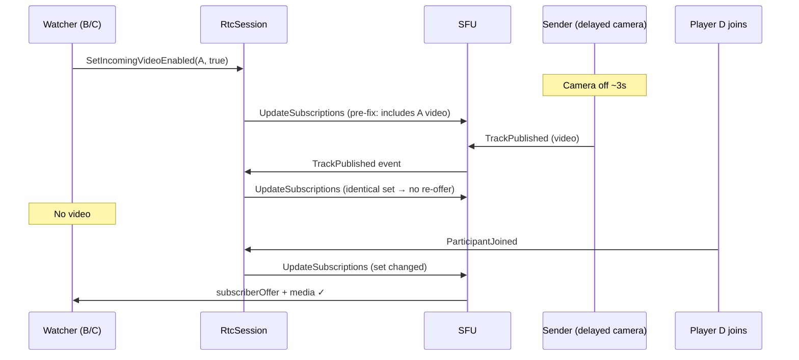

# Unity Video SDK — Next Release Task Specification

**Created:** 2026-07-14  
**Author context:** Internal engineering spec for upcoming Unity SDK releases  
**Primary customer driver:** Martin Mussin — delayed video publish race (first 2–3 participants see only local camera until another joins)  
**Goal:** Each task below is self-contained enough to implement in a separate chat/session without losing critical context.

---

## Table of contents

1. [Background & customer issue](#1-background--customer-issue)
2. [Architecture overview](#2-architecture-overview)
3. [What was already fixed (Jul 7–14, 2026)](#3-what-was-already-fixed-jul-714-2026)
4. [Task index](#4-task-index)
5. [Epic 1 — Martin fix validation & hardening (P0)](#epic-1--martin-fix-validation--hardening-p0)
6. [Epic 2 — Reconnect & session recovery (P1)](#epic-2--reconnect--session-recovery-p1)
7. [Epic 3 — Track lifecycle completeness (P1)](#epic-3--track-lifecycle-completeness-p1)
8. [Epic 4 — Subscription manager refactor & API parity (P2)](#epic-4--subscription-manager-refactor--api-parity-p2)
9. [Epic 5 — RPC resilience (P1)](#epic-5--rpc-resilience-p1)
10. [Epic 6 — Mobile platform hardening (P1–P2)](#epic-6--mobile-platform-hardening-p1p2)
11. [Epic 7 — Observability & customer support (P2)](#epic-7--observability--customer-support-p2)
12. [Epic 8 — Test infrastructure (P0–P1)](#epic-8--test-infrastructure-p0p1)
13. [Release sequencing recommendation](#13-release-sequencing-recommendation)
14. [Key file reference map](#14-key-file-reference-map)
15. [Cross-SDK reference map](#15-cross-sdk-reference-map)

---

## 1. Background & customer issue

### 1.1 Customer report (Martin Mussin)

**Symptom:** After upgrading to newer Unity SDK versions (post reconnection/networking improvements), the first 2–3 players in a call only see their own local cameras. Remote video does not appear until an additional player joins — then everyone suddenly receives all streams.

**Customer setup (critical detail):**
- Integration closely follows the Sample project.
- `SetIncomingVideoEnabled(true)` + `SetIncomingAudioEnabled(true)` called in:
  - `CallStarted` handler — for all participants already in call
  - `ParticipantJoined` handler — for each newcomer
- **Key difference from Sample:** Customer enables local video publisher **only after** `JoinCallAsync` finishes and camera warms up (~3 second wait), then calls `VideoDeviceManager.SetEnabled(true)`. This was added to fix a "white camera" bug where the sender track was built from a cold 16×16 placeholder frame.
- Audio is enabled immediately → audio always worked.
- Game auto-starts camera via `FirstOrDefault` — players have no manual camera controls.

**Customer hypothesis (validated):** When player A joins, B and C call `SetIncomingVideoEnabled(true)` for A — but A's video track isn't published yet. Early subscriptions deliver no frames. Subscription is not re-evaluated once the track is published later. A new join (or reconnection) forces re-sync and fixes everyone.

### 1.2 Why Sample project did not reproduce

| Factor | Sample behavior | Customer behavior |
|--------|----------------|-------------------|
| Camera enable | User manually picks device and enables camera | Game auto-enables after ~3s warm-up |
| Publish timing | Camera often publishing before remotes subscribe | Remotes subscribe before sender publishes |
| Platform mix | Editor testing, manual flow | iOS (primary), Android, Windows/macOS Editor |
| Race window | Narrow (lucky timing) | Wide (deterministic inversion) |

Daniel's partial repro: Mac user joins → Android joins → Mac enables video → Android doesn't receive until 3rd user joins. Similar symptom, possibly overlapping but not identical root cause on all platforms.

### 1.3 Three independent failure modes (same symptom)

All three produce "no remote video until another participant joins":



| Bug ID | Description | Why "another join" fixed it |
|--------|-------------|------------------------------|
| **A** | Premature video in first `UpdateSubscriptions` RPC | New join changes global subscription set → SFU re-negotiates |
| **B** | Subscription intent lost during in-flight RPC | New join re-queues subscription request |
| **C** | WebRTC `OnTrack` before `TrackLookupPrefix` hydrated | New join/renegotiation re-delivers media with prefix now known |

---

## 2. Architecture overview

### 2.1 Layer split

```
SFU WebSocket events (ParticipantJoined, TrackPublished, SubscriberOffer, ICE restart)
        ↓
RtcSession.cs — subscription state, pending buffer, reconnect, SFU RPC
        ↓
PublisherPeerConnection / SubscriberPeerConnection (C#)
        ↓
io.stream.unity.webrtc (vendored C# wrapper)
        ↓
WebRTCPlugin (native C++) — libwebrtc + Unity graphics/audio
```

**Important:** The native plugin (`com.unity.webrtc22222222/Plugin~/`) does **not** implement subscribe/publish semantics. All subscription logic is in `RtcSession.cs`. Native layer handles transport + media I/O only.

### 2.2 Incoming video subscription flow (Unity)

```
SetIncomingVideoEnabled(true)
  → RtcSession.UpdateIncomingVideoRequested(sessionId, true)
  → _incomingVideoRequestedByParticipantSessionId[sessionId] = true
  → QueueTracksSubscriptionRequest()  // bumps _trackSubscriptionGeneration

RtcSession.Update() each frame
  → TryExecuteSubscribeToTracks()  // 100ms debounce
  → SubscribeToTracksAsync()
  → GetDesiredTracksDetails()
  → SendUpdateSubscriptionsAsync()  // SFU RPC

SFU responds with SubscriberOffer
  → NegotiateSubscriberOfferAsync() (serialized via _subscriberNegotiationLock)
  → OnTrack → StreamAdded → OnSubscriberStreamAdded
  → Bind by stream ID "{trackPrefix}:{TRACK_TYPE_*}" or buffer in _pendingTracks
  → participant.SetTrack() → TrackAdded event
```

### 2.3 Video subscription gating (post UNI-184)

```csharp
// RtcSession.cs ~1377-1386
private bool ShouldSubscribeToVideoTrack(IStreamVideoCallParticipant participant)
    => _incomingVideoRequestedByParticipantSessionId.GetValueOrDefault(participant.SessionId, false)
       && IsParticipantPublishingTrack(participant, TrackType.Video);
```

Video requires **both** local opt-in AND remote `PublishedTracks` contains video. Audio only requires opt-in.

### 2.4 Auto-subscription on join

```csharp
// RtcSession.cs ~882-896
public void NotifyParticipantJoined(string participantSessionId)
{
    var participantCount = ActiveCall.Participants?.Count ?? 0;
    var requestVideo = participantCount <= MaxParticipantsForVideoAutoSubscription; // = 5
    var requestAudio = true;
    _incomingVideoRequestedByParticipantSessionId.TryAdd(participantSessionId, requestVideo);
    _incomingAudioRequestedByParticipantSessionId.TryAdd(participantSessionId, requestAudio);
    // NOTE: does NOT call QueueTracksSubscriptionRequest()
}
```

---

## 3. What was already fixed (Jul 7–14, 2026)

| PR | Ticket | Commit | Fix summary | Tests |
|----|--------|--------|-------------|-------|
| #219 | UNI-183 | `f7ff2b0` | Generation counter for `_trackSubscriptionRequested` — changes during in-flight RPC no longer drop follow-up | `TrackSubscriptionRequestRaceTests.cs` |
| #221 | UNI-184 | `9a80b2d` | Publish-gated video; `AddPublishedTrack`/`RemovePublishedTrack` on SFU events; always re-queue on publish/unpublish | `PublishGatedVideoSubscriptionTests.cs` |
| #222 | UNI-185 | `0271b0a` | `_subscriberNegotiationLock` — serialize subscriber SDP; ICE restart for subscriber (was ignored) | `SubscriberOfferNegotiationTests.cs` |
| #223 | UNI-186 | `13ffbf6`, `25bfd2f` | `_pendingTracks` buffer + drain; `EnsureParticipantFromSfuDto` for large-call path | `PendingRemoteTrackBufferTests.cs` |

**Detailed spec for UNI-186:** `.agents/notes/pending-remote-track-buffer-spec.md`

**Assessment:** These fixes directly target Martin's three failure modes. **Not yet proven on iOS device matrix.** Residual risks documented in tasks below.

---

## 4. Task index

| ID | Title | Epic | Priority | Status |
|----|-------|------|----------|--------|
| 1.1 | Queue subscription on `NotifyParticipantJoined` | 1 | P0 | Not started |
| 1.2 | Martin-scenario integration test | 1 | P0 | Not started |
| 1.3 | Device test matrix | 1 | P0 | Not started |
| 1.4 | Re-queue on `UpdateSubscriptions` RPC error | 1 | P0 | Not started |
| 1.5 | Handle `TrackPublished` when participant null | 1 | P0 | Not started |
| 1.6 | Health-check subscription self-heal | 1 | P0 | Not started |
| 1.7 | Release notes for delayed-publish pattern | 1 | P0 | Not started |
| 2.1 | FAST reconnect subscription restore | 2 | P1 | Not started |
| 2.2 | SFU migration implementation | 2 | P1 | Not started |
| 2.3 | Network change / WS close reconnect triggers | 2 | P1 | Not started |
| 2.4 | Subscriber offer retry with backoff | 2 | P1 | Not started |
| 2.5 | Reconnect E2E tests | 2 | P1 | Not started |
| 2.6 | Validate reconnect join payload subscriptions | 2 | P1 | Not started |
| 3.1 | `TrackRemoved` / unpublish event for UI | 3 | P1 | Not started |
| 3.2 | Wire `OnRemoveTrack` → unbind participant track | 3 | P1 | Not started |
| 3.3 | Pending buffer TTL, cap, ended cleanup | 3 | P1 | Not started |
| 3.4 | Lifecycle listeners on buffered tracks | 3 | P1 | Not started |
| 3.5 | Unpublish → resubscribe → republish test | 3 | P1 | Not started |
| 4.1 | Extract `TrackSubscriptionManager` | 4 | P2 | Not started |
| 4.2 | Subscription payload dedup | 4 | P2 | Not started |
| 4.3 | Call-level incoming video API | 4 | P2 | Not started |
| 4.4 | Visibility-gated subscriptions (dynascale) | 4 | P2 | Not started |
| 4.5 | Bandwidth throttle (>2 video subs) | 4 | P2 | Not started |
| 4.6 | Screenshare subscriptions | 4 | P2 | Not started |
| 4.7 | Observable override state for UI | 4 | P2 | Not started |
| 5.1 | RPC retry decorator | 5 | P1 | Not started |
| 5.2 | 30-retry cap with generation invalidation | 5 | P1 | Not started |
| 5.3 | Implement `UpdateMuteStates` + `RestartIce` APIs | 5 | P1 | Not started |
| 5.4 | Serialize / order publisher mute-state updates | 5 | P2 | Not started |
| 6.1 | iOS delayed-auto-camera E2E validation | 6 | P1 | Not started |
| 6.2 | iOS native decode path (`kNative`) | 6 | P2 | Not started |
| 6.3 | Android `EglBase$Context` for codec factory | 6 | P2 | Not started |
| 6.4 | Native `StopMediaStreamTrack` implementation | 6 | P2 | Not started |
| 6.5 | Native `OnRemoveTrack` ref cleanup | 6 | P2 | Not started |
| 6.6 | Document camera warm-up best practices | 6 | P1 | Not started |
| 7.1 | Subscription state diagnostics | 7 | P2 | Not started |
| 7.2 | SFU trace export helper | 7 | P2 | Not started |
| 7.3 | Actionable log for early `SetIncomingVideoEnabled` | 7 | P2 | Not started |
| 7.4 | Sample: delayed auto-camera mode | 7 | P2 | Not started |
| 8.1 | Combined race-fix simulation test | 8 | P0 | Not started |
| 8.2 | FAST reconnect subscription test | 8 | P1 | Not started |
| 8.3 | CI device farm / manual checklist | 8 | P0 | Not started |
| 8.4 | Pending buffer optional tests (TTL, cap, leave) | 8 | P1 | Not started |

---

## Epic 1 — Martin fix validation & hardening (P0)

> **Release goal:** Ship hotfix to Martin with belt-and-suspenders safety nets. Prove fix on iOS-first device matrix.

---

### Task 1.1 — Queue subscription on `NotifyParticipantJoined`

**Priority:** P0  
**Status:** Not started  
**Primary file:** `Runtime/Core/LowLevelClient/RtcSession.cs` (~line 883)

#### Problem

`NotifyParticipantJoined` sets incoming video/audio intent flags but does **not** call `QueueTracksSubscriptionRequest()`. Subscription RPC depends on a separate SFU `ParticipantJoined` WebSocket event or `DoJoin` flow to trigger `QueueTracksSubscriptionRequest()`.

#### Scenario it fixes

- Coordinator-side participant add (via `StreamCall.OnSessionParticipantAdded`) happens **before** SFU `ParticipantJoined` event arrives.
- On mobile, event ordering may differ from Editor — participant is known locally but no subscription RPC is sent until unrelated event.
- Customer calls `SetIncomingVideoEnabled` in `ParticipantJoined` handler; if that handler fires from coordinator before SFU event, subscription intent is stored but RPC may be delayed or never sent if no subsequent SFU event occurs.

#### Current Unity behavior

```csharp
public void NotifyParticipantJoined(string participantSessionId)
{
    // ... sets TryAdd on intent dictionaries only
    // NO QueueTracksSubscriptionRequest()
}
```

Called from:
- `StreamCall.OnSessionParticipantAdded`
- `DoJoin` for existing remotes

#### Proposed fix

Add `QueueTracksSubscriptionRequest()` at end of `NotifyParticipantJoined`:

```csharp
_incomingVideoRequestedByParticipantSessionId.TryAdd(participantSessionId, requestVideo);
_incomingAudioRequestedByParticipantSessionId.TryAdd(participantSessionId, requestAudio);
QueueTracksSubscriptionRequest();
```

#### Why we believe this is needed

Defensive fix — ensures subscription intent always triggers RPC regardless of SFU event ordering. Low risk (debounce + generation counter prevent storms). Other SDKs always recompute subscriptions on any participant change.

#### Reference SDK behavior

| SDK | Behavior | File |
|-----|----------|------|
| **JS** | `participantJoined` handler calls `reconcileOrphanedTracks` then state update; `TrackSubscriptionManager` reactively applies | `stream-video-js/packages/client/src/events/participant.ts` |
| **Android** | `ParticipantJoined` → immediate `setVideoSubscriptions()` | `RtcSession.kt` participant event handlers |
| **Swift** | `SFUEventAdapter` updates participant storage → `WebRTCUpdateSubscriptionsAdapter` reactively pushes | `WebRTCUpdateSubscriptionsAdapter.swift` |

None of the mature SDKs rely on a single event source to trigger subscription — they react to any participant state change.

#### Tests

- Editor test: call `NotifyParticipantJoined` → assert `UpdateSubscriptions` RPC sent (mock SFU).
- Verify no duplicate RPC storm when both `NotifyParticipantJoined` and `OnSfuParticipantJoined` fire.

#### Acceptance criteria

- [ ] `NotifyParticipantJoined` triggers debounced subscription request
- [ ] No regression in existing `TrackSubscriptionRequestRaceTests`
- [ ] Publish-gated logic still prevents premature video in RPC payload

#### Dependencies

None — independent change.

---

### Task 1.2 — Martin-scenario integration test

**Priority:** P0  
**Status:** Not started  
**Test file:** `Tests/Editor/MartinDelayedPublishScenarioTests.cs` (new)

#### Problem

Existing unit tests cover individual fixes (publish-gate, generation counter, pending buffer) in isolation. No test simulates the full customer scenario: subscribe before publish, then publish, then assert video subscription without a 4th join.

#### Scenario it validates

1. Players A, B, C join call.
2. B and C call `SetIncomingVideoEnabled(true)` for A immediately.
3. A has **not** published video yet (only audio).
4. First `UpdateSubscriptions` from B/C must **not** include A's video track.
5. A publishes video (`TrackPublished` event).
6. Second `UpdateSubscriptions` **must** include A's video track.
7. SFU sends `SubscriberOffer` → stream arrives → bound to A's participant.
8. **No 4th participant join** required.

#### Proposed test design

Follow `PublishGatedVideoSubscriptionTests.cs` harness pattern:
- Test subclass of `RtcSession` with mock SFU HTTP client.
- Controllable `ITimeService` for debounce.
- Invoke SFU event handlers via reflection.
- Assert RPC payloads at each step.
- Optionally mock `BindSubscriberStream` returning true.

Test cases:

| Test name | Validates |
|-----------|-----------|
| `When_subscribe_before_publish_expect_video_only_after_track_published` | Bug A fix |
| `When_subscribe_during_in_flight_rpc_expect_follow_up_after_publish` | Bug B fix |
| `When_stream_before_prefix_expect_bind_after_track_published` | Bug C fix |
| `When_all_three_races_combined_expect_video_without_fourth_join` | Full Martin scenario |

#### Reference SDK tests

| SDK | Equivalent test | File |
|-----|----------------|------|
| **JS** | `participant.test.ts` — reconcile on publish after orphan | `events/__tests__/participant.test.ts` |
| **JS** | `Subscriber.test.ts` — orphan registration | `rtc/__tests__/Subscriber.test.ts` |
| **Android** | `RtcSessionTest2.kt` — subscription after publish | `RtcSessionTest2.kt` |

#### Acceptance criteria

- [ ] Combined scenario test passes without 4th join
- [ ] Each individual bug regression covered
- [ ] Test follows `.agents/skills/write-test/SKILL.md` conventions

---

### Task 1.3 — Device test matrix

**Priority:** P0  
**Status:** Not started  
**Type:** Manual QA protocol (no code change required, but blocks release)

#### Problem

All fixes are covered by Editor unit tests only. Martin's issue manifests on **iOS (primary)**, Android, Windows/macOS Editor. Daniel could only repro reliably with Mac as first user. Platform-specific timing (camera init, WebRTC signaling thread) may expose remaining races.

#### Test matrix (minimum)

| Config | Devices | Steps |
|--------|---------|-------|
| **A — iOS primary** | 3× iOS (iPhone/iPad) | Join lobby, auto-enable camera after 3s delay |
| **B — Mixed** | iOS + Android + Win Editor | Same delayed-camera setup |
| **C — Daniel repro** | macOS Editor + Android | Mac joins first, Android second, Mac enables video after 3s |
| **D — Customer original** | Win Editor + macOS Editor + iPad + iPhone + Xiaomi | Full original matrix |

#### Per-test procedure

1. All participants join same call ID.
2. Each participant uses delayed video publish (3s after join) — match Martin's setup.
3. Each watcher calls `SetIncomingVideoEnabled(true)` on join (CallStarted + ParticipantJoined).
4. Verify remote video appears for all within 10s **without** a 4th participant.
5. Record: call ID, org ID, device model, OS version, Unity version, SDK version.
6. Collect SFU trace logs on failure.

#### What to capture on failure

- `RtcSession` logs: `UpdateSubscriptions` payloads, `TrackPublished` events, pending buffer assign logs.
- Whether 4th join "fixes" it (indicates residual Bug A/B / missing self-heal).
- Whether audio works but video doesn't (isolates to video subscription path).

#### Acceptance criteria

- [ ] Config A passes on 3 consecutive runs
- [ ] Config B passes
- [ ] No regression vs pre-fix behavior on immediate-camera-enable setup
- [ ] Failure logs captured and triaged for any remaining tasks

---

### Task 1.4 — Re-queue on `UpdateSubscriptions` RPC error

**Priority:** P0  
**Status:** Not started  
**Primary file:** `Runtime/Core/LowLevelClient/RtcSession.cs` (~line 1290)

#### Problem

When `SubscribeToTracksAsync` receives an error response from SFU, it logs and returns **without** re-queuing `_trackSubscriptionRequested`:

```csharp
if (response?.Error != null)
{
    _logs.Error(response.Error.Message);
    return;  // subscription intent lost until next unrelated event
}
```

#### Scenario it fixes

- Transient SFU error during `UpdateSubscriptions` (network blip, SFU busy, rate limit).
- Customer's early subscription attempt fails silently.
- Video never recovers unless another participant joins (triggers new `QueueTracksSubscriptionRequest`).

#### Proposed fix

On error response, keep `_trackSubscriptionRequested = true` (do not clear at line 1298). Optionally add explicit re-queue:

```csharp
if (response?.Error != null)
{
    _logs.Error(response.Error.Message);
    QueueTracksSubscriptionRequest(); // ensure retry on next debounce tick
    return;
}
```

Consider exponential backoff for repeated failures (see Task 5.1).

#### Reference SDK behavior

| SDK | Behavior | File |
|-----|----------|------|
| **JS** | Debounced coalescing; failed apply logs and retries on next state change | `TrackSubscriptionManager.ts` |
| **Android** | Retry decorator on signaling RPCs; 30-retry cap for mute state | `RtcSession.kt` — `StreamTodo: implement retry strategy` mirror |
| **Swift** | Task cancellation aware; reactive adapter re-pushes on participant changes | `WebRTCUpdateSubscriptionsAdapter.swift` |

#### Tests

- Extend `TrackSubscriptionRequestRaceTests`: RPC returns error → assert follow-up RPC on next tick.
- Verify generation counter still works correctly after error retry.

#### Acceptance criteria

- [ ] SFU error does not permanently drop subscription intent
- [ ] Debounce prevents error retry storm
- [ ] Success after error recovery works

---

### Task 1.5 — Handle `TrackPublished` when participant is null

**Priority:** P0  
**Status:** Not started  
**Primary file:** `Runtime/Core/LowLevelClient/RtcSession.cs` (~line 1744)

#### Problem

`UpdateParticipantTracksState` early-returns when participant not found in `ActiveCall.Participants`:

```csharp
participant = ActiveCall.Participants.FirstOrDefault(p => p.SessionId == sessionId);
if (participant == null)
{
    // Valid case per comment — TrackPublished before participant wired
    return;
}
```

`OnSfuTrackPublished` then cannot call `AddPublishedTrack` or drain pending tracks for that participant. `EnsureParticipantFromSfuDto` only helps when SFU embeds participant DTO — not when `TrackPublished` arrives with sessionId only and no DTO.

#### Scenario it fixes

- SFU sends `TrackPublished` for sessionId X before `ParticipantJoined` for X.
- Without embedded DTO, Unity skips publish state update.
- Even after participant later joins, `IsPublishingTrack(Video)` may be false → publish-gated subscription never includes video.

#### Proposed fix

**Option A (preferred):** In `OnSfuTrackPublished`, if participant is null and no DTO, store pending publish state:

```csharp
// New: _pendingPublishedTracks[sessionId] |= trackType
```

Drain when participant materializes (in `OnSfuParticipantJoined`, `EnsureParticipantFromSfuDto`, `DoJoin`).

**Option B:** Always require SFU DTO on `TrackPublished` — not viable, DTO is optional per proto comments.

#### Reference SDK behavior

| SDK | Behavior | File |
|-----|----------|------|
| **JS** | `trackPublished` with embedded `participant` DTO creates/updates participant; state patch includes `publishedTracks` | `events/participant.ts` — `watchTrackPublished` |
| **Android** | `updatePublishState` on track events; orphaned track reconciliation | `RtcSession.kt` lines 1562–1638 |
| **Swift** | `handleTrackPublished` in `SFUEventAdapter` updates flags even if participant storage is being built | `SFUEventAdapter.swift` |

#### Tests

- `TrackPublished` with no participant, no DTO → pending state stored.
- `ParticipantJoined` for same sessionId → `IsPublishingTrack(Video)` true → video in next RPC.
- `TrackPublished` with DTO → existing `EnsureParticipantFromSfuDto` path still works.

#### Acceptance criteria

- [ ] Publish state not lost when event ordering is TrackPublished → ParticipantJoined
- [ ] No duplicate publish state on normal ordering
- [ ] Publish-gated subscription includes video after participant materializes

---

### Task 1.6 — Health-check subscription self-heal

**Priority:** P0  
**Status:** Not started  
**Primary file:** `Runtime/Core/LowLevelClient/RtcSession.cs` (~line 2047 `OnSfuHealthCheck`)

#### Problem

If all race-condition mitigations fail, there is no periodic reconciliation. The only recovery mechanism is an unrelated event (new participant join, manual reconnect). Martin's "4th join fixes everyone" is this failure mode.

#### Scenario it fixes

- Participant A is publishing video (SFU state correct).
- B has `_incomingVideoRequested = true` for A.
- B's `UpdateSubscriptions` was sent but SFU never re-offered (stale state).
- B has no bound video track for A.
- No new participants join.
- **Currently:** stuck forever.
- **With self-heal:** health check detects mismatch → re-queues subscription.

#### Proposed fix

In `OnSfuHealthCheck` or `Update()` (throttled, e.g. every 5s), detect mismatches:

```csharp
foreach (var remote in ActiveCall.Participants.Where(p => !p.IsLocalParticipant))
{
    bool wantsVideo = _incomingVideoRequestedByParticipantSessionId.GetValueOrDefault(remote.SessionId);
    bool peerPublishing = remote.IsPublishingTrack(TrackType.Video);
    bool hasBoundTrack = remote.TryGetTrack(TrackType.Video, out var track) && track != null;

    if (wantsVideo && peerPublishing && !hasBoundTrack)
    {
        _logs.Warning($"Self-heal: missing video track for {remote.SessionId}, re-queuing subscription");
        QueueTracksSubscriptionRequest();
        break; // one re-queue per cycle
    }
}
```

#### Reference SDK behavior

| SDK | Behavior |
|-----|----------|
| **JS** | No explicit health-check loop; relies on event-driven re-apply + UI re-bind. Known gap. |
| **Android** | Event-driven + reconnect restore; no periodic heal documented |
| **Swift** | Reactive adapter re-pushes on any participant storage change |

Unity-only safety net — JS doesn't have this, but Unity's monolithic `RtcSession` lacks Swift's reactive pipeline. This is a pragmatic belt-and-suspenders for game engines with unusual timing.

#### Tests

- Simulate: wants video + publishing + no bound track → assert `QueueTracksSubscriptionRequest` called.
- Throttle: only one re-queue per 5s.
- No false positive when track is legitimately loading (optional grace period).

#### Acceptance criteria

- [ ] Stuck subscription auto-recovers within 5–10s
- [ ] No RPC storm under normal operation
- [ ] Logged as warning for field triage

---

### Task 1.7 — Release notes for delayed-publish pattern

**Priority:** P0  
**Status:** Not started  
**Type:** Documentation

#### Content to document

1. **Root cause summary** — subscribe-before-publish race (customer-friendly language).
2. **What we fixed** — publish-gated subscriptions, subscription RPC race, pending track buffer.
3. **Recommended integration pattern:**
   - Option A: Enable camera **before** or **during** `JoinCallAsync` (Sample approach).
   - Option B: If delayed publish required, `SetIncomingVideoEnabled` timing is fine — SDK now re-subscribes on `TrackPublished`. No app-side workaround needed post-fix.
   - Option C: Wait for first real camera frame before `SetEnabled(true)` instead of fixed 3s timer (avoids 16×16 placeholder AND reduces race window).
4. **Migration notes** — behavior change: video no longer in `UpdateSubscriptions` until remote publishes.
5. **Known remaining limitations** — link to Epic 2/3 items if hotfix doesn't include them.

#### Acceptance criteria

- [ ] CHANGELOG entry for release
- [ ] Integration guide section (or linked doc)
- [ ] Shared with Martin for validation testing

---

## Epic 2 — Reconnect & session recovery (P1)

> **Release goal:** Mobile production reliability — network blips, backgrounding, ICE failures must not permanently lose video.

---

### Task 2.1 — FAST reconnect subscription restore

**Priority:** P1  
**Primary file:** `Runtime/Core/LowLevelClient/RtcSession.cs` (~line 1813)

#### Problem

`ReconnectFast` calls `DoJoin` but does **not** call `RestoreSubscribedTracks()`:

```csharp
protected virtual async Task ReconnectFast()
{
    await DoJoin(_joinCallData, ...);
    // GetCallAsync for state refresh
    // NO RestoreSubscribedTracks()
}

protected virtual async Task ReconnectRejoin()
{
    await DoJoin(...);
    RestorePublishedTracks();
    RestoreSubscribedTracks();  // ✓ only in REJOIN
}
```

#### Scenario it fixes

- Mobile user brief network blip → FAST reconnect triggers.
- ICE restarts, join payload includes subscriptions, but explicit refresh may be needed.
- Android always calls `setVideoSubscriptions(true)` after fast reconnect.
- User returns to call with audio but no remote video until someone joins/leaves.

#### Proposed fix

After `DoJoin` in `ReconnectFast`, add:

```csharp
RestoreSubscribedTracks();
```

Also consider publisher/subscriber ICE restart (Unity already restarts publisher ICE in some paths; UNI-185 added subscriber ICE restart on SFU `ICERestart` event — verify FAST path triggers both).

#### Reference SDK behavior

**Android** (`RtcSession.kt` line 2030):
```kotlin
internal suspend fun fastReconnect(reconnectDetails: ReconnectDetails?): FastReconnectResult {
    // ... connectInternal ...
    restartIceAfterFastReconnect()
    setVideoSubscriptions(true)  // explicit refresh
    return FastReconnectResult.Connected
}
```

**JS** (`Call.ts`): `reconnectFast` → `doJoin` with subscriptions in reconnect details; `restoreSubscribedTracks` on REJOIN/MIGRATE paths.

#### Tests

- Extend `ReconnectFlowTests` or `ReconnectRetryTests`: FAST reconnect → assert `UpdateSubscriptions` called post-join.
- Task 8.2 dedicated test.

#### Acceptance criteria

- [ ] FAST reconnect restores video subscriptions
- [ ] No duplicate RPC storm (debounce handles it)
- [ ] Parity with Android fast reconnect behavior

---

### Task 2.2 — SFU migration implementation

**Priority:** P1  
**Primary file:** `RtcSession.cs` (~line 1842)

#### Problem

```csharp
protected virtual Task ReconnectMigrate()
{
    throw new NotImplementedException("Sfu migration is not yet implemented.");
}
```

SFU migration is used when the SFU node changes (scaling, region failover). Without it, migration events escalate to failed reconnect or stuck session.

#### Scenario it fixes

- Large calls or SFU infrastructure changes trigger participant migration.
- Unity client receives migration event → currently throws → call drops or hangs.
- All other Stream SDKs handle migration with dual-WS or graceful handoff.

#### Proposed fix (phased)

**Phase 1 (minimum viable):** Escalate migration to REJOIN:
```csharp
protected virtual async Task ReconnectMigrate()
{
    _logs.Warning("SFU migration: escalating to rejoin");
    await ReconnectRejoin();
}
```

**Phase 2 (full):** Implement dual WebSocket during migration per JS client:
- Keep old WS alive during handoff
- `StreamTodo` lines 2540–2547 reference this
- Migrate publisher/subscriber to new SFU
- Restore published + subscribed tracks on new node

#### Reference SDK behavior

| SDK | File | Approach |
|-----|------|----------|
| **JS** | `Call.ts` — `reconnectMigrate` | Full migration with `restoreSubscribedTracks` |
| **Android** | `RtcSession.kt` | Migration handler with reconnect details |
| **Swift** | `WebRTCCoordinator` state machine | Migration stage in coordinator |

#### Acceptance criteria

- [ ] Phase 1: migration does not throw; call recovers via rejoin
- [ ] Phase 2 (later release): seamless migration without full call drop
- [ ] Tests for migration event handling

---

### Task 2.3 — Network change / SFU WS close reconnect triggers

**Priority:** P1  
**Primary file:** `RtcSession.cs` (~lines 963–965)

#### Problem

```csharp
//StreamTODO: add triggering from SFU WS closed.
//StreamTODO: add triggering from network changed -> js Call.ts "network.changed"
```

Reconnect currently triggers from ICE failure/disconnect events on peer connections. Missing triggers:
- SFU WebSocket unexpected close
- Device network interface change (WiFi ↔ cellular)

#### Scenario it fixes

- Mobile user switches WiFi → cellular mid-call.
- SFU WebSocket drops but peer connections appear connected (stale).
- Video freezes; no reconnect triggered.
- Android/JS proactively reconnect on network change.

#### Proposed fix

1. Subscribe to `ISfuWebSocket.Closed` → `OnReconnectionNeeded(Fast, "sfu-ws-closed")`.
2. Subscribe to `INetworkMonitor.NetworkChanged` → debounced reconnect:
   ```csharp
   _networkMonitor.NetworkChanged += (_, _) => {
       if (CallState == CallingState.Joined)
           OnReconnectionNeeded(Fast, "network-changed");
   };
   ```

#### Reference SDK behavior

**JS:** `Call.ts` listens for `network.changed` event → `reconnectFast`.

**Android:** Network callback triggers `fastReconnect` with ICE restart on both PCs.

#### Acceptance criteria

- [ ] SFU WS close triggers reconnect
- [ ] Network change triggers debounced FAST reconnect
- [ ] No reconnect storm on flaky network (debounce 2–5s)

---

### Task 2.4 — Subscriber offer retry with backoff

**Priority:** P1  
**Primary file:** `RtcSession.cs` — `NegotiateSubscriberOfferAsync`

#### Problem

Subscriber offer negotiation is serialized (UNI-185) but has no retry on failure. If `SetRemoteDescription`, `CreateAnswer`, or `SendAnswer` fails, negotiation aborts. No follow-up until next SFU offer or unrelated subscription change.

#### Scenario it fixes

- SFU sends `SubscriberOffer` during concurrent state changes.
- SDP negotiation fails (transient WebRTC error, thread contention on mobile).
- Remote video never binds; audio may work (different negotiation path).

#### Proposed fix

Wrap `NegotiateSubscriberOfferAsync` with retry:

```csharp
private async Task NegotiateSubscriberOfferWithRetryAsync(SubscriberOffer offer, int maxRetries = 3)
{
    for (int attempt = 0; attempt < maxRetries; attempt++)
    {
        try
        {
            await NegotiateSubscriberOfferAsync(offer);
            return;
        }
        catch (Exception e) when (attempt < maxRetries - 1)
        {
            _logs.Warning($"Subscriber offer negotiation failed (attempt {attempt + 1}): {e.Message}");
            await Task.Delay(100 * (attempt + 1), cancellationToken);
        }
    }
}
```

#### Reference SDK behavior

**Android:** `RtcSession.kt` — `handleSubscriberOffer` has retry logic (referenced in UNI-185 PR comments as removed during Unity refactor). Check Android source for exact backoff.

**JS:** Subscriber offer handling with error logging; re-offer from SFU on next subscription change.

#### Tests

- Extend `SubscriberOfferNegotiationTests`: first negotiation throws → retry succeeds.
- Verify lock is released between retries.

#### Acceptance criteria

- [ ] Transient negotiation failure recovers within 3 attempts
- [ ] Permanent failure logged and does not block future offers
- [ ] Serialized lock not deadlocked on retry

---

### Task 2.5 — Reconnect E2E tests

**Priority:** P1  
**Test files:** `Tests/Editor/ReconnectFlowTests.cs`, `ReconnectRetryTests.cs` (extend)

#### Test scenarios

| Test | Validates |
|------|-----------|
| FAST reconnect → subscriptions restored | Task 2.1 |
| REJOIN reconnect → published + subscribed tracks restored | Existing + enhance |
| ICE restart mid-call → video resumes | UNI-185 + reconnect |
| Subscriber offer failure → retry → success | Task 2.4 |
| Network change trigger → FAST reconnect | Task 2.3 |

#### Acceptance criteria

- [ ] All reconnect paths assert `UpdateSubscriptions` called
- [ ] Published tracks restored in correct order (m-line ordering)

---

### Task 2.6 — Validate reconnect join payload subscriptions

**Priority:** P1  
**Primary file:** `RtcSession.cs` — `DoJoin` (~line 579)

#### Problem

`StreamTodo` line 54: `reconnect flow needs to send UpdateSubscription`. Join request embeds `reconnectDetails.Subscriptions` from `GetDesiredTracksDetails()` at join time. If participant state changes during offline period, embedded subscriptions may be stale. Explicit post-join `RestoreSubscribedTracks` (Task 2.1) mitigates for FAST, but full validation needed.

#### Proposed fix

1. Audit `DoJoin` reconnect path: ensure `GetDesiredTracksDetails()` reflects current intent maps.
2. Always call `RestoreSubscribedTracks()` after any reconnect strategy (FAST, REJOIN, MIGRATE).
3. Add test comparing join payload subscriptions vs post-join `UpdateSubscriptions` payload.

#### Reference SDK behavior

**Android:** `currentSfuInfo()` returns `(sessionId, currentSubscriptions, publisherTracks)` used in reconnect details.

**JS:** `getReconnectDetails` includes current subscription state from `TrackSubscriptionManager`.

#### Acceptance criteria

- [ ] Reconnect join payload matches desired subscription state
- [ ] Post-join refresh always sent

---

## Epic 3 — Track lifecycle completeness (P1)

> **Release goal:** Remote tracks are correctly bound, unbound, and re-bound through publish/unpublish/reconnect cycles.

---

### Task 3.1 — `TrackRemoved` / unpublish event for UI

**Priority:** P1  
**Files:** `StreamCall.cs`, `StreamVideoCallParticipant.cs`, `RtcSession.cs`

#### Problem

```csharp
// RtcSession.cs line 1707
//StreamTodo: raise an event so user can react to track unpublished? Otherwise the video will just freeze
```

When remote participant unpublishes video, the last frame remains frozen on screen. No event for UI to show placeholder/avatar.

#### Scenario it fixes

- Remote user disables camera mid-call.
- Customer UI shows frozen frame indefinitely.
- Customer must guess track state from `Participant.TrackEnabled` flags (if they know to check).

#### Proposed fix

1. Add `StreamCall.TrackRemoved` or extend `TrackStateChanged` with `isPublished: false` distinction.
2. On `OnSfuTrackUnpublished`, after `RemovePublishedTrack`, raise event.
3. In `StreamVideoCallParticipant`, clear render target reference on unpublish (optional — UI may prefer to keep last frame).

#### Reference SDK behavior

| SDK | Event | File |
|-----|-------|------|
| **JS** | Track `ended` / `mute` listeners; state removes from `publishedTracks` | `Subscriber.ts`, `CallState.ts` |
| **Android** | `updatePublishState(false)` + UI observes flow | `RtcSession.kt` |
| **Swift** | `handleTrackUnpublished` updates hasVideo flag | `SFUEventAdapter.swift` |

#### Acceptance criteria

- [ ] UI can react to remote unpublish
- [ ] Sample `ParticipantView` shows placeholder on unpublish
- [ ] No breaking change to existing `TrackAdded` consumers

---

### Task 3.2 — Wire `OnRemoveTrack` → unbind participant track

**Priority:** P1  
**Files:** `SubscriberPeerConnection.cs`, `RtcSession.cs`, `MediaStream.cs`

#### Problem

WebRTC layer fires `OnRemoveTrack` / `MediaStream.OnRemoveTrack`, but Stream SDK never handles it for participant unbinding. Native plugin has asymmetric ref retention (`OnTrack` adds refs, `OnRemoveTrack` doesn't release).

#### Scenario it fixes

- SFU stops sending video track (unpublish, participant left, simulcast layer change).
- WebRTC removes receiver track.
- Unity participant still holds stale `MediaStream` reference.
- Memory leak over long sessions; potential crash on re-bind.

#### Proposed fix

1. In `SubscriberPeerConnection`, handle `OnRemoveTrack`:
   - Parse stream ID for trackPrefix + type.
   - Call `RtcSession.OnSubscriberStreamRemoved(participant, trackType)`.
2. In `RtcSession`:
   - `participant.ClearTrack(trackType)`.
   - Raise `TrackRemoved` event (Task 3.1).
   - Remove from `_pendingTracks` if buffered.

#### Reference SDK behavior

**JS:** Attaches `ended` listener on tracks (including orphaned). `removeOrphanedTrack` on ended.

**Android:** `orphanedTracks` cleanup on participant left. Track removal handled in subscriber connection.

#### Acceptance criteria

- [ ] `OnRemoveTrack` clears participant track reference
- [ ] No stale texture rendered after removal
- [ ] Pending buffer cleaned on removal

---

### Task 3.3 — Pending buffer TTL, cap, ended cleanup

**Priority:** P1  
**Primary file:** `RtcSession.cs` — `_pendingTracks`

#### Problem

UNI-186 implemented pending buffer without TTL, cap, or `ended` cleanup (spec §4 optional items). Pathological cases:
- Prefix never arrives (SFU bug, participant left before prefix) → unbounded buffer growth.
- Track ends while buffered → stale entry never removed.

#### Proposed fix

```csharp
// In Update(), throttled:
_pendingTracks.RemoveAll(entry => _timeService.Time - entry.BufferedAt > PendingTrackTtlSeconds);

// On buffer add:
if (_pendingTracks.Count >= MaxPendingTracks)
    _pendingTracks.RemoveAt(0); // drop oldest

// On buffer add, attach ended listener:
mediaStream.OnRemoveTrack += (_) => _pendingTracks.Remove(entry);
```

Constants: `PendingTrackTtlSeconds = 30`, `MaxPendingTracks = 50`.

#### Reference SDK behavior

**JS:** No TTL/cap. Cleanup on `ended` only. Unity adds safety beyond JS.

**Swift:** Track storage with participant lifecycle cleanup.

#### Tests (Task 8.4)

- TTL expiry removes stale entries.
- Cap drops oldest.
- Participant leave removes pending by prefix.

#### Acceptance criteria

- [ ] Buffer bounded under pathological conditions
- [ ] No impact on normal bind-within-ms flow

---

### Task 3.4 — Lifecycle listeners on buffered tracks

**Priority:** P1  
**Primary file:** `RtcSession.cs` — `OnSubscriberStreamAdded`

#### Problem

JS attaches `mute`, `unmute`, `ended` listeners **before** orphan check. Unity buffers stream without attaching any listeners. If buffered track ends before prefix arrives, buffer holds dead stream.

#### Proposed fix

When buffering, attach listeners immediately:

```csharp
mediaStream.OnRemoveTrack += (_) => RemovePendingTrackByStreamId(streamId);
// If MediaStreamTrack supports ended:
track.OnEnded += () => RemovePendingTrackByStreamId(streamId);
```

Mirror JS `Subscriber.ts` handleOnTrack pattern.

#### Reference SDK behavior

**JS** (`Subscriber.ts` line ~149): listeners attached before `registerOrphanedTrack` check.

#### Acceptance criteria

- [ ] Buffered track that ends before bind is cleaned up
- [ ] Listeners don't leak after successful bind (detach on drain)

---

### Task 3.5 — Unpublish → resubscribe → republish test

**Priority:** P1  
**Test file:** new or extend `PublishGatedVideoSubscriptionTests.cs`

#### Scenario

1. A publishing video, B subscribed and bound.
2. A unpublishes video → B's subscription updated (no video in RPC).
3. A republishes video → B's subscription updated (video in RPC) → new stream bound.
4. B sees video again without C joining.

#### Acceptance criteria

- [ ] Full publish cycle works without external trigger
- [ ] No frozen frame after republish (with Task 3.1/3.2)

---

## Epic 4 — Subscription manager refactor & API parity (P2)

> **Release goal:** API and architecture parity with JS/Android/Swift for integrator flexibility and maintainability.

---

### Task 4.1 — Extract `TrackSubscriptionManager`

**Priority:** P2  
**New file:** `Runtime/Core/LowLevelClient/TrackSubscriptionManager.cs`

#### Problem

`RtcSession.cs` is ~2800 lines. Subscription logic (intent maps, debounce, generation counter, desired tracks builder, resolution overrides) is embedded inline. Hard to test, hard to reason about, diverges from other SDKs' separation.

#### Proposed refactor

Extract class responsible for:
- `_incomingVideoRequestedByParticipantSessionId`
- `_incomingAudioRequestedByParticipantSessionId`
- `_videoResolutionByParticipantSessionId`
- `_trackSubscriptionGeneration` / debounce state
- `GetDesiredTracksDetails()` → `BuildSubscriptionDetails(participants)`
- `QueueApply()` / `TryExecuteApplyAsync()`

`RtcSession` delegates to manager; manager calls back for SFU RPC.

#### Reference SDK behavior

**JS:** `packages/client/src/helpers/TrackSubscriptionManager.ts` — standalone class with `apply()`, `setOverrides()`, `subscriptions` getter.

**Android:** `Subscriber.kt` + `TrackOverridesHandler.kt` — split responsibilities.

**Swift:** `WebRTCUpdateSubscriptionsAdapter.swift` — reactive adapter separate from coordinator.

#### Acceptance criteria

- [ ] No behavior change (all existing tests pass)
- [ ] `RtcSession.cs` reduced by ~300–500 lines
- [ ] Manager unit-testable in isolation

---

### Task 4.2 — Subscription payload dedup

**Priority:** P2  
**Primary file:** `TrackSubscriptionManager` (or `RtcSession.cs`)

#### Problem

Unity always sends `UpdateSubscriptions` RPC when debounce fires, even if payload is identical to last successful send. Wastes SFU resources; may contribute to unnecessary re-negotiations.

#### Proposed fix

```csharp
private List<TrackSubscriptionDetails> _lastSentTracks;

// Before RPC:
var tracks = BuildSubscriptionDetails();
if (TracksEqual(tracks, _lastSentTracks))
    return; // skip
_lastSentTracks = tracks;
```

#### Reference SDK behavior

**Android:** `Subscriber.setVideoSubscriptions` compares with last sent list.

**Swift:** `WebRTCUpdateSubscriptionsAdapter` compares `Set` of last sent tracks.

#### Acceptance criteria

- [ ] Identical consecutive payloads skip RPC
- [ ] State change still triggers RPC
- [ ] Reconnect forces send (ignore dedup once)

---

### Task 4.3 — Call-level incoming video API

**Priority:** P2  
**Files:** `StreamCall.cs`, `IStreamCall.cs`, new override handler

#### Problem

Unity only has per-participant `SetIncomingVideoEnabled(bool)`. Mature SDKs have call-level API with global + per-session overrides and tri-state auto/on/off.

#### Proposed API

```csharp
// StreamCall
void SetIncomingVideoEnabled(bool? enabled, params string[] sessionIds);
// null = auto (first 5 get video), true = force on, false = force off
// empty sessionIds = all participants

void SetPreferredIncomingVideoResolution(VideoResolution? resolution, params string[] sessionIds);
```

#### Reference SDK behavior

| SDK | API | File |
|-----|-----|------|
| **JS** | `Call.setIncomingVideoEnabled(enabled)` + `setPreferredIncomingVideoResolution` | `Call.ts`, `TrackSubscriptionManager.ts` |
| **Android** | `Call.setIncomingVideoEnabled(enabled?, sessionIds?)` | `Call.kt`, `TrackOverridesHandler.kt` |
| **Swift** | `Call.setIncomingVideoQualitySettings(.disabled(group: .all))` | `IncomingVideoQualitySettings.swift` |

**Android `TrackOverridesHandler`:** uses `"all"` key for global override; per-session keys for targeted override; `null` = auto.

#### Acceptance criteria

- [ ] Global disable incoming video works
- [ ] Per-session override works
- [ ] Tri-state `null` = auto (backward compatible with current default)
- [ ] Existing per-participant API delegates to new handler

---

### Task 4.4 — Visibility-gated subscriptions (dynascale)

**Priority:** P2  
**Files:** `ParticipantView.cs` (sample), `TrackSubscriptionManager`, `RtcSession.cs`

#### Problem

Unity has `UpdateRequestedVideoResolution` but no visibility gate. Subscriptions are sent even when renderer is hidden or 0×0. Wastes bandwidth on mobile.

#### Proposed fix

1. Track per-participant visibility state (visible/hidden, dimensions).
2. Exclude from desired tracks when hidden or 0×0.
3. Re-subscribe when visibility changes or dimensions change.

Sample `ParticipantView` should call visibility update on enable/disable.

#### Reference SDK behavior

**JS:** `DynascaleManager.ts` — `0×0` dimensions = unsubscribe video. Binds to video element visibility.

**Android:** `VideoRenderer.kt` — `setVisibility(false)` → `updateTrackDimensions(0, 0)` → excluded from subscriptions.

#### Acceptance criteria

- [ ] Hidden participant not in video subscription payload
- [ ] 0×0 resolution = no video subscription
- [ ] Becoming visible triggers subscription

---

### Task 4.5 — Bandwidth throttle (>2 video subs)

**Priority:** P2  

#### Problem

When subscribing to many video streams on mobile, bandwidth saturates. Android downscales resolution when >2 active video subscriptions.

#### Proposed fix

In `BuildSubscriptionDetails`, when active video subscription count > 2, apply `throttledVideoDimension` (e.g. cap at 360p) to resolution hints.

#### Reference SDK behavior

**Android:** `Subscriber.kt` — `throttledVideoDimension` logic when multiple visible video subs.

#### Acceptance criteria

- [ ] >2 video subs sends reduced resolution hints
- [ ] Reducing sub count restores higher resolution

---

### Task 4.6 — Screenshare subscriptions

**Priority:** P2  
**Primary file:** `RtcSession.cs` line 1327

#### Problem

```csharp
//StreamTodo: inject info on what tracks we want. Hardcoded audio & video but missing screenshare support
var trackTypes = new[] { SfuTrackType.Video, SfuTrackType.Audio };
```

Screen share publish is partially skipped in `RestorePublishedTracks` too (lines 1864–1868).

#### Proposed fix

1. Add `SfuTrackType.ScreenShare` and `ScreenShareAudio` to desired tracks builder.
2. Gate on `IsPublishingTrack(ScreenShare)` like video.
3. Add `SetIncomingScreenShareEnabled` or extend incoming video API.
4. Restore screenshare in `RestorePublishedTracks`.

#### Reference SDK behavior

All mature SDKs include screenshare in subscription details and publish restore.

#### Acceptance criteria

- [ ] Screenshare subscribe/unsubscribe works
- [ ] Reconnect restores screenshare publish

---

### Task 4.7 — Observable override state for UI

**Priority:** P2  

#### Problem

UI cannot observe current incoming video override state reactively. JS has `incomingVideoSettings$`; Android has `participantVideoEnabledOverrides` flow.

#### Proposed fix

Expose read-only state on `StreamCall`:
```csharp
IReadOnlyDictionary<string, bool?> IncomingVideoOverrides { get; }
event Action IncomingVideoOverridesChanged;
```

#### Acceptance criteria

- [ ] UI can bind to override state changes
- [ ] Reflects call-level and per-participant overrides

---

## Epic 5 — RPC resilience (P1)

---

### Task 5.1 — RPC retry decorator

**Priority:** P1  
**Primary file:** `RtcSession.cs` — `ISfuClient.RpcCallAsync` (~line 2192)

#### Problem

```csharp
//StreamTodo: implement retry strategy like in Android SDK
// StreamTODO: Add multiple retries
var response = await rpcCallAsync(_httpClient, request, cancellationToken);
```

Single attempt for all SFU RPCs. Transient HTTP/2 errors, timeouts cause permanent failure for that operation.

#### Proposed fix

Wrap RPC calls with retry decorator:
- Retry on: timeout, 5xx, connection reset.
- Don't retry on: 4xx (except 429 with backoff).
- Apply to: `UpdateSubscriptions`, `SetPublisher`, `UpdateMuteStates`, `SendAnswer`, `SendOffer`.

#### Reference SDK behavior

**Android:** Retry decorator on signaling layer. Specific 30-retry cap for mute state updates.

#### Acceptance criteria

- [ ] Transient failures retry up to 3 times with backoff
- [ ] Non-retryable errors fail fast
- [ ] Tracing shows retry attempts

---

### Task 5.2 — 30-retry cap with generation invalidation

**Priority:** P1  

#### Problem

Without cap, retry loop could run indefinitely. Without generation check, stale subscription retries could apply outdated state.

#### Proposed fix

Combine retry with `_trackSubscriptionGeneration` check (already used in UNI-183). If generation changed during retry, abort and let new request take over.

#### Reference SDK behavior

**Android:** 30-retry cap documented for mute state. Unity comment at lines 1210–1217 references this.

#### Acceptance criteria

- [ ] Max 30 retries for subscription RPC
- [ ] Generation change cancels in-flight retry

---

### Task 5.3 — Implement `UpdateMuteStates` + `RestartIce` APIs

**Priority:** P1  
**Primary file:** `RtcSession.cs` lines 50–51

#### Problem

```csharp
//StreamTodo: Implement GeneratedApi.UpdateMuteStates
//StreamTodo: Implement GeneratedApi.RestartIce
```

Mute state updates may use legacy path. ICE restart may rely on WebRTC-native restart only without SFU RPC in some paths.

#### Proposed fix

Wire generated API methods into existing mute/ICE flows. Verify SFU-coordinated ICE restart vs WebRTC-native restart policy (UNI-185 added subscriber ICE restart; clarify single source of truth per cross-SDK comment).

#### Acceptance criteria

- [ ] Mute state synced with SFU via proper RPC
- [ ] ICE restart coordinated with SFU

---

### Task 5.4 — Serialize / order publisher mute-state updates

**Priority:** P2  
**Status:** Not started  
**Primary file:** `Runtime/Core/LowLevelClient/RtcSession.cs` — `UpdateMuteStateAsync`, `OnPublisher{Audio,Video}TrackChanged`, `InternalExecuteSetPublisher{Audio,Video}TrackEnabled`

#### Problem

`UpdateMuteStateAsync` is always called fire-and-forget (`.LogIfFailed()`, never awaited) and the RPC is a Twirp-over-HTTP call (`GeneratedAPI.UpdateMuteStates` → `DoRequest(HttpClient, "/twirp/.../UpdateMuteStates")`). Multiple in-flight calls therefore have **no ordering guarantee** — HTTP connection pooling, retries, or packet loss can deliver them to the SFU out of order.

`UpdateMuteStatesRequest` carries the **full desired state** (`Muted = !isEnabled`), not a delta. If an older request lands after a newer one, the SFU is left on the stale value.

#### Scenario it fixes

- User rapidly toggles mic/camera (double-tap, spam-click, or programmatic toggle loop). Two RPCs race; if `muted=true` lands after `muted=false`, the SFU ends on the wrong value.
- **User-visible symptom:** remote peers think you are muted / camera-off when you are not (or vice versa).
- Self-heals only on the **next** mute change for that track — the local enabled-flag is the source of truth, so the client will not correct itself from SFU echoes. Until then the wrong published state persists.

#### Current Unity behavior

Every mute-state change path fires an independent, unordered RPC:

```csharp
// InternalExecuteSetPublisher{Audio,Video}TrackEnabled — on toggle
UpdateMuteStateAsync(TrackType.Video, isEnabled).LogIfFailed();

// OnPublisher{Audio,Video}TrackChanged — on track (re)creation while enabled
if (videoTrack != null && _publisherVideoTrackIsEnabled)
    UpdateMuteStateAsync(TrackType.Video, true).LogIfFailed();
```

There is no per-track-type queue, no cancellation of the in-flight request, and no comparison against the last sent state.

#### Root cause

Fire-and-forget concurrency over an unordered transport + full-state (non-idempotent-across-ordering) payload.

#### Proposed fix

Serialize mute-state updates **per track type** with last-writer-wins semantics:

- Keep the latest desired `Muted` value per `TrackType`.
- Cancel/await any in-flight request before sending the next, OR coalesce so the most recent desired state is always the last one sent.
- Optionally skip the RPC when the desired state equals the last **acknowledged** state (dedup — mirrors Task 4.2 for subscriptions).
- Optionally reconcile against the SFU-reported mute state so a lost/reordered update self-corrects without a manual toggle.

Sketch:

```csharp
// per TrackType: desired state + in-flight CTS
private async Task SetMuteStateAsync(TrackType trackType, bool isEnabled)
{
    _desiredMuteState[trackType] = isEnabled;
    _muteCts[trackType]?.Cancel();
    var cts = _muteCts[trackType] = new CancellationTokenSource();
    // await prior send, then send current desired value; last writer wins
}
```

#### Why we believe this is needed

Genuine correctness gap that maps directly to a class of support reports ("I'm unmuted but nobody can hear me"). Low-frequency and self-healing, so not urgent, but the fix is cheap and removes a whole category of flaky-network / rapid-toggle bugs.

**Note:** The pre-existing race was **not** introduced by the UNI-187 branch. That branch's join-time behavior can double-send mute state, but both sends carry the identical value (`muted=false`), so ordering is irrelevant there — no new wrong-value hazard. This task addresses the general rapid-toggle / transport-reordering case. Consider folding the redundant join-time double-send into a single call as part of this work.

#### Reference SDK behavior

| SDK | Behavior | File |
|-----|----------|------|
| **Android** | Retry decorator on signaling RPCs; dedicated **30-retry cap for mute state** (see Task 5.2) | `RtcSession.kt` |
| **JS** | Mute state applied through coalescing/debounced paths; state re-applied on change | `Call.ts` / mute helpers |
| **Swift** | Reactive adapters push latest state; task-cancellation aware | `WebRTCStateAdapter.swift` |

#### Tests

- Fire two `SetMuteStateAsync` calls in quick succession with opposite values → assert the SFU ends on the **last** requested value regardless of completion order (mock RPC with controllable completion order).
- Identical consecutive desired state → RPC skipped (if dedup implemented).
- In-flight request cancelled when a newer state is requested.

#### Acceptance criteria

- [ ] Rapid opposite toggles converge to the last requested state on the SFU
- [ ] Out-of-order RPC completion does not leave stale mute state
- [ ] No RPC storm under normal single-toggle operation
- [ ] (Optional) join-time double-send collapsed to a single call

#### Dependencies

Complements Task 5.1 (retry decorator) and Task 5.2 (retry cap + generation invalidation); can reuse the same generation/cancellation approach.

---

## Epic 6 — Mobile platform hardening (P1–P2)

---

### Task 6.1 — iOS delayed-auto-camera E2E validation

**Priority:** P1  
**Type:** Device testing (extends Task 1.3)

#### Problem

Martin's primary players are on iOS. iOS has specific audio/video constraints:
- VPIO requires `PlayAndRecord` before audio unit opens.
- Camera cold-start produces 16×16 placeholder frame.
- `EnsureIOSAudioSessionReadyForVPIO` in `RtcSession.cs`.

#### Scenario

iOS device joins → 3s delay → `SetEnabled(true)` → verify remote iOS/Android/Editor receive video.

#### Additional iOS-specific checks

- Background/foreground transition during delayed publish.
- Audio session interruption (phone call) during video warm-up.
- Multiple iOS devices with different camera capabilities.

#### Acceptance criteria

- [ ] iOS → iOS video works with delayed publish
- [ ] iOS → Android video works
- [ ] No VPIO audio errors in logs

---

### Task 6.2 — iOS native decode path (`kNative`)

**Priority:** P2  
**Native file:** `com.unity.webrtc22222222/Plugin~/WebRTCPlugin/UnityVideoRenderer.cpp`

#### Problem

`VideoFrameAdapter` forces `kI420` on iOS, not `kNative`/`ObjCFrameBuffer`. All decode goes through CPU libyuv conversion → higher latency and CPU on iOS.

#### Proposed fix

Implement `ObjCFrameBuffer` zero-copy path for iOS decode where possible.

#### Impact

Performance optimization, not functional bug. Lower priority but important for production quality on iOS.

---

### Task 6.3 — Android `EglBase$Context` for codec factory

**Priority:** P2  
**Native file:** `Plugin~/WebRTCPlugin/Android/AndroidCodecFactoryHelper.cpp`

#### Problem

`EglBase$Context` passed as `null` — may limit hardware codec surface paths and zero-copy rendering on Android.

---

### Task 6.4 — Native `StopMediaStreamTrack` implementation

**Priority:** P2  
**Native file:** `Plugin~/WebRTCPlugin/WebRTCPlugin.cpp`

#### Problem

`StopMediaStreamTrack` is empty stub (`// todo:(kazuki)`). Track stop/dispose may not fully release native resources.

---

### Task 6.5 — Native `OnRemoveTrack` ref cleanup

**Priority:** P2  
**Native file:** `Plugin~/WebRTCPlugin/PeerConnectionObject.cpp`

#### Problem

`OnTrack` calls `AddRefPtr` on transceiver/receiver/track. `OnRemoveTrack` does not release from `Context::m_mapRefPtr`. Potential native ref leaks over long sessions.

---

### Task 6.6 — Document camera warm-up best practices

**Priority:** P1  
**Type:** Documentation

#### Content

For game engines with auto-camera:
1. **Best:** Wait for first frame callback with real dimensions (not 16×16) before publishing.
2. **Good:** Enable camera before `JoinCallAsync` (Sample approach).
3. **Acceptable:** Delayed publish after join — SDK now handles subscribe-before-publish (post UNI-184).
4. **Avoid:** Fixed timer without frame readiness check.

Include code sample using `VideoStreamTrack` frame dimensions check.

---

## Epic 7 — Observability & customer support (P2)

---

### Task 7.1 — Subscription state diagnostics

**Priority:** P2  

#### Proposed implementation

Debug-only (or `STREAM_DEBUG_ENABLED`) structured log on each `Update()` tick (throttled):

```
[SubDiag] participant=A wantsVideo=true publishing=true bound=false pending=true
```

Expose via `RtcSession.GetSubscriptionDiagnostics()` for support tooling.

---

### Task 7.2 — SFU trace export helper

**Priority:** P2  

#### Proposed implementation

Method to export `_sfuTracer` entries filtered by call ID / time range. JSON format for sharing with support team. Include RPC payloads, SFU events, pending buffer state.

---

### Task 7.3 — Actionable log for early `SetIncomingVideoEnabled`

**Priority:** P2  

#### Proposed implementation

When `SetIncomingVideoEnabled(true)` called but `IsPublishingTrack(Video)` is false:

```
[Subscription] Incoming video requested for {sessionId} but remote is not publishing video yet. 
Subscription will be sent when TrackPublished arrives.
```

Helps integrators understand this is expected, not an error.

---

### Task 7.4 — Sample: delayed auto-camera mode

**Priority:** P2  
**File:** `Samples~/VideoChat/`

#### Proposed implementation

Add toggle in sample UI: "Delayed camera (simulate game engine)" — enables camera 3s after join. Allows internal regression testing without customer project.

---

## Epic 8 — Test infrastructure (P0–P1)

---

### Task 8.1 — Combined race-fix simulation test

**Priority:** P0  
**Test file:** `Tests/Editor/CombinedSubscriptionRaceTests.cs`

Single test exercising all three bugs (A, B, C) in sequence without 4th join. See Task 1.2 for details.

---

### Task 8.2 — FAST reconnect subscription test

**Priority:** P1  
**Test file:** extend `ReconnectFlowTests.cs`

Assert `UpdateSubscriptions` called after `ReconnectFast()`. See Task 2.1.

---

### Task 8.3 — CI device farm / manual checklist

**Priority:** P0  

#### Checklist template

```markdown
## Pre-release device checklist

- [ ] 3× iOS delayed-camera (Task 1.3 Config A)
- [ ] iOS + Android + Editor (Config B)
- [ ] macOS + Android (Config C)
- [ ] Immediate-camera regression (Sample default)
- [ ] Background/foreground on iOS
- [ ] Network switch on Android
- [ ] 5+ participants (auto-subscription limit)
```

---

### Task 8.4 — Pending buffer optional tests

**Priority:** P1  
**Test file:** extend `PendingRemoteTrackBufferTests.cs`

| Test | Scenario |
|------|----------|
| TTL expiry | Prefix never arrives, entry removed after 30s |
| Cap overflow | 51st entry drops oldest |
| Participant leave | `RemovePendingTracks` on leave |
| Track ended while buffered | Listener cleanup (Task 3.4) |

---

## 13. Release sequencing recommendation

| Release | Tasks | Goal |
|---------|-------|------|
| **Hotfix (vNext patch)** | 1.1, 1.2, 1.3, 1.4, 1.5, 1.6, 1.7, 8.1, 8.3 | Fix + validate Martin's issue |
| **Minor (vNext minor)** | 2.1–2.6, 3.1–3.5, 5.1–5.3, 8.2, 8.4 | Reconnect + track lifecycle + RPC resilience |
| **Feature (vNext feature)** | 4.1–4.7, 5.4, 6.2–6.5, 7.1–7.4 | API parity + platform optimization + observability |

### Hotfix confidence assessment

| Area | Confidence | Risk if not in hotfix |
|------|------------|----------------------|
| Subscribe-before-publish (Bug A) | High — UNI-184 merged | Low if device-tested |
| In-flight RPC race (Bug B) | High — UNI-183 merged | Low |
| Stream-before-prefix (Bug C) | High — UNI-186 merged | Medium on iOS timing |
| NotifyParticipantJoined gap | Medium — not fixed | Medium on mobile event ordering |
| FAST reconnect subs | Low — not fixed | High on mobile network blips |
| Self-heal loop | None — not fixed | Medium — stuck state possible |

---

## 14. Key file reference map

### Unity SDK

| File | Responsibility |
|------|---------------|
| `Runtime/Core/LowLevelClient/RtcSession.cs` | Subscription state, SFU events, reconnect, pending buffer |
| `Runtime/Core/StatefulModels/StreamVideoCallParticipant.cs` | `SetIncomingVideoEnabled`, track binding |
| `Runtime/Core/StatefulModels/StreamCall.cs` | Participant events, join/leave |
| `Runtime/Core/Models/CallSession.cs` | `AddOrUpdateParticipantFromSfu` |
| `Runtime/Core/LowLevelClient/PublisherPeerConnection.cs` | Local track publish |
| `Runtime/Core/LowLevelClient/SubscriberPeerConnection.cs` | Remote track receive |
| `Samples~/VideoChat/Scripts/UI/ParticipantView.cs` | Render target binding, resolution |
| `Tests/Editor/PublishGatedVideoSubscriptionTests.cs` | Bug A tests |
| `Tests/Editor/TrackSubscriptionRequestRaceTests.cs` | Bug B tests |
| `Tests/Editor/PendingRemoteTrackBufferTests.cs` | Bug C tests |
| `Tests/Editor/SubscriberOfferNegotiationTests.cs` | UNI-185 tests |
| `Tests/Editor/ReconnectFlowTests.cs` | Reconnect tests |
| `.agents/notes/pending-remote-track-buffer-spec.md` | UNI-186 detailed spec |

### Native plugin

| File | Responsibility |
|------|---------------|
| `Plugin~/WebRTCPlugin/WebRTCPlugin.cpp` | P/Invoke surface |
| `Plugin~/WebRTCPlugin/PeerConnectionObject.cpp` | OnTrack/OnRemoveTrack |
| `Plugin~/WebRTCPlugin/UnityVideoRenderer.cpp` | Remote video decode/render |
| `Plugin~/WebRTCPlugin/UnityVideoTrackSource.cpp` | Local video capture |
| `Plugin~/WebRTCPlugin/Android/AndroidCodecFactoryHelper.cpp` | Android HW codec |

---

## 15. Cross-SDK reference map

### JavaScript (`stream-video-js`)

| Concern | File |
|---------|------|
| Orphaned tracks | `packages/client/src/rtc/Subscriber.ts` |
| Orphan storage | `packages/client/src/store/CallState.ts` — `registerOrphanedTrack`, `takeOrphanedTracks` |
| Reconcile on events | `packages/client/src/events/participant.ts` — `reconcileOrphanedTracks` |
| Subscription manager | `packages/client/src/helpers/TrackSubscriptionManager.ts` |
| Dynascale / visibility | `packages/client/src/helpers/DynascaleManager.ts` |
| Reconnect | `packages/client/src/Call.ts` — `reconnectFast`, `restoreSubscribedTracks` |
| Incoming video API | `Call.ts` — `setIncomingVideoEnabled` |
| Tests | `rtc/__tests__/Subscriber.test.ts`, `events/__tests__/participant.test.ts` |

### Android (`stream-video-android`)

| Concern | File |
|---------|------|
| Orphaned tracks | `stream-video-android-core/.../RtcSession.kt` — `orphanedTracks` ConcurrentHashMap |
| Reconcile | `RtcSession.kt` — `reconcileOrphanedTracks` |
| Fast reconnect + subs | `RtcSession.kt` line 2030 — `setVideoSubscriptions(true)` |
| Subscriber subscriptions | `.../connection/Subscriber.kt` — `setVideoSubscriptions`, `defaultTracks`, `visibleTracks` |
| Override handler | `.../utils/TrackOverridesHandler.kt` |
| Incoming video API | `Call.kt` — `setIncomingVideoEnabled` |
| Tests | `RtcSessionTest2.kt`, `FastReconnectIceRestartTest.kt`, `ReconnectEscalationTest.kt` |

### Swift (`stream-video-swift`)

| Concern | File |
|---------|------|
| Subscription adapter | `Sources/StreamVideo/WebRTC/v2/UpdateSubscriptions/WebRTCUpdateSubscriptionsAdapter.swift` |
| Publish-gated subs | `Sources/StreamVideo/WebRTC/v2/Extensions/CallParticipant+Convenience.swift` |
| Incoming video settings | `Sources/StreamVideo/Models/IncomingVideoQualitySettings.swift` |
| SFU events | `Sources/StreamVideo/WebRTC/v2/SFU/SFUEventAdapter.swift` |
| State adapter | `Sources/StreamVideo/WebRTC/v2/WebRTCStateAdapter.swift` |
| Coordinator | `Sources/StreamVideo/WebRTC/v2/WebRTCCoordinator.swift` |

---

## Appendix A — Task template (for future tasks)

When adding new tasks to this spec, include:

```markdown
### Task X.Y — Title

**Priority:** P0/P1/P2
**Status:** Not started | In progress | Done
**Primary file(s):** path

#### Problem
[What is broken or missing]

#### Scenario it fixes
[Concrete user-visible scenario]

#### Current Unity behavior
[Code reference or description]

#### Root cause
[Why it happens]

#### Proposed fix
[Implementation approach with code sketches]

#### Why we believe this is needed
[Business/technical justification]

#### Reference SDK behavior
[JS / Android / Swift with file paths]

#### Tests
[What to add]

#### Acceptance criteria
[ ] Checkboxes

#### Dependencies
[Other tasks this depends on]
```

---

## Appendix B — Glossary

| Term | Meaning |
|------|---------|
| **Publish-gated** | Video included in `UpdateSubscriptions` only when remote `PublishedTracks` contains video |
| **TrackLookupPrefix** | SFU-assigned prefix used in WebRTC stream IDs (`{prefix}:{TRACK_TYPE_VIDEO}`) |
| **Pending buffer** | `_pendingTracks` list holding MediaStreams that arrived before prefix was known |
| **FAST reconnect** | Re-join SFU WebSocket + ICE restart without full peer connection teardown |
| **REJOIN reconnect** | Full re-join with new peer connections + restore published/subscribed tracks |
| **SFU migration** | Moving participant to different SFU node (scaling/failover) |
| **Dynascale** | Subscribing to video resolutions based on UI viewport size and visibility |
| **Generation counter** | `_trackSubscriptionGeneration` — detects subscription intent changes during in-flight RPC |
| **Orphaned track** | JS/Android term for media track received before participant metadata is available |

---

*End of specification. Update task Status column as work progresses.*
