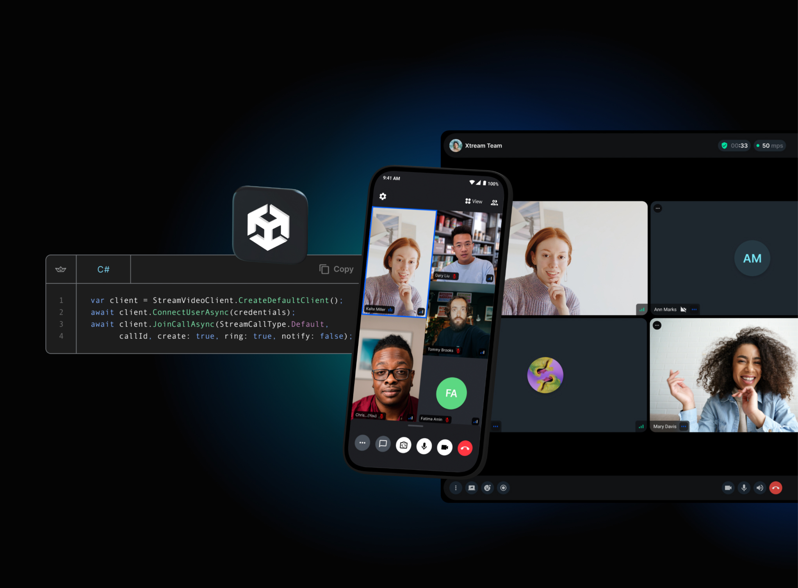

<p align="center">
  
</p>

# Official [Stream Video](https://getstream.io/video/docs/) SDK for Unity Engine

This is the official [Stream Video](https://getstream.io/video) SDK for Unity, a service for building **video calls**, **audio rooms**, and **live-streaming** inside a Unity Project. This library includes a stateful video client that is automatically synchronized with Stream servers.
This greatly reduces the integration complexity and allows you to build any kind of Video & Audio streaming experience in a matter of days.

<a href="https://getstream.io">

</a>

## 🛥 What is Stream?

Stream allows developers to rapidly deploy scalable feeds, chat messaging and video with an industry leading 99.999% uptime SLA guarantee.

Stream provides state handling that make it easy to build video calling for your app. All calls run on Stream's network of edge servers around the world, ensuring optimal latency and reliability.

## &#11088; Cross-platform support

Stream's Video SDK for Unity allows you to easily build any type of video or audio streaming experience that works cross-platform - you can check out supported platforms [here](https://getstream.io/video/docs/unity/platforms/overview/).

<p align="center">
  
</p>

## &#9889; How to install

1. Open Unity's Package Manager (Unity Editor Top Bar -> Window -> Package Manager)
2. Click the "+" button in the top left corner of the Package Manager
3. Select `Add package from git URL...`
4. Paste in the following url and click the `Add` button:
```
https://github.com/GetStream/stream-video-unity.git?path=/Packages/StreamVideo
```

More information [here](https://getstream.io/video/docs/unity/basics/installation/).

## 📕 Tutorials

With Stream's video components, you can use our SDK to build in-app video calling, audio rooms, audio calls, or live streaming. The best place to get started is with our tutorials:

- **[Video & Audio Calling Tutorial](https://getstream.io/video/docs/unity/tutorials/video-calling/)**
- **[Audio Rooms Tutorial](https://getstream.io/video/docs/unity/tutorials/audio-room/)**

## 👔 Sample Project

Our SDK includes a sample project showing how to build a simple video streaming app between multiple participants.

Read **[here](https://getstream.io/video/docs/unity/basics/example-project/)** on how to import the sample project.

## 👩‍💻 Free for Makers 👨‍💻

Stream is free for most side and hobby projects. To qualify, your project/company needs to have < 5 team members and < $10k in monthly revenue. Makers get $100 in monthly credit for video for free.
For more details, check out the [Maker Account](https://getstream.io/maker-account?utm_source=Github&utm_medium=Github_Repo_Content_Ad&utm_content=Developer&utm_campaign=Github_Android_Video_SDK&utm_term=DevRelOss).

## 💡 Supported Features 💡

Here are some of the features we support:

* Developer experience: Great SDKs, docs, tutorials and support so you can build quickly
* Edge network: Servers around the world ensure optimal latency and reliability
* Security & Privacy: Based in USA and EU, Soc2 certified, GDPR compliant
* Dynascale: Automatically switch resolutions, fps, bitrate, codecs and paginate video on large calls
* Screensharing
* Active speaker
* Custom events
* Geofencing
* Notifications and ringing calls
* Opus DTX & Red for reliable audio
* Webhooks & SQS
* Backstage mode
* Flexible permissions system
* Joining calls by ID, link or invite
* Enabling and disabling audio and video when in calls
* Enabling and disabling camera in calls
* Enabling and disabling speakerphone in calls
* Push notification providers support
* Call recording
* Broadcasting to HLS

### Dynascale 2.0

- currently we support selecting which of the 3 video quality layers you want to send: f, h and q.

## 💼 We are hiring!

We've recently closed a [\$38 million Series B funding round](https://techcrunch.com/2021/03/04/stream-raises-38m-as-its-chat-and-activity-feed-apis-power-communications-for-1b-users/) and we keep actively growing.
Our APIs are used by more than a billion end-users, and you'll have a chance to make a huge impact on the product within a team of the strongest engineers all over the world.
Check out our current openings and apply via [Stream's website](https://getstream.io/team/#jobs).

## License

```
Copyright (c) 2014-2023 Stream.io Inc. All rights reserved.

Licensed under the Stream License;
you may not use this file except in compliance with the License.
You may obtain a copy of the License at

   https://github.com/GetStream/stream-video-unity/blob/main/LICENSE

Unless required by applicable law or agreed to in writing, software
distributed under the License is distributed on an "AS IS" BASIS,
WITHOUT WARRANTIES OR CONDITIONS OF ANY KIND, either express or implied.
See the License for the specific language governing permissions and
limitations under the License.
```
