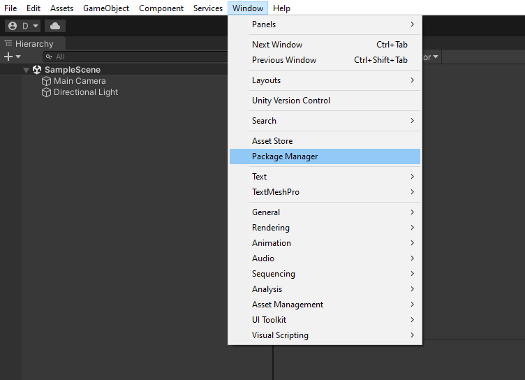
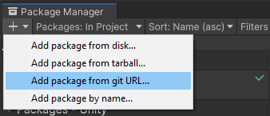
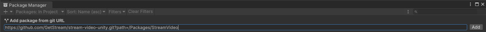

1. Open Unity's Package Manager by selecting from the top bar **Window -> Package Manager**.

2. Click the **+** button in the top left corner and select the **Add package from git URL...**

3. Paste in the following url and click the **Add** button:
```
https://github.com/GetStream/stream-video-unity.git?path=/Packages/StreamVideo
``` 


After the package import is complete, **Stream's Video SDK for Unity** should be available in your project.

## Using a specific SDK version

We recommend always using the most recent version of the SDK. However, you may want to use a particular version of the SDK.
In such case, you need to append the `#` symbol, followed by the version number, to the package URL as shown below:
```
https://github.com/GetStream/stream-video-unity.git?path=/Packages/StreamVideo#0.5.0
```
Here, the version `0.5.0` will be imported, even if a newer version is available.

:::caution

Importing the package with a version defined will lock this version indefinitely. The **Update** button in Unity's package manager will not update the package, and the only way to upgrade will be to remove the package and add it again without the version suffix.

:::