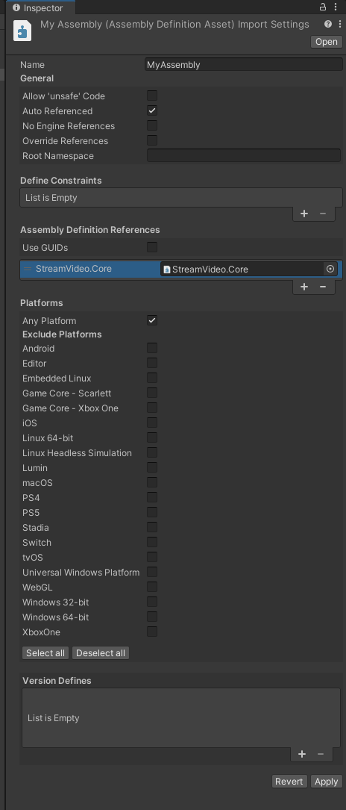

1. Open Unity's Package Manager by selecting from the top bar **Window -> Package Manager**.<br />

2. Click the **+** button in the top left corner and select the **Add package from git URL...**<br />

3. Paste in the following url and click the **Add** button:
```
https://github.com/GetStream/stream-video-unity.git?path=/Packages/StreamVideo
``` 


After the import is complete, the **Stream's Video SDK for Unity** package should appear in the **Packages** window.

## Assembly Definitions

If you're using [Unity's Assembly Definitions](https://docs.unity3d.com/Manual/ScriptCompilationAssemblyDefinitionFiles.html) in your project, you need to add a reference to the `StreamVideo.Core` assembly in the assembly inspector as shown in below:
