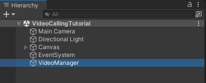
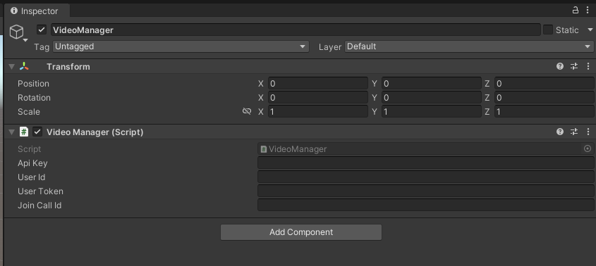
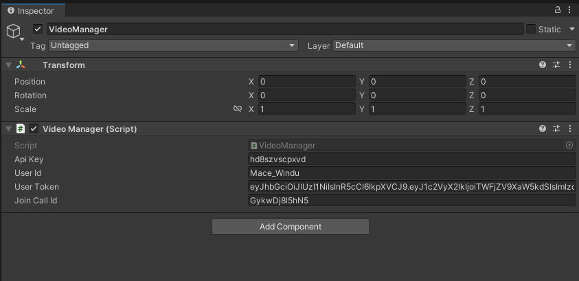
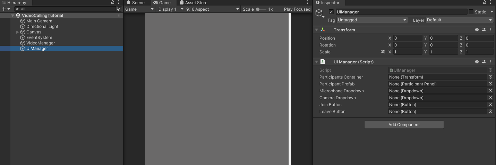
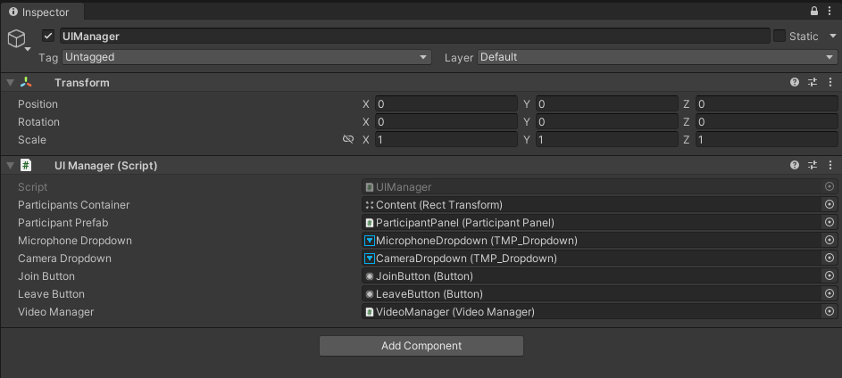
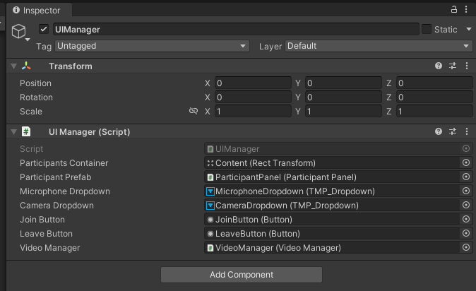
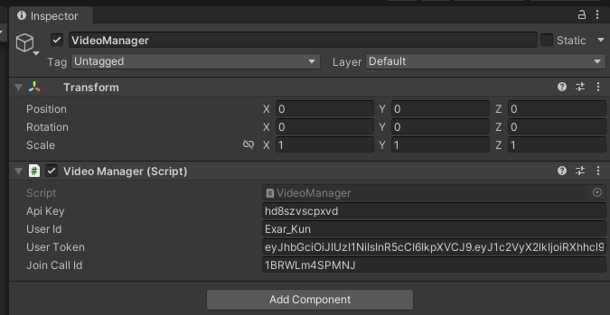
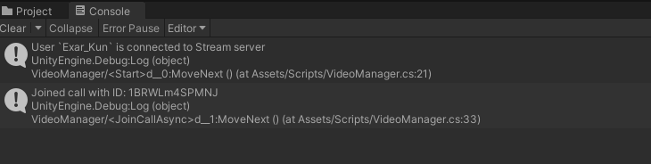

import { TokenSnippet } from '../../../shared/_tokenSnippet.jsx';

This tutorial teaches you how to build Zoom/Whatsapp style video calling for your app.

* Calls run on Stream's global edge network for optimal latency & reliability.
* Permissions give you fine-grained control over who can do what.
* Video quality and codecs are automatically optimized.
* Powered by Stream's [Video Calling API](https://getstream.io/video/).

### Step 0 - Prepare your environment

To follow this tutorial you'll need to have a Unity Editor installed. We'll be using the `2021.3.2f1` LTS version, but any supported Unity version will do just fine. You can check the full list of supported Unity Editor versions [here](https://getstream.io/video/docs/unity/).

## Step 1 - Download Starting Project

To speed you up, we've prepared a starting Unity project that you can download [here](https://github.com/GetStream/stream-unity-video-calling-tutorial).

Download the project, open it in Unity Editor, and open the `VideoCallingTutorial` scene.

If you're new to `GitHub`, you can just download [here](https://github.com/GetStream/stream-unity-video-calling-tutorial/archive/refs/heads/main.zip) to download the project in a zip file.

The starting project contains Unity's UGUI UI components:
* A scrollable list of the call participants
* Dropdowns to pick microphone and camera device (not needed if you're targeting Android or IOS)
* A `Join` button

## Step 2 - Add Stream's Video SDK for Unity

Please follow the [installation section](./basics/installation/) to see how to import Stream's Video SDK into a Unity Project.

After completing this step you should now see "Stream Video & Audio Chat SDK" package in Project->Packages


## Step 3 - Setup Video Manager

1. Go to the **Project** window
2. In the **Assets** folder, create a new folder called **Scripts**
3. Inside the **Scripts** folder, create a new script file and call it `VideoManager.cs`
4. Open `VideoManager.cs` in your IDE (code editor) and replace it with the following script:

```csharp
using System;
using System.Threading.Tasks;
using StreamVideo.Core;
using StreamVideo.Core.StatefulModels;
using StreamVideo.Libs.Auth;
using UnityEngine;

public class VideoManager : MonoBehaviour
{
    private async void Start()
    {
        // Create Client instance
        _client = StreamVideoClient.CreateDefaultClient();

        var credentials = new AuthCredentials(_apiKey, _userId, _userToken);

        try
        {
            // Connect user to Stream server
            await _client.ConnectUserAsync(credentials);
            Debug.Log($"User `{_userId}` is connected to Stream server");
        }
        catch (Exception e)
        {
            // Log potential issues that occured during trying to connect
            Debug.LogException(e);
        }
    }

    [SerializeField]
    private string _apiKey;
    
    [SerializeField]
    private string _userId;
    
    [SerializeField]
    private string _userToken;
    
    [SerializeField]
    private string _joinCallId;

    private IStreamVideoClient _client;
}
```

Let's go through this script step by step to understand what we're doing.

This part defines variables for the **api key**, **user id** and the **user token** . These 3 variables are essential to establish a connection for a user.
```csharp
    [SerializeField]
    private string _apiKey;
    
    [SerializeField]
    private string _userId;
    
    [SerializeField]
    private string _userToken;
```

The `_joinCallId` variable will be used to provide the **id** of the call that we'll be joining. 

```csharp
    [SerializeField]
    private string _joinCallId;
```

Here we instantiate a default client for the Stream's Video SDK:
```csharp
_client = StreamVideoClient.CreateDefaultClient();
```
Next, we wrap the authorization credentials in a convenient structure:
```csharp
var credentials = new AuthCredentials(_apiKey, _userId, _userToken);
```
And finally, we call the ConnectUserAsync that will attempt to establish a connection:
```csharp
await _client.ConnectUserAsync(credentials);
```
Please note that we're using .NET's modern async/await syntax, this makes writing asynchronous code that wait for server response very easy.

After the `await` completes, we should now be connected to the stream server.

Also note, that we've wrapped the asynchronous `ConnectUserAsync` method in a try/catch block. Unless you're proficient with .NET's async/await syntax and understand how to properly handle exceptions for asynchronous methods, we advise you to always wrap awaited methods in a try/catch block in order to catch any thrown exceptions and therefore be notified about any errors that occured during async operation.

Now go to Scene Hierarchy Window and create an empty game object and call it `VideoManager`:


Next, drag in the newly created `VideoManager.cs` script onto the `VideoManager` game object and save the scene.

You should now have a game object with our `VideoManager.cs` script attached.



Once you select this game object you should see `Api Key`, `User Id`, and the User Token fields exposed in the Inspector Window.



---

# Step 4 - Connect a user to Stream server

To actually run this script we need a valid user token. The user token is typically generated by your server side API. When a user logs in to your app you return the user token that gives them access to the call. To make this tutorial easier to follow we'll generate a user token for you:

<TokenSnippet sampleApp='meeting' />

Copy `api key`, `user id`, and the `user token` from the window above and paste them into `VideoManager` exposed fields:



After you run the project, you should now see a log confirming that the user is connected to the stream server

---

# Step 5 - Add methods to `Join` and `Leave` a call

In this step we'll add methods to `Join` and `Leave` the call. These will be called from our UI when the user clicks on the `Join` and `Leave` buttons.

Open the `VideoManager.cs` script and apply the following changes:

First, add the `_activeCall` field to the class:
```csharp
private IStreamCall _activeCall;
```

The fields part of the class should look like this:
```csharp
    [SerializeField]
    private string _apiKey;
    
    [SerializeField]
    private string _userId;
    
    [SerializeField]
    private string _userToken;
    
    [SerializeField]
    private string _joinCallId;

    private IStreamVideoClient _client;
    
    // highlight-next-line
    private IStreamCall _activeCall;
```

Next, add the `JoinCallAsync` and the `LeaveCallAsync` methods to the `AudioRoomsManager` class.

```csharp
    public async Task JoinCallAsync()
    {
        _activeCall = await _client.JoinCallAsync(StreamCallType.Default, _joinCallId, create: true, ring: true, notify: false);
        Debug.Log($"Joined call with ID: {_activeCall.Id}");
    }
    
    public async Task LeaveCallAsync()
    {
        if (_activeCall == null)
        {
            Debug.LogWarning("Leave request ignored. There is no active call to leave.");
            return;
        }

        await _activeCall.LeaveAsync();
    }
```

---

# Step 6 - Create UI Manager script

Next, we'll add a UI manager script that will keep references to all of our interactable UI elements and will handle user interaction.

1. Go to Scripts folder, create new C# script nad call it `UIManager.cs`
2. Open the script in your code editor and paste the following content:
```csharp
using UnityEngine;
using UnityEngine.UI;

public class UIManager : MonoBehaviour
{
    [SerializeField]
    private Transform _participantsContainer;
    
    [SerializeField]
    private ParticipantPanel _participantPrefab;
    
    [SerializeField]
    private TMP_Dropdown _microphoneDropdown;
    
    [SerializeField]
    private TMP_Dropdown _cameraDropdown;

    [SerializeField]
    private Button _joinButton;
    
    [SerializeField]
    private Button _leaveButton;
    
    [SerializeField]
    private VideoManager _videoManager;
}
```
3. In Unity Editor, go to scene's **Hierarchy** window, create new empty game object, and call it `UIManager`.
4. Select the `UIManager` game object and attach the `UIManager.cs` script onto it.
5. Save scene

You should now have a `UIManager` game object with `UIManager.cs` script attach to it:


# Step 7 - Setup `UIManager` references in the inspector

Attach references in the following way:
* `Participants Container` - Hierarchy window -> `Content` game object (a child of ParticipantsPanel's **ScrollView**)
* `Participant Prefab` - Project window -> Prefabs -> `ParticipantPanel` prefab
* `Microphone Dropdown` - Hierarchy window ->
* `Camera Dropdown` - Hierarchy window ->
* `Join Button` - Hierarchy window ->
* `Leave Button` - Hierarchy window -> `LeaveButton` game object
* `Video Manager` - Hierarchy window -> `VideoManager` game object

After attaching the references your `UIManager` game object should look like this in the inspector:


Here you can witch game object from the scene hierarchy should get references by the `UIManager` script:


# Step 8 - Add `UIManager` logic

Next, add those 2 methods to the `UIManager.cs` script:

```csharp
    private async void OnJoinButtonClickedAsync()
    {
        // Because this is async void method we need to wrap asynchronous call in a try/catch block
        try
        {
            await _videoManager.JoinCallAsync();
            
            // When await is finished we have joined the call. We can now hide the `join` button and show the `leave` button
            _joinButton.gameObject.SetActive(false);
            _leaveButton.gameObject.SetActive(true);
        }
        catch (Exception e)
        {
            Debug.LogException(e);
        }
    }
    
    private async void OnLeaveButtonClickedAsync()
    {
        // Because this is async void method we need to wrap asynchronous call in a try/catch block
        try
        {
            await _videoManager.LeaveCallAsync();
            
            // When await is finished we have left the call. We can now show the `join` button again and hide the `leave` button
            _joinButton.gameObject.SetActive(true);
            _leaveButton.gameObject.SetActive(false);
        }
        catch (Exception e)
        {
            Debug.LogException(e);
        }
    }
```

The `OnJoinButtonClickedAsync` method will call and await the `JoinCallAsync` method on the `VideoManager` script. Once the `JoinCallAsync` method is awaited, it means that we have joined a call. Therefore, we hide the **join* button and show the **leave** button.

The `OnLeaveButtonClickedAsync` on the other hand, will call and await the `LeaveCallAsync` method on the `VideoManager` script and once its awaited, it will again show the **join** button and hide the **leave** button.

Next, add the following `Awake` method:
```csharp
    private void Awake()
    {
        // Replace microphone dropdown options with device names from Microphone.devices
        _microphoneDropdown.ClearOptions();
        _microphoneDropdown.AddOptions(Microphone.devices.ToList());
        
        // Replace camera dropdown options with device names from WebCamTexture.devices
        _cameraDropdown.ClearOptions();
        _cameraDropdown.AddOptions(WebCamTexture.devices.Select(d => d.name).ToList());
        
        // Subscribe to join & leave buttons onClick event
        _joinButton.onClick.AddListener(OnJoinButtonClickedAsync);
        _leaveButton.onClick.AddListener(OnLeaveButtonClickedAsync);
        
        // Hide leave button - we'll show it once we join a call
        _leaveButton.gameObject.SetActive(false);
    }
```

Let's quickly go through what's going on.

The following part clears the default options in the microphone dropdown and adds new options based on Unity's `Microphone.devices` array. This array contains the list of available microphone devices names.
```csharp
        _microphoneDropdown.ClearOptions();
        _microphoneDropdown.AddOptions(Microphone.devices.ToList());
```

:::warning

You need to have at least 1 microphone device available. Otherwise, the `Microphone.devices` array will be empty and our code will not work.

:::

Next, we do the same for camera dropdown. We clear the default options and repopulate the list based on Unity's `WebCamTexture.devices`. It's worth that `Microphone.devices` is an array of strings representing microphone devices names whereas the `WebCamTexture.devices` is an array of [WebCamDevice](https://docs.unity3d.com/ScriptReference/WebCamDevice.html). Therefore, we grab the actual device names with LINQ `WebCamTexture.devices.Select(d => d.name)`.
```csharp
        _cameraDropdown.ClearOptions();
        _cameraDropdown.AddOptions(WebCamTexture.devices.Select(d => d.name).ToList());
```

:::warning

You need to have at least 1 camera device available. Otherwise, the `WebCamTexture.devices` array will be empty and our project will not work.

:::

Next, we subscribe to buttons **onClick** event:
```csharp
        _joinButton.onClick.AddListener(OnJoinButtonClickedAsync);
        _leaveButton.onClick.AddListener(OnLeaveButtonClickedAsync);
```

And finally, we set the **leave** button to be hidden by default. We'll show it once we're connected to a **call**.
```csharp
_leaveButton.gameObject.SetActive(false);
```

# Step 8 - Test joining the call

Copy the `Call ID` from the window below and paste into **VideoManager's** `Join Call Id` field in the inspector window.

<TokenSnippet sampleApp='meeting' />

You should now have the **Api Key**, **User Id**, **User Token**, and the **Join CallId** all filled:


Now run the project, and after you click on the `Join` button, you should see a log confirming that we've got connected to a call with the provided id:


# Step 9 - Handle call participants

Next, we'll add handling call participants. Call participants are usually other users that joined the same call. It's worth noting that a single user can join through multiple devices and therefore becoming a multiple call participants.

Open `VideoManager.cs` in your code editor.


