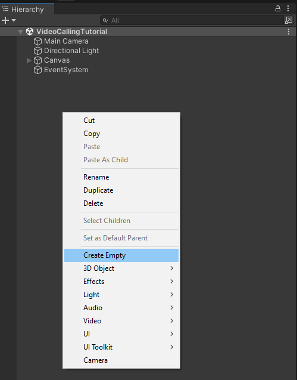
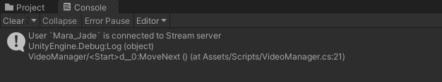
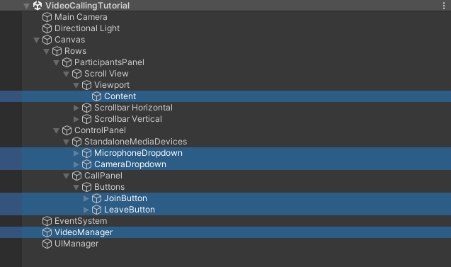
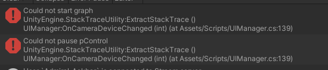

import { TokenSnippet } from '../../../shared/_tokenSnippet.jsx';

This tutorial teaches you how to build Zoom/Whatsapp style video calling for your app.

* Calls run on Stream's global edge network for optimal latency & reliability.
* Permissions give you fine-grained control over who can do what.
* Video quality and codecs are automatically optimized.
* Powered by Stream's [Video Calling API](https://getstream.io/video/).

### Step 0 - Prerequisites

To follow this tutorial you'll need to have a Unity Editor installed. We'll be using the `2021.3.2f1` LTS version, but any supported Unity version will do just fine. You can check the full list of supported Unity Editor versions [here](https://getstream.io/video/docs/unity/).

### Step 1 - Download Starting Project

To speed you up, we've prepared a starting **Unity Project** that you can download from [this](https://github.com/GetStream/stream-unity-video-calling-tutorial) GitHub repository. You can just click [here](https://github.com/GetStream/stream-unity-video-calling-tutorial/archive/refs/heads/main.zip) to download the project in a zip file.

Unpack the downloaded project, and open it in Unity Editor.

The starting project contains the following UGUI UI elements:
* A **scrollable list** to show **call participants**
* **Dropdowns** to select active **microphone** and **camera** device (not needed if you're targeting Android or IOS)
* A **Join** button

Now open the `VideoCallingTutorial` scene located in the `Scenes` folder.

### Step 2 - Add Stream's Video SDK for Unity

Please follow the [installation section](../01-basics/02-installation.mdx) to import **Stream's Video SDK** into a Unity Project.

After completing this step you should now see `Stream Video & Audio Chat SDK` package in the **Project->Packages** window:


### Step 3 - Setup Video Manager

1. Go to the **Project** window
2. Navigate to **Assets -> Scripts ** folder
3. Create a new script file, and call it `VideoManager.cs`
4. Open the `VideoManager.cs` in your code editor, and replace it with the following script:

```csharp
using System;
using System.Threading.Tasks;
using StreamVideo.Core;
using StreamVideo.Core.StatefulModels;
using StreamVideo.Libs.Auth;
using UnityEngine;

public class VideoManager : MonoBehaviour
{
    private async void Start()
    {
        // Create Client instance
        _client = StreamVideoClient.CreateDefaultClient();

        var credentials = new AuthCredentials(_apiKey, _userId, _userToken);

        try
        {
            // Connect user to Stream server
            await _client.ConnectUserAsync(credentials);
            Debug.Log($"User `{_userId}` is connected to Stream server");
        }
        catch (Exception e)
        {
            // Log potential issues that occured during trying to connect
            Debug.LogException(e);
        }
    }

    [SerializeField]
    private string _apiKey;
    
    [SerializeField]
    private string _userId;
    
    [SerializeField]
    private string _userToken;
    
    [SerializeField]
    private string _joinCallId;

    private IStreamVideoClient _client;
}
```

Let's go through this script step by step to understand what's going on.

This part defines variables for the **api key**, **user id** and the **user token** - these 3 variables are essential to establish a connection with the **Stream Service**.
```csharp
[SerializeField]
private string _apiKey;

[SerializeField]
private string _userId;

[SerializeField]
private string _userToken;
```

The `_joinCallId` variable will be used to provide the **id** of the call that we'll be joining. 

```csharp
[SerializeField]
private string _joinCallId;
```

Here we instantiate a default client for the Stream's Video SDK:
```csharp
_client = StreamVideoClient.CreateDefaultClient();
```
Next, we wrap the authorization credentials in a convenient struct:
```csharp
var credentials = new AuthCredentials(_apiKey, _userId, _userToken);
```
And finally, we call the `ConnectUserAsync` method that will attempt to establish a connection:
```csharp
await _client.ConnectUserAsync(credentials);
```
It's worth noting that we're using .NET's modern **async/await syntax** - this makes writing asynchronous code that waits for the server response very clean & concise.

After the `await` completes, we should now be connected to the Stream server.

We've wrapped the asynchronous `ConnectUserAsync` method in a **try/catch** block. In case you're not familiar with handling exceptions in asynchronous methods, we advise you to always wrap awaited methods in a try/catch block to catch any thrown exceptions and therefore never miss any errors that can potentially occur during async operations.

---

Now go to Scene's **Hierarchy** Window (Make sure the `VideoCallingTutorial` scene is opened), create an empty **game object** and call it `VideoManager`:



Next, drag in the newly created `VideoManager.cs` script onto the `VideoManager` game object and save the scene.

You should now have a game object with the `VideoManager.cs` script attached.


Once you select this game object you should see `Api Key`, `User Id`, and the `User Token` fields visible in the **Inspector** Window (Make sure the `VideoManager` game object is selected).


---

### Step 4 - Connect a user to Stream server

To run this script we need a valid **User Token**. A **User Token** is typically generated by your backend service. When a user logs in to your app you authorize them and return the **user token** that allows them to join call. This way, you have full control over who can access a call. For the sake of this tutorial we'll generate a **User Token** for you:

<TokenSnippet sampleApp='meeting' />

Copy `api key`, `user id`, and the `user token` from the window above and paste them into the corresponding fields in the `VideoManager` game object:


You can run the project by pressing **Play** in the Unity Editor, you should now see a log in Unity Console confirming that the user is connected to the stream server:



---

### Step 5 - Add methods to `Join` and `Leave` a call

In this step, we'll add methods to `Join` and `Leave` the call - these will be called from our UI when the user clicks on the `Join` and `Leave` buttons.

Open the `VideoManager.cs` script and apply the following changes:

First, add the `_activeCall` field to the class:
```csharp
private IStreamCall _activeCall;
```

The fields part of the class should now look like this:
```csharp
[SerializeField]
private string _apiKey;

[SerializeField]
private string _userId;

[SerializeField]
private string _userToken;

[SerializeField]
private string _joinCallId;

private IStreamVideoClient _client;

// highlight-next-line
private IStreamCall _activeCall;
```

Next, add the `JoinCallAsync` and the `LeaveCallAsync` methods to the `VideoManager` class.

```csharp
public async Task JoinCallAsync()
{
    _activeCall = await _client.JoinCallAsync(StreamCallType.Default, _joinCallId, create: true, ring: true, notify: false);
    Debug.Log($"Joined call with ID: {_activeCall.Id}");
}

public async Task LeaveCallAsync()
{
    if (_activeCall == null)
    {
        Debug.LogWarning("Leave request ignored. There is no active call to leave.");
        return;
    }

    await _activeCall.LeaveAsync();
}
```

---

### Step 6 - Create UI Manager script

Next, we'll add a UI manager script that will keep references to all of the interactable UI elements and will handle user interactions.

1. Go to the **Scripts** folder, create a new C# script, and call it `UIManager.cs`
2. Open the script in your code editor and paste the following content:
```csharp
using System;
using System.Linq;
using TMPro;
using UnityEngine;
using UnityEngine.UI;

public class UIManager : MonoBehaviour
{
    [SerializeField]
    private Transform _participantsContainer;
    
    [SerializeField]
    private ParticipantPanel _participantPrefab;
    
    [SerializeField]
    private TMP_Dropdown _microphoneDropdown;
    
    [SerializeField]
    private TMP_Dropdown _cameraDropdown;

    [SerializeField]
    private Button _joinButton;
    
    [SerializeField]
    private Button _leaveButton;
    
    [SerializeField]
    private VideoManager _videoManager;
}
```
3. In Unity Editor, go to the **Hierarchy** window, create a new empty game object, and call it `UIManager`.
4. Select the `UIManager` game object and attach the `UIManager.cs` script to it.
5. Save the scene

You should now have a `UIManager` game object with `UIManager.cs` script attach to it:


### Step 7 - Setup `UIManager` references in the inspector

Now we need attach game objects to `UIManager` script component.

In case you're wondering how to do this efficiently you can follow these steps:
1. Select the `UIManager` game object in the **Hierarchy** window and **lock** the window (Read [Unity Docs](https://docs.unity3d.com/Manual/InspectorOptions.html) on how to lock **Inspector** window)
2. Use the **Hierarchy's** window search input to search for each game object by name, and drag it into the corresponding field in the locked **Inspector** window.
3. Unlock the **Inspector** window

Here's a full list of `UIManager` fields and the corresponding game objects that we want to attach:
* `Participants Container` - Search for `ParticipantsContainer` in the **Hierarchy** window
* `Participant Prefab` - This is the only one that we'll drag in from the **Project** window, drag in the **Prefabs/ParticipantPanel** prefab file
* `Microphone Dropdown` - Search for the `MicrophoneDropdown` in the **Hierarchy** window
* `Camera Dropdown` - Search for the `CameraDropdown` in the **Hierarchy** window
* `Join Button` - Search for the `JoinButton` in the **Hierarchy** window
* `Leave Button` - Search for the `LeaveButton` in the **Hierarchy** window
* `Video Manager` - Search for the `VideoManager` in the **Hierarchy** window

These are the game objects, from the Scene Hierarchy, that should be attached to the `UIManager` script:


And on to of the hierarchy game objects, we attach the `Prefabs/ParticipantPanel` prefab file from the Project window.

After completing this step, your `UIManager` game object should look as below:


### Step 8 - Add `UIManager` logic

Next, add the following code to the `UIManager.cs` script:

```csharp
private async void OnJoinButtonClickedAsync()
{
    // Because this is async void method we need to wrap asynchronous call in a try/catch block
    try
    {
        await _videoManager.JoinCallAsync();
        
        // When await is finished we have joined the call. We can now hide the `join` button and show the `leave` button
        _joinButton.gameObject.SetActive(false);
        _leaveButton.gameObject.SetActive(true);
    }
    catch (Exception e)
    {
        Debug.LogException(e);
    }
}

private async void OnLeaveButtonClickedAsync()
{
    // Because this is async void method we need to wrap asynchronous call in a try/catch block
    try
    {
        await _videoManager.LeaveCallAsync();
        
        // When await is finished we have left the call. We can now show the `join` button again and hide the `leave` button
        _joinButton.gameObject.SetActive(true);
        _leaveButton.gameObject.SetActive(false);
    }
    catch (Exception e)
    {
        Debug.LogException(e);
    }
}
```

The `OnJoinButtonClickedAsync` method calls the **VideoManager's** `JoinCallAsync` method. Once the `JoinCallAsync` method is awaited, it means that we have joined a call. We then update the UI to reflect this state -> hide the **join* button and show the **leave** button.

The `OnLeaveButtonClickedAsync` method calls the **VideoManager's** `LeaveCallAsync` method and once it's awaited, it will also update the UI and show the **join** button and hide the **leave** button.

Next, add the following `Awake` method to the `UIManager.cs` script:
```csharp
private void Awake()
{
    // Replace microphone dropdown options with device names from Microphone.devices
    _microphoneDropdown.ClearOptions();
    _microphoneDropdown.AddOptions(Microphone.devices.ToList());
    
    // Replace camera dropdown options with device names from WebCamTexture.devices
    _cameraDropdown.ClearOptions();
    _cameraDropdown.AddOptions(WebCamTexture.devices.Select(d => d.name).ToList());
    
    // Subscribe to join & leave buttons onClick event
    _joinButton.onClick.AddListener(OnJoinButtonClickedAsync);
    _leaveButton.onClick.AddListener(OnLeaveButtonClickedAsync);
    
    // Hide leave button - we'll show it once we join a call
    _leaveButton.gameObject.SetActive(false);
}
```

Let's quickly go through the recently added code changes.

The following part clears the default options in the microphone dropdown and adds new options based on Unity's `Microphone.devices` array. This array contains the list of available microphone device names.
```csharp
_microphoneDropdown.ClearOptions();
_microphoneDropdown.AddOptions(Microphone.devices.ToList());
```

:::warning

You need to have at least 1 microphone device available. Otherwise, the `Microphone.devices` array will be empty and our code will not work.

:::

Next, we do the same for the camera dropdown. We clear the default options and repopulate the list based on Unity's `WebCamTexture.devices`. It's worth noting that `Microphone.devices` is an array of strings representing microphone device names whereas the `WebCamTexture.devices` is an array of [WebCamDevice](https://docs.unity3d.com/ScriptReference/WebCamDevice.html) objects. Therefore, we grab the actual device names with LINQ `WebCamTexture.devices.Select(d => d.name)`.
```csharp
_cameraDropdown.ClearOptions();
_cameraDropdown.AddOptions(WebCamTexture.devices.Select(d => d.name).ToList());
```

:::warning

You need to have at least 1 camera device available. Otherwise, the `WebCamTexture.devices` array will be empty and our code will not work.

:::

Next, we subscribe to buttons **onClick** event:
```csharp
_joinButton.onClick.AddListener(OnJoinButtonClickedAsync);
_leaveButton.onClick.AddListener(OnLeaveButtonClickedAsync);
```

And finally, we set the **leave** button to be hidden by default. We'll show it once we're connected to a **call**.
```csharp
_leaveButton.gameObject.SetActive(false);
```

### Step 8 - Test joining the call

Copy the `Call ID` from the window below and paste into **VideoManager's** `Join Call Id` field in the inspector window.

<TokenSnippet sampleApp='meeting' />

You should now have the **Api Key**, **User Id**, **User Token**, and the **Join CallId** all filled:


Now run the project, and after you click on the `Join` button, you should see a log confirming that we've got connected to a call with the provided id:


### Step 9 - Handle call participants

Next, we'll add handling call participants. Call participants are usually other users that joined the same call. It's worth noting that a single user can join through multiple devices and therefore becoming a multiple call participants.

Open `VideoManager.cs` in your code editor.

First, add 2 events to the `VideoManager` class:
```csharp
    public Action<IStreamVideoCallParticipant> ParticipantJoined;
    public Action<string> ParticipantLeft;
```

Next, add those 2 methods:
```csharp
    private void OnParticipantJoined(IStreamVideoCallParticipant participant)
    {
        ParticipantJoined?.Invoke(participant);
    }

    private void OnParticipantLeft(string sessionId, string userid)
    {
        ParticipantLeft?.Invoke(sessionId);
    }
```

Next, replace the `JoinCallAsync` method with the following code:
```csharp
    public async Task JoinCallAsync()
    {
        _activeCall = await _client.JoinCallAsync(StreamCallType.Default, _joinCallId, create: true, ring: true, notify: false);
        Debug.Log($"Joined call with ID: {_activeCall.Id}");
        
        // Subscribe to events in order to get notified when participants joins or leaves the call
        _activeCall.ParticipantJoined += OnParticipantJoined;
        _activeCall.ParticipantLeft += OnParticipantLeft;
        
        // Process already present participants
        foreach (var participant in _activeCall.Participants)
        {
            // Skip local user
            if (participant.IsLocalParticipant)
            {
                continue;
            }
            
            OnParticipantJoined(participant);
        }
    }
```

What we do here is:
* Process `call.Participants` array that contains participants already present in the call when we joined. We skip the participant representing the local user because usually we want to see other participants of the call and not ourselves.
* Subscribe to and handle the `call.ParticipantJoined` event - triggered whenever a new participant joins the call
* Subscribe to and handle the `call.ParticipantLeft` event - triggered whenever a participant leaves the call

This class only propagates the events further so that in the next step we can subscribe to those events from our UI layer and spawn appropriate UI elements.

And finally, replace the `LeaveCallAsync` method with the following code:
```csharp
    public async Task LeaveCallAsync()
    {
        if (_activeCall == null)
        {
            Debug.LogWarning("Leave request ignored. There is no active call to leave.");
            return;
        }
        
        // Unsubscribe from events 
        _activeCall.ParticipantJoined -= OnParticipantJoined;
        _activeCall.ParticipantLeft -= OnParticipantLeft;
        
        await _activeCall.LeaveAsync();
    }
```

### Step 10 - Setup the **ParticipantPanel**

Now let's prepare the logic that will handle a single call participant and their tracks. Participant tracks represent either video or audio data they're streaming during the call.

Open the `ParticipantPanel.cs` in your code editor and replace it with the following code:
```csharp
using System;
using StreamVideo.Core.StatefulModels;
using StreamVideo.Core.StatefulModels.Tracks;
using UnityEngine;
using UnityEngine.UI;

public class ParticipantPanel : MonoBehaviour
{
    public void Init(IStreamVideoCallParticipant participant)
    {
        _participant = participant;

        // Process already present tracks
        foreach (var track in _participant.GetTracks())
        {
            OnTrackAdded(_participant, track);
        }
        
        // Subscribe to TrackAdded event to get notified whenever a new track is added during the call
        _participant.TrackAdded += OnTrackAdded;
    }

    private void OnTrackAdded(IStreamVideoCallParticipant participant, IStreamTrack track)
    {
        // Switch based on track type
        switch (track)
        {
            case StreamAudioTrack streamAudioTrack:

                var audioSource = GetComponent<AudioSource>();
                
                // Set audioSource as target - now this AudioSource object will receive audio data from the participant
                streamAudioTrack.SetAudioSourceTarget(audioSource);
                
                break;
            case StreamVideoTrack streamVideoTrack:

                var rawImage = GetComponent<RawImage>();
                
                // Set rawImage as target - now this RawImage object will receive video data from the participant
                streamVideoTrack.SetRenderTarget(rawImage);
                
                break;
            default:
                throw new ArgumentOutOfRangeException(nameof(track));
        }
    }

    // OnDestroy is called by Unity Engine when object is being destroyed
    private void OnDestroy()
    {
        if (_participant == null)
        {
            return;
        }
        
        // Unsubscribe from event when panel is being destroyed
        _participant.TrackAdded -= OnTrackAdded;
    }

    private IStreamVideoCallParticipant _participant;
}
```

Now let's go through what's going on here.

First, we expose the public `Init` method. We'll call it after we spawn the participant panel prefab and call this method to initialize it.

The key parts are:
* Process all currently available tracks. We call `OnTrackAdded` method for each track. This method will handle receiving video or audio data.
* Subscribe to the `TrackAdded` event. This way we'll process any tracks added in the future.

```csharp
    public void Init(IStreamVideoCallParticipant participant)
    {
        _participant = participant;

        // Process already present tracks
        foreach (var track in _participant.GetTracks())
        {
            OnTrackAdded(_participant, track);
        }
        
        // Subscribe to TrackAdded event to get notified whenever a new track is added during the call
        _participant.TrackAdded += OnTrackAdded;
    }
```

Next, the `OnTrackAdded` method is called to finally process the track:
* If the track is of type `StreamAudioTrack` we get the `AudioSource` reference and call `streamAudioTrack.SetAudioSourceTarget(audioSource);` in order to start receiving audio data into this `AudioSource` component.
* If the track is of type `StreamVideoTrack` we get the `RawImage` reference and call `streamVideoTrack.SetRenderTarget(rawImage);` in order to start receiving video data into this `RawImage` component.

```csharp
    private void OnTrackAdded(IStreamVideoCallParticipant participant, IStreamTrack track)
    {
        // Switch based on track type
        switch (track)
        {
            case StreamAudioTrack streamAudioTrack:

                var audioSource = GetComponent<AudioSource>();
                
                // Set audioSource as target - now this AudioSource object will receive audio data from the participant
                streamAudioTrack.SetAudioSourceTarget(audioSource);
                
                break;
            case StreamVideoTrack streamVideoTrack:

                var rawImage = GetComponent<RawImage>();
                
                // Set rawImage as target - now this RawImage object will receive video data from the participant
                streamVideoTrack.SetRenderTarget(rawImage);
                
                break;
            default:
                throw new ArgumentOutOfRangeException(nameof(track));
        }
    }
```

Lastly, we define the `OnDestroy` method and unsubscribe from the `TrackAdded` event. The `OnDestroy` is a special method called by Unity Engine when the object is about to get destroyed.

```csharp
    // OnDestroy is called by Unity Engine when object is being destroyed
    private void OnDestroy()
    {
        if (_participant == null)
        {
            return;
        }
        
        // Unsubscribe from event when panel is being destroyed
        _participant.TrackAdded -= OnTrackAdded;
    }
```

### Step 11 - Add UI layer handling call participants

Open the `UIManager.cs` in your code editor and make the following changes:

Add this field to the class:
```csharp
    // Store references to participants panels using their Session ID as the dictionary key
    private readonly Dictionary<string, ParticipantPanel> _participantPanels = new Dictionary<string, ParticipantPanel>();
```

We'll use it to store spawned participant panel. We use dictionary, so we can store the panel using participant's **Session ID** as dictionary key. The reason for this is that whenever a participant the call, the `ParticipantLeft` event will tell us the **Session ID** of this participant and thanks to dictionary it'll be easy to retrieve the corresponding participant panel.

Next, add the following `OnParticipantJoined` method to the class:
```csharp
    private void OnParticipantJoined(IStreamVideoCallParticipant participant)
    {
        var panel = Instantiate(_participantPrefab, _participantsContainer);

        // Call Init to process tracks and subscribe to TrackAdded event
        panel.Init(participant);

        // Save panel reference in dictionary using participant SessionId so we can easily destroy it when participant leaves the call
        _participantPanels.Add(participant.SessionId, panel);
    }
```

This method will be called for every call participant. It does 3 things:
* Spawn a new instance of `ParticipantPanel` from a prefab
* Call the `ParticipantPanel.Init` method and pass the instance of `IStreamVideoCallParticipant` object
* Add the newly spawned panel to the `_participantPanels` dictionary using the participant's **SessionId** as key

Next, add the following `OnParticipantLeft` method to the class:
```csharp
    private void OnParticipantLeft(string sessionId)
    {
        // If we have a panel for this participant -> destroy it
        if (_participantPanels.TryGetValue(sessionId, out var participantPanel))
        {
            Destroy(participantPanel.gameObject);
        }
    }
```

This method will be triggered whenever a participant leaves the call. It will retrieve the `ParticipantPanel` object that corresponds to the participant that left the call and destroy it.

Next, append these 2 lines to the `Awake` method:
```csharp
        // Subscribe to events so we can react to changing participants in the call
        _videoManager.ParticipantJoined += OnParticipantJoined;
        _videoManager.ParticipantLeft += OnParticipantLeft;
```
This will subscribe to the `VideoManager` events that we've exposed earlier and trigger the logic to handle participant joining or leaving the call.

Lastly, replace the `OnLeaveButtonClickedAsync` with the following code:
```csharp
    private async void OnLeaveButtonClickedAsync()
    {
        // Because this is async void method we need to wrap asynchronous call in a try/catch block
        try
        {
            await _videoManager.LeaveCallAsync();

            // When await is finished we have left the call. We can now show the `join` button again and hide the `leave` button
            _joinButton.gameObject.SetActive(true);
            _leaveButton.gameObject.SetActive(false);

            foreach (var panel in _participantPanels.Values)
            {
                Destroy(panel.gameObject);
            }

            _participantPanels.Clear();
        }
        catch (Exception e)
        {
            Debug.LogException(e);
        }
    }
```

What we've added is this part:
```csharp
foreach (var panel in _participantPanels.Values)
{
    Destroy(panel.gameObject);
}

_participantPanels.Clear();
```

This will destroy all participant panels after we leave the call and clear the dictionary.

### Step 12 - Setup Camera and Microphone

We're finally able to receive video & audio streamed by others. The last piece that we're missing is being able to send video & audio from our own device.

To do so, we must set the appropriate device as an input source.

* On standalone platforms (Windows, macOS, Linux) you usually want to show a dropdown with all available devices from which the user will pick which one to use
* On mobile platforms (Android, IOS), the OS controls the camera & microphone devices so you most often just want to pick the default device. Alternatively, for video, you may want to give user a choice to toggle between the front and back cameras.

Let's proceed with the implementation, open the `VideoManager.cs` script in your code editor and add the following code:
```csharp
    public void SetAudioInputSource(AudioSource audioSource)
    {
        // If client is not available yet -> cache audio source
        if (_client == null)
        {
            _inputAudio = audioSource;
            return;
        }
        _client.SetAudioInputSource(audioSource);
    }

    public void SetCameraInputSource(WebCamTexture webCamTexture)
    {
        // If client is not available yet -> cache video source
        if (_client == null)
        {
            _inputVideo = webCamTexture;
            return;
        }
        
        _client.SetCameraInputSource(webCamTexture);
    }
    
    private AudioSource _inputAudio;
    private WebCamTexture _inputVideo;
```

The `SetAudioInputSource` and `SetCameraInputSource` will be called by the UI layer to set the source components for audio & video input respectively. We want to set the input sources on the client instance but it's possible that the client is not setup yet therefore we cache the components if the client is null.

Now replace the `Start` method with the following code:
```csharp
    private async void Start()
    {
        // Create Client instance
        _client = StreamVideoClient.CreateDefaultClient();

        if (_inputAudio != null)
        {
            _client.SetAudioInputSource(_inputAudio);
        }
        
        if (_inputVideo != null)
        {
            _client.SetCameraInputSource(_inputVideo);
        }

        var credentials = new AuthCredentials(_apiKey, _userId, _userToken);

        try
        {
            // Connect user to Stream server
            await _client.ConnectUserAsync(credentials);
            Debug.Log($"User `{_userId}` is connected to Stream server");
        }
        catch (Exception e)
        {
            // Log potential issues that occured during trying to connect
            Debug.LogException(e);
        }
    }
```

We've added this part:
```csharp
        if (_inputAudio != null)
        {
            _client.SetAudioInputSource(_inputAudio);
        }
        
        if (_inputVideo != null)
        {
            _client.SetCameraInputSource(_inputVideo);
        }
```
to set the input sources if during the client initialization the audio or video input source components were already set.

Now, open the `UIManager.cs` script in the code editor.

First, add those 3 fields to the class:
```csharp
    private AudioSource _inputAudioSource;
    
    private string _activeMicrophoneDeviceName;
    private WebCamTexture _activeCamera;
```

* `_inputAudioSource` - this will hold a reference to `AudioSource` component that will receive audio input from the active microphone device
* `_activeMicrophoneDeviceName` - this string will hold the name of the currently active microphone device
* `_activeCamera` - this will hold reference to the `WebCamTexture` component that will receive video input from the active camera device

Next, add the following method to the class:
```csharp
    private void OnMicrophoneDeviceChanged(int deviceIndex)
    {
        // If another device was already active -> stop it
        if (!string.IsNullOrEmpty(_activeMicrophoneDeviceName))
        {
            Microphone.End(_activeMicrophoneDeviceName);
        }
        
        // Save name of the active microphone device
        _activeMicrophoneDeviceName = _microphoneDropdown.options[deviceIndex].text;
        
        // Stream microphone input into AudioSource component
        _inputAudioSource.clip
            = Microphone.Start(_activeMicrophoneDeviceName, true, 3, AudioSettings.outputSampleRate);
        _inputAudioSource.loop = true;
        _inputAudioSource.Play();
    }
```

This method will start capturing the microphone input from a selected microphone device. The `deviceIndex` argument will be provided by Unity's dropdown `onValueChanged` event and will represent the index of the dropdown option that was selected.

Next, add a similar method that will handle the camera device:
```csharp
    private void OnCameraDeviceChanged(int deviceIndex)
    {
        // Stop previous camera device
        if (_activeCamera != null && _activeCamera.isPlaying)
        {
            _activeCamera.Stop();
            _activeCamera = null;
        }
        
        var cameraDeviceName = _cameraDropdown.options[deviceIndex].text;
        
        // Stream camera input into WebCamTexture component 
        _activeCamera = new WebCamTexture(cameraDeviceName, 1920, 1080, 30);
        _activeCamera.Play();
        
        // Set this WebCamTexture to be the input for our local user video
        _videoManager.SetCameraInputSource(_activeCamera);
    }
```

This method will start capturing the camera input from a selected camera device. Likewise, the `deviceIndex` will be provided by Unity's dropdown `onValueChanged` event.

Lastly, append this code to the `Awake` method:
```csharp
        // Add AudioSource that will buffer audio data from the Microphone
        _inputAudioSource = gameObject.AddComponent<AudioSource>();
        
        // Set this AudioSource to be the input for our local user audio
        _videoManager.SetAudioInputSource(_inputAudioSource);
        
        // Subscribe to dropdown onValueChanged events to react when user changes the active device
        _microphoneDropdown.onValueChanged.AddListener(OnMicrophoneDeviceChanged);
        _cameraDropdown.onValueChanged.AddListener(OnCameraDeviceChanged);

        // Start capturing audio & video from the default device that is first on the list
        OnMicrophoneDeviceChanged(0);
        OnCameraDeviceChanged(0);
```

Let's go through what's going on here.

First, we create an `AudioSource` component that will receive audio input from the microphone device and save the component reference in a variable:
```csharp
_inputAudioSource = gameObject.AddComponent<AudioSource>();
```

We then set the `AudioSource` to be the input source for our local user in a call:
```csharp
        // Set this AudioSource to be the input for our local user audio
        _videoManager.SetAudioInputSource(_inputAudioSource);
```

Next, we subscribe to dropdown `onValueChanged` events in order to switch the active microphone or camera device when user picks a different device from a dropdown menu:
```csharp
        // Subscribe to dropdown onValueChanged events to react when user changes the active device
        _microphoneDropdown.onValueChanged.AddListener(OnMicrophoneDeviceChanged);
        _cameraDropdown.onValueChanged.AddListener(OnCameraDeviceChanged);
```

Lastly, we call the `OnMicrophoneDeviceChanged` & `OnCameraDeviceChanged` methods providing `0` as a `deviceIndex` argument so that we start capturing the input from the first device from the list. This is reasonable default behaviour:
```csharp
        // Start capturing audio & video from the default device that is first on the list
        OnMicrophoneDeviceChanged(0);
        OnCameraDeviceChanged(0);
```

### Step 13 - Test

We're all set to join a call and receive video & audio from other participants as well as send our own video & audio input from our microphone and camera device.

You can press the `Join` button in the box below in order to join the call from a web browser, and then join the same call from our Unity Editor.

<TokenSnippet sampleApp='meeting' />

Congrats! You should now be able to share the call between multiple participants. You can join the same call from as many devices you like (standalone & mobile) using the `Join` button in the box above.

### Troubleshooting

In order for this tutorial app to work, Unity needs to be able to access the microphone and the camera devices.

If you're noticing cryptic errors like below:


This means that Unity is not able to access the selected devices. In such case, you need to ensure that no other application is using the devices and try again.

### Recap

Please do let us know if you ran into any issues while building an video calling app with Kotlin.
Our team is also happy to review your UI designs and offer recommendations on how to achieve it with Stream.

We've used Stream's [Video Calling API](https://getstream.io/video/), which means calls run on a global edge network of video servers.
By being closer to your users the latency and reliability of calls are better.
The Unity SDK enables you to build in-app video calling, audio rooms and livestreaming very easily.

We hope you've enjoyed this tutorial and please do feel free to reach out if you have any suggestions or questions.


