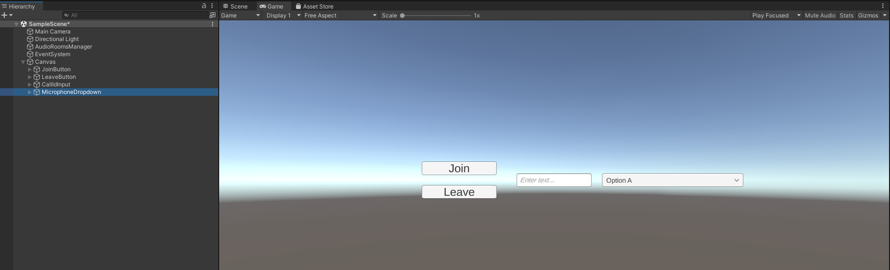
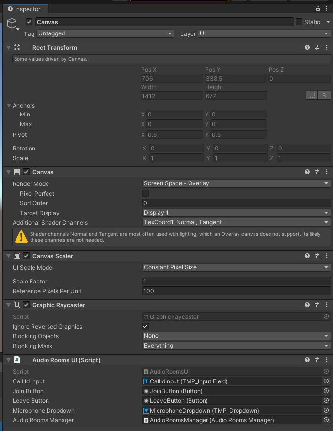

import { TokenSnippet } from '../../../shared/_tokenSnippet.jsx';

# Introduction


Although we called our product "Video SDK" please note that you can use audio only if you wish so.

This is exactly what we'll be doing in this tutorial - we'll setup Audio Rooms to which users can join and talk to each other. This is a very similar use case to when you'd want to implement a Voice Chat for a game session participants.

---

# Project Setup

Create new Unity Project. For this tutorial we'll be using the **2021.3.0f1** LTS version but any supported version should work fine as well.

Please follow the [installation section](../01-basics/02-installation.mdx) to see how to import Stream's Video SDK into a Unity Project.

After completing this step you should now see "Stream Video & Audio Chat SDK" package in Project->Packages


---

# Initialize StreamVideoClient

1. Go to Project window
2. In the **Assets** folder, create a new folder called **Scripts**
3. Inside the **Scripts** folder, create a new script file and call it `AudioRoomsManager.cs`
4. Open `AudioRoomsManager.cs` in your IDE (code editor) and replace it with the following script:
```csharp
using System;
using StreamVideo.Core;
using StreamVideo.Libs.Auth;
using UnityEngine;

public class AudioRoomsManager : MonoBehaviour
{
    async void Start()
    {
        // Create Client instance
        _client = StreamVideoClient.CreateDefaultClient();

        var credentials = new AuthCredentials(_apiKey, _userId, _userToken);

        try
        {
            // Connect user to Stream server
            await _client.ConnectUserAsync(credentials);
            Debug.Log($"User `{_userId}` is connected to Stream server");
        }
        catch (Exception e)
        {
            // Log potential issues that occured during trying to connect
            Debug.LogException(e);
        }
    }

    [SerializeField]
    private string _apiKey;
    
    [SerializeField]
    private string _userId;
    
    [SerializeField]
    private string _userToken;

    private IStreamVideoClient _client;
}
```

Let's go through this script step by step to understand what we're doing.

This part defines variables for the **api key**, **user id** and the **user token** . These 3 variables are essential to establish a connection for a user.
```csharp
    [SerializeField]
    private string _apiKey;
    
    [SerializeField]
    private string _userId;
    
    [SerializeField]
    private string _userToken;
```

Here we instantiate a default client for the Stream's Video SDK:
```csharp
_client = StreamVideoClient.CreateDefaultClient();
```
Next, we wrap the authorization credentials in a convenient structure:
```csharp
var credentials = new AuthCredentials(_apiKey, _userId, _userToken);
```
And finally, we call the ConnectUserAsync that will attempt to establish a connection:
```csharp
await _client.ConnectUserAsync(credentials);
```
Please note that we're using .NET's modern async/await syntax, this makes writing asynchronous code that wait for server response very easy.

After the `await` completes, we should now be connected to the stream server.

Also note, that we've wrapped the asynchronous `ConnectUserAsync` method in a try/catch block. Unless you're proficient with .NET's async/await syntax and understand how to properly handle exceptions for asynchronous methods, we advise you to always wrap awaited methods in a try/catch block in order to catch any thrown exceptions and therefore be notified about any errors that occured during async operation.

Now go to Scene Hierarchy Window and create an empty game object and call it `AudioRoomsManager`:


Next, drag in the newly created `AudioRoomsManager.cs` script onto the AudioRoomsManager game object and save the scene.

You should now have a game object with our `AudioRoomsManager.cs` script attached. Once you select this game object you should see `Api Key`, `User Id`, and the User Token fields exposed in the Inspector Window.


---

# Connect a user to Stream server

To actually run this script we need a valid user token. The user token is typically generated by your server side API. When a user logs in to your app you return the user token that gives them access to the call. To make this tutorial easier to follow we'll generate a user token for you:

<TokenSnippet sampleApp='audio-rooms' />

Copy `api key`, `user id`, and the `user token` from the window above and paste them into `AudioRoomsManager` exposed fields:


After you run the project, you should now see a log confirming that the user is connected to the stream server

---

# Add methods to `Join` and `Leave` a call

In this step we'll add methods to `Join` and `Leave` the call. These will be called from our UI when the user clicks on the `Join` and `Leave` buttons.

First, add this field to the `AudioRoomsManager` class:
```csharp
private IStreamCall _activeCall;
```

So the fields part of the class will look like this:
```csharp
    [SerializeField]
    private string _apiKey;
    
    [SerializeField]
    private string _userId;
    
    [SerializeField]
    private string _userToken;

    private IStreamVideoClient _client;

    // highlight-next-line
    private IStreamCall _activeCall;
```

Next, add the `JoinCallAsync` and the `LeaveCallAsync` methods to the `AudioRoomsManager` class.

```csharp
    public async Task JoinCallAsync(string callId)
    {
        _activeCall = await _client.JoinCallAsync(StreamCallType.Default, callId, create: true, ring: false, notify: false);
    }
    
    public async Task LeaveCallAsync()
    {
        if (_activeCall == null)
        {
            Debug.LogWarning("Leave request ignored. There is no active call to leave.");
            return;
        }

        await _activeCall.LeaveAsync();
    }
```

# Create UI scripts

1. In Scripts folder create new script and call it AudioRoomsUI.cs
2. Open this script in your IDE and paste the following content:
```csharp
using System;
using TMPro;
using UnityEngine;
using UnityEngine.UI;

public class AudioRoomsUI : MonoBehaviour
{
    // Awake is called automatically by Unity Engine
    private void Awake()
    {
        // Add listeners to when user clicks on the buttons
        _joinButton.onClick.AddListener(OnJoinButtonClicked);
        _leaveButton.onClick.AddListener(OnLeaveButtonClicked);
        
        // Remove default option
        _microphoneDropdown.ClearOptions();
        // Populate dropdown with available microphone devices
        _microphoneDropdown.AddOptions(Microphone.devices.ToList());
    }

    private async void OnLeaveButtonClicked()
    {
        try
        {
            await _audioRoomsManager.LeaveCallAsync();
        }
        catch (Exception e)
        {
            Debug.LogException(e);
        }
    }

    private async void OnJoinButtonClicked()
    {
        if (string.IsNullOrEmpty(_callIdInput.text))
        {
            Debug.LogError("Please provide call ID");
            return;
        }

        try
        {
            await _audioRoomsManager.JoinCallAsync(_callIdInput.text);
        }
        catch (Exception e)
        {
            Debug.LogException(e);
        }
    }
    
    [SerializeField]
    private TMP_InputField _callIdInput;

    [SerializeField]
    private Button _joinButton;
    
    [SerializeField]
    private Button _leaveButton;

    [SerializeField]
    private AudioRoomsManager _audioRoomsManager;
    
    // Microphone will use this AudioSource as an audio buffer
    private AudioSource _microphoneAudioSource;

    // Currently active microphone device
    private string _activeMicrophoneDevice;
}
```

Let's break this down.

At the very bottom we've defined fields that will hold references to:
- Join & Leave buttons
- Input that we'll use to provide a call ID to connect
- Dropdown that we'll use to pick the active microphone device
- reference to our AudioRoomsManager
- reference to an `AudioSource` to which active microphone will send audio input
- reference to active microphone device name. In Unity, we use the microphone device name to start & stop streaming audio from the microphone.
```csharp
    [SerializeField]
    private TMP_InputField _callIdInput;

    [SerializeField]
    private Button _joinButton;
    
    [SerializeField]
    private Button _leaveButton;
    
    [SerializeField]
    private TMP_Dropdown _microphoneDropdown;

    [SerializeField]
    private AudioRoomsManager _audioRoomsManager;
    
    // Microphone will use this AudioSource as an audio buffer
    private AudioSource _microphoneAudioSource;

    // Currently active microphone device
    private string _activeMicrophoneDevice;
```

Here, in Unity's Awake special event method, we:
* subscribe `OnJoinButtonClicked` callback method to the join button click event and
* subscribe `OnLeaveButtonClicked` callback to the leave button click event
* Generate dropdown options based on Unity's `Microphone.devices` array
```csharp
    private void Awake()
    {
        // Add listeners to when user clicks on the buttons
        _joinButton.onClick.AddListener(OnJoinButtonClicked);
        _leaveButton.onClick.AddListener(OnLeaveButtonClicked);
        
        // Remove default option
        _microphoneDropdown.ClearOptions();
        // Populate dropdown with available microphone devices
        _microphoneDropdown.AddOptions(Microphone.devices.ToList());
    }
```

The `OnJoinButtonClicked` triggered when user clicks the Join button checks if the call id is set in the input and if it is it then calls the `JoinCallAsync` on our `AudioRoomsManager`:
```csharp
    private async void OnJoinButtonClicked()
    {
        // Validate input
        if (string.IsNullOrEmpty(_callIdInput.text))
        {
            Debug.LogError("Please provide call ID");
            return;
        }

        try
        {
            await _audioRoomsManager.JoinCallAsync(_callIdInput.text);
        }
        catch (Exception e)
        {
            Debug.LogException(e);
        }
    }
```

The `OnLeaveButtonClicked` triggered when user clicks the Leave button calls the `LeaveCallAsync` on our `AudioRoomsManager`:
```csharp
    private async void OnLeaveButtonClicked()
    {
        try
        {
            await _audioRoomsManager.LeaveCallAsync();
        }
        catch (Exception e)
        {
            Debug.LogException(e);
        }
    }
```

# Handle microphone

In order to send audio from our microphone we need to add few more things to our `AudioRoomsUI.cs`.

First, add this method to the `AudioRoomsUI` class:
```csharp
    private void SetActiveMicrophone(int value)
    {
        // Dropdown onValueChanged callback will give us the index of the selected option and we need a device name so we extract it from options
        _activeMicrophoneDevice = _microphoneDropdown.options[value].text;
        
        // If previous microphone device was active -> stop it
        if (_activeMicrophoneDevice != null)
        {
            Microphone.End(_activeMicrophoneDevice);
        }
        
        // Get microphone input 
        _microphoneAudioSource.clip
            = Microphone.Start(_activeMicrophoneDevice, true, 3, AudioSettings.outputSampleRate);
        _microphoneAudioSource.loop = true;
        _microphoneAudioSource.volume = 0; // Set volume to 0 so we don't hear back our microphone
        _microphoneAudioSource.Play();
    }
```
The `SetActiveMicrophone` method will be called whenever a user picks a new microphone device from the dropdown. The `int value` parameter will be populated by the dropdown `onValueChanged` event as we'll soon see.

Let's break down this method:

Because the dropdown `onValueChanged` event will provide us the `index` of the selected option, and we need the actual device name to interact with the microphone, we extract the selected device name with:
```csharp
_activeMicrophoneDevice = _microphoneDropdown.options[value].text;
```

If the microphone device gets changed multiple times we must always stop the previous microphone before activating the new one and we achieve this with the following code:
```csharp
// If previous microphone device was active -> stop it
if (_activeMicrophoneDevice != null)
{
    Microphone.End(_activeMicrophoneDevice);
}
```

Finally, we use Unity's `Microphone.Start` method to start capturing the audio from the microphone device and stream it into `_microphoneAudioSource` AudioSource component that we'll later set as an audio input source for the audio calls.

If your curious about why microphone audio is captured in this way you can refer to [Unity documentation](https://docs.unity3d.com/ScriptReference/Microphone.Start.html) for more information.

Next, add this method to the `AudioRoomsUI` class as well:
```csharp
    private void InitMicrophone()
    {
        // Create AudioSource
        _microphoneAudioSource = gameObject.AddComponent<AudioSource>();

        // Set this AudioSource to be used for Audio Input
        _audioRoomsManager.SetInputAudioSource(_microphoneAudioSource);
        
        // Set first microphone device active. User can change active microphone via dropdown
        SetActiveMicrophone(0);
    }
```

In the `InitMicrophone` method we:
1. Create `AudioSource` component and save its reference in the `_microphoneAudioSource` field.
2. We pass this `AudioSource` to the `_audioRoomsManager.SetInputAudioSource` method so that we can later pass this reference to the Stream's SDK. We'll create this method in the next step.
3. Lastly we call `SetActiveMicrophone(0);` in order to enable first microphone device as an active microphone

As the last step in this section, open the `AudioRoomsManager.cs` class and add the following method:
```csharp
    public void SetInputAudioSource(AudioSource audioSource)
    {
        _inputAudioSource = audioSource;
    }
```
And the following field to the fields section:
```csharp
    private AudioSource _inputAudioSource;
```

# Create UI scene objects

Go to scene hierarchy window and create the `Canvas` game object. One way to do this is by clicking the `GameObject -> UI -> Canvas` from the top menu.


Now, create these UI elements as a children of the `Canvas` game object:
- Button
 - name the Game Object as `JoinButton`
 - on the `RectTransform` component set the `Pos X` to `-200` and the `Pos Y` to `25`
 - click on the inner game object, and on the `TextMeshPro - Text(UI)` component, change the text to `Join`
- Second Button
 - name the Game Object as `LeaveButton`
 - on the `RectTransform` component set the `Pos X` to `-200` and the `Pos Y` to `-25`
 - click on the inner game object, and on the `TextMeshPro - Text(UI)` component, change the text to `Leave`
- Input Field 
 - name the GameObject as `CallIdInput`
- Dropdown
 - name the GameObject as `MicrophoneDropdown`
 - on the `RectTransform` component set the `Pos X` to `250` and the `Width` to `300`

One way to do this is to right-click on the `Canvas` object and select those items from the `UI` submenu.


After completing this step you should see the newly created UI elements when switching over to the `Game` window:



Now attach the `AudioRoomsUI.cs` script to the `Canvas` game object and in the Inspector window drag references to the:
* Join Button
* Leave Button
* Call Id Input
* Microphone Dropdown
* AudioRoomsManager

After completing this step you should now have a `Canvas` object with `AudioRoomsUI` component and all references attached:



**Save the scene.**

Now, open the `AudioRoomsManager.cs` script again, and add the missing `JoinCallAsync` and the `LeaveCallAsync` methods:
```csharp
    public async Task JoinCallAsync(string callId)
    {
        _activeCall = await _client.JoinCallAsync(StreamCallType.AudioRoom, callId, create: true, ring: false, notify: false);
    }

    public async Task LeaveCallAsync()
    {
        if (_activeCall == null)
        {
            Debug.LogWarning("Leave request ignored. There is no active call to leave.");
            return;
        }

        await _activeCall.LeaveAsync();
    }
```

# Handling participants

Last major part to implement is handling participants and their tracks. Call participants are users who joined through one or multiple devices and tracks represent either Audio or Video data stream from a participant. In this tutorial however, we'll be using audio tracks only.

First let's create a new script `AudioCallParticipant.cs`:

```csharp
using StreamVideo.Core.StatefulModels;
using StreamVideo.Core.StatefulModels.Tracks;
using UnityEngine;

public class AudioCallParticipant : MonoBehaviour
{
    public void Init(IStreamVideoCallParticipant participant)
    {
        _participant = participant;
        
        // Process already available tracks
        foreach (var track in _participant.GetTracks())
        {
            OnTrackAdded(_participant, track);
        }
        
        // Subscribe to TrackAdded - this way we'll handle any track added in the future
        _participant.TrackAdded += OnTrackAdded;
    }

    private void OnTrackAdded(IStreamVideoCallParticipant participant, IStreamTrack track)
    {
        Debug.Log($"Track of type `{track.GetType()}` added for {_participant.Name}");
        
        // For this tutorial we only care for audio tracks but video tracks are also possible
        if (track is StreamAudioTrack streamAudioTrack)
        {
            // Create AudioSource
            _audioOutputAudioSource = gameObject.AddComponent<AudioSource>();
            
            // Set this AudioSource to receive participant's audio stream
            streamAudioTrack.SetAudioSourceTarget(_audioOutputAudioSource);
        }
    }

    // Unity's special method called when object is destroyed
    private void OnDestroy()
    {
        // It's a good practice to always unsubscribe from events
        _participant.TrackAdded -= OnTrackAdded;
    }

    // This AudioSource will play the audio received from the participant
    private AudioSource _audioOutputAudioSource;

    // Keep reference so we can unsubscribe from events in OnDestroy
    private IStreamVideoCallParticipant _participant;
}
```

This script will represent a single call participant and handle its track. Let's break this down to fully understand what's going on:

The `Init` method:
```csharp
    public void Init(IStreamVideoCallParticipant participant)
    {
        _participant = participant;
        
        // Process already available tracks
        foreach (var track in _participant.GetTracks())
        {
            OnTrackAdded(_participant, track);
        }
        
        // Subscribe to TrackAdded - this way we'll handle any track added in the future
        _participant.TrackAdded += OnTrackAdded;
    }
```
1. Saves the `IStreamVideoCallParticipant` object in a class field
2. Loops over currently available tracks and calls `OnTrackAdded` for each available track
3. Subscribes to `IStreamVideoCallParticipant.TrackAdded` event in order to also handle any tracks that will appear in the future

The `OnTrackAdded` method:
```csharp
    private void OnTrackAdded(IStreamVideoCallParticipant participant, IStreamTrack track)
    {
        Debug.Log($"Track of type `{track.GetType()}` added for {_participant.Name}");
        
        // For this tutorial we only care for audio tracks but video tracks are also possible
        if (track is StreamAudioTrack streamAudioTrack)
        {
            // Create AudioSource
            _audioOutputAudioSource = gameObject.AddComponent<AudioSource>();
            
            // Set this AudioSource to receive participant's audio stream
            streamAudioTrack.SetAudioSourceTarget(_audioOutputAudioSource);
        }
    }
```

1. Casts the track to `StreamAudioTrack` type and handles the track if cast succeeds. Again, in this tutorial we're only interested in audio tracks but if you'd be implementing video calls also you'd have to handle the `StreamVideoTrack` here as well.
2. Create the `AudioSource` component that will receive participant's audio stream
3. We bind the newly created `AudioSource` to the `StreamAudioTrack` via `streamAudioTrack.SetAudioSourceTarget` method - this is essential so that the `AudioSource` receives audio data from the track

Next, in Unity's `OnDestroy` method that gets automatically called whenever this object is destroyed:
```csharp
    private void OnDestroy()
    {
        // It's a good practice to always unsubscribe from events
        _participant.TrackAdded -= OnTrackAdded;
    }
```
we unsubscribe from the `TrackAdded` event.

And lastly:
```csharp
    // This AudioSource will play the audio received from the participant
    private AudioSource _audioOutputAudioSource;

    // Keep reference so we can unsubscribe from events in OnDestroy
    private IStreamVideoCallParticipant _participant;
```
we've defined two fields to keep the `AudioSource` and the participant references.

Next, in the `AudioRoomsManager.cs`:

Add the following field:
```csharp
private readonly Dictionary<string, AudioCallParticipant> _callParticipantBySessionId
        = new Dictionary<string, AudioCallParticipant>();
```

We'll use this to keep references to `AudioCallParticipant` component that we'll create for every participant. We keep references in the dictionary where a `SessionId` will be the key because this way whenever a participant leaves the call we can easily find the corresponding game object and destroy it.

Next, add this method to the `AudioRoomsManager.cs`:
```csharp
private void OnParticipantJoined(IStreamVideoCallParticipant participant)
{
    var go = new GameObject();
    go.name = $"Participant - {participant.Name} ({participant.SessionId})";
    var callParticipant = go.AddComponent<AudioCallParticipant>();
    callParticipant.Init(participant);
    
    // Save reference by Session ID so we can easily destroy when this participant leaves the call
    _callParticipantBySessionId.Add(participant.SessionId, callParticipant);
}
```
The `OnParticipantJoined` method will be called for each call participant. Let's go through what's going on here:
1. We create a new GameObject to which we'll attach the `AudioCallParticipant` component. We created a new GameObject dynamically but in a real project it's usually better to spawn the game object from a prefab.
2. We name the GameObject to include participant's name and the Session ID. Remember that same user can join multiple times through multiple device so `SessionId` is the unique participant identifier.
3. We then attach the `AudioCallParticipant` and call `callParticipant.Init` method that will handle participant tracks
4. Lastly, we store a reference to the `AudioCallParticipant` in the dictionary, so we can easily destroy once the participant leaves the call.

Next, add the `OnParticipantLeft` method to the `AudioRoomsManager.cs`:
```csharp
private void OnParticipantLeft(string sessionId, string userid)
{
    if (!_callParticipantBySessionId.ContainsKey(sessionId))
    {
        // If participant is not found just ignore
        return;
    }

    var audioCallParticipant = _callParticipantBySessionId[sessionId];
    
    // Remember to destroy the game object and not the component only
    Destroy(audioCallParticipant.gameObject);
}
```
The `OnParticipantLeft` will be called whenever a participant leaves the call. All we're doing here is trying to find a `AudioCallParticipant` component using participant's `sessionId` in the `_callParticipantBySessionId` dictionary and destroy its game object.

Next, replace the `JoinCallAsync` method with the following code:
```csharp
public async Task JoinCallAsync(string callId)
{
    _activeCall = await _client.JoinCallAsync(StreamCallType.Default, callId, create: true, ring: false, notify: false);

    // Handle already present participants
    foreach (var participant in _activeCall.Participants)
    {
        OnParticipantJoined(participant);
    }

    // Subscribe to events in order to react to participant joining or leaving the call
    _activeCall.ParticipantJoined += OnParticipantJoined;
    _activeCall.ParticipantLeft += OnParticipantLeft;
}
```

We've added:
1. Calling `OnParticipantJoined` for each participant that's already present on the call
2. Subscribing to `ParticipantJoined` and `ParticipantLeft` events so we get notified whenever a participant joins or leaves the call

Lastly, replace the `LeaveCallAsync` method with:
```csharp
public async Task LeaveCallAsync()
{
    if (_activeCall == null)
    {
        Debug.LogWarning("Leave request ignored. There is no active call to leave.");
        return;
    }
    
    // Unsubscribe from events
    _activeCall.ParticipantJoined -= OnParticipantJoined;
    _activeCall.ParticipantLeft -= OnParticipantLeft;

    await _activeCall.LeaveAsync();
}
```
We've just added unsubscribing from the `ParticipantJoined` and `ParticipantLeft` events.

# Test

We're now ready to test the app! In order to test it we need 2 instances of the app. Because each instance of the app will be using a microphone and a speaker a good way to test it is by using your PC and your smartphone. Depending on what type of device you have you can follow the [Android](./platforms/android/) or [IOS](./platforms/ios/) sections to learn how to deploy the app on those devices.

Once you launch the app in two separate devices provide the same **call Id** on both devices in order to join the same audio call.

### Other built-in features

There are a few more exciting features that you can use to build audio rooms:

- ** Requesting Permissions **: Participants can ask the host for permission to speak, share video etc
- ** Query Calls **: You can query calls to easily show upcoming calls, calls that recently finished etc
- ** Call Previews **: Before you join the call you can observe it and show a preview. IE John, Sarah and 3 others are on this call.
- ** Reactions & Custom events **: Reactions and custom events are supported
- ** Recording & Broadcasting **: You can record your calls, or broadcast them to HLS
- ** Chat **: Stream's chat SDKs are fully featured and you can integrate them in the call
- ** Moderation **: Moderation capabilities are built-in to the product
- ** Transcriptions **: Transcriptions aren't available yet, but are coming soon

### Recap

It was fun to see just how quickly you can build an audio-room for your app.
Please do let us know if you ran into any issues.
Our team is also happy to review your UI designs and offer recommendations on how to achieve it with Stream.

Calls run on Stream's global edge network of video servers.
Being closer to your users improves the latency and reliability of calls.
For audio rooms we use Opus RED and Opus DTX for optimal audio quality.

The SDKs enable you to build audio rooms, video calling and livestreaming app very easily.

We hope you've enjoyed this tutorial, and please do feel free to reach out if you have any suggestions or questions.
