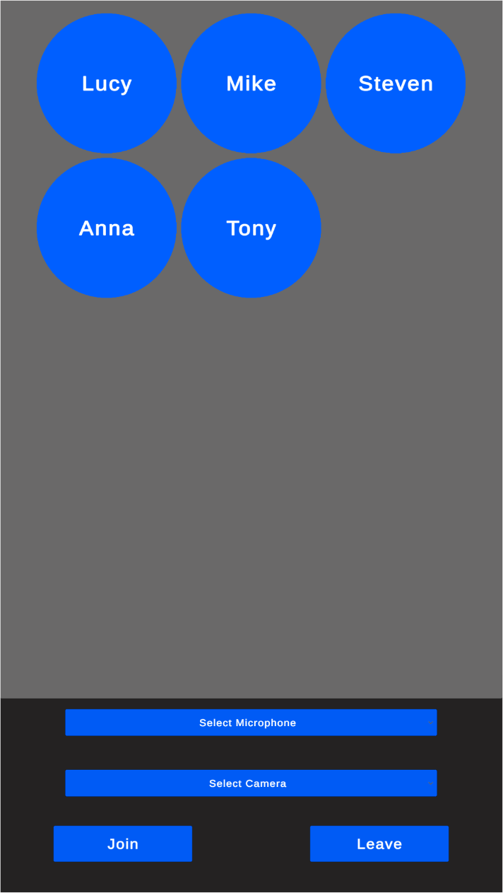

import { TokenSnippet } from '../../../shared/_tokenSnippet.jsx';

### Introduction

Although we called our product "Video SDK" please note that you can use audio only if you wish so.

This is exactly what we'll be doing in this tutorial - we'll setup Audio Rooms to which users can join and talk to each other. This is a very similar use case to when you'd want to implement a Voice Chat for a game session participants.



---

### Prerequisites

To follow this tutorial, you must install a Unity Editor. We'll use the `2021.3.2f1` LTS version, but any supported Unity version will do just fine. You can check the complete list of supported Unity Editor versions [here](https://getstream.io/video/docs/unity/).

### Step 1 - Download Starting Project

To speed you up, we've prepared a starting **Unity Project** that you can download from our [GitHub repository](https://github.com/GetStream/stream-unity-audio-rooms-tutorial). You can download it using **git** or [click here](https://github.com/GetStream/stream-unity-audio-rooms-tutorial/archive/refs/heads/main.zip) to download the project in a zip file.

Download the project and open it in Unity Editor.

The starting project contains the UI that we will use during this tutorial.

### Step 1 - Add Stream's Video SDK for Unity

Follow the [installation section](../01-basics/02-installation.mdx) to see how to import Stream's Video SDK into a Unity Project.

After completing this step, you should see the **Stream Video & Audio Chat SDK** package under **Packages** in the **Project** window.


---

### Step 2 - Create the Audio Client instance

1. Open the `AudioRoomsTutorial` scene in the `Scenes` folder
2. In the the **Project** window, navigate to **Assets -> Scripts** folder
3. Create a new script file and name it `AudioRoomsManager.cs`
4. Open the `AudioRoomsManager.cs` in your code editor and replace it with the following script:
```csharp
using System;
using System.Collections.Generic;
using System.Threading.Tasks;
using StreamVideo.Core;
using StreamVideo.Core.StatefulModels;
using StreamVideo.Libs.Auth;
using UnityEngine;

public class AudioRoomsManager : MonoBehaviour
{
    private async void Start()
    {
        // Create Client instance
        _client = StreamVideoClient.CreateDefaultClient();

        var credentials = new AuthCredentials(_apiKey, _userId, _userToken);

        try
        {
            // Connect user to Stream server
            await _client.ConnectUserAsync(credentials);
            Debug.Log($"User `{_userId}` is connected to Stream server");
        }
        catch (Exception e)
        {
            // Log potential issues that occured during trying to connect
            Debug.LogException(e);
        }
    }

    [SerializeField]
    private string _apiKey;
    
    [SerializeField]
    private string _userId;
    
    [SerializeField]
    private string _userToken;

    private IStreamVideoClient _client;
}
```

Let's go through this script step by step.

These fields allow us to set the authorization variables(**api key**, **user id** and the **user token**). They're essential to establish a connection for a user:
```csharp
[SerializeField]
private string _apiKey;

[SerializeField]
private string _userId;

[SerializeField]
private string _userToken;
```

This line instantiates the client for the **Stream's Video & Audio SDK**:
```csharp
_client = StreamVideoClient.CreateDefaultClient();
```
Next, we wrap the authorization credentials in a convenient structure:
```csharp
var credentials = new AuthCredentials(_apiKey, _userId, _userToken);
```
And finally, we call the **ConnectUserAsync** that will attempt to establish a connection:
```csharp
await _client.ConnectUserAsync(credentials);
```

:::note

We're using .NET's modern async/await syntax, which makes writing asynchronous code that waits for server response very clean & concise.

:::

After the `await` completes, we should be connected to the Stream server.

We've wrapped the asynchronous `ConnectUserAsync` method in a **try/catch** block. If you're not familiar with handling exceptions in asynchronous methods - we advise you to always wrap awaited methods in a try/catch block to catch any thrown exceptions and never miss any errors that can occur during async operations.

Now go to the Scene **Hierarchy** window, and create an empty game object, and call it `AudioRoomsManager`:


Next, drag in the newly created `AudioRoomsManager.cs` script onto the `AudioRoomsManager` game object and save the scene.

Once you select the `AudioRoomsManager` game object, you should see the `Api Key`, `User Id`, and the `User Token` fields visible in the **Inspector** window.


---

### Step 3 - Connect a user to Stream server

To run this script, we need a valid **User Token**. A **User Token** is typically generated by your backend service. When a user logs in to your app, you authorize them and return the **user token** that allows them to join the call. This way, you have complete control over who can access a call. For the sake of this tutorial, we'll generate a **User Token** for you:

<TokenSnippet sampleApp='audio-rooms' />

Copy the `api key`, `user id`, and the `user token` from the window above and paste them into the corresponding fields in the `AudioRoomsManager` game object.

Once you run the project (Press the **Play** button in Unity Editor), you should see a log in Unity Console confirming that the user is connected to the stream server:


---

### Step 4 - Add methods to join and leave the call

In this step, we'll add methods to `Join` and `Leave` the call - these will be called from our UI when the user clicks on the `Join` and `Leave` buttons.

Open the `AudioRoomsManager.cs` script and apply the following changes:

First, add the `_activeCall` field to the class:
```csharp
private IStreamCall _activeCall;
```

The fields part of the class should now look like this:
```csharp
[SerializeField]
private string _apiKey;

[SerializeField]
private string _userId;

[SerializeField]
private string _userToken;

private IStreamVideoClient _client;

// highlight-next-line
private IStreamCall _activeCall;
```

Next, add the following methods to the `AudioRoomsManager` class:

```csharp
public async Task JoinCallAsync(string callId)
{
    _activeCall = await _client.JoinCallAsync(StreamCallType.Default, callId, create: true, ring: false, notify: false);
}

public async Task LeaveCallAsync()
{
    if (_activeCall == null)
    {
        Debug.LogWarning("Leave request ignored. There is no active call to leave.");
        return;
    }

    await _activeCall.LeaveAsync();
}
```

### Step 5 - Create the UI manager

Next, we'll create the **UI Manager** script to reference all UI elements and handle user interactions.

1. In the **Scripts** folder, create a new script and call it `UIManager.cs`
2. Open this script in your code editor and paste the following content:
```csharp
using System;
using System.Collections.Generic;
using System.Linq;
using System.Threading.Tasks;
using StreamVideo.Core;
using StreamVideo.Core.StatefulModels;
using StreamVideo.Libs.Auth;
using TMPro;
using UnityEngine;
using UnityEngine.UI;

public class UIManager : MonoBehaviour
{
    // Awake is called automatically by Unity Engine
    private void Awake()
    {
        // Add listeners to when user clicks on the buttons
        _joinButton.onClick.AddListener(OnJoinButtonClicked);
        _leaveButton.onClick.AddListener(OnLeaveButtonClicked);
        
        // Remove default option
        _microphoneDropdown.ClearOptions();
        // Populate dropdown with available microphone devices
        _microphoneDropdown.AddOptions(Microphone.devices.ToList());
    }

    private async void OnLeaveButtonClicked()
    {
        try
        {
            await _audioRoomsManager.LeaveCallAsync();
        }
        catch (Exception e)
        {
            Debug.LogException(e);
        }
    }

    private async void OnJoinButtonClicked()
    {
        if (string.IsNullOrEmpty(_callIdInput.text))
        {
            Debug.LogError("Please provide call ID");
            return;
        }

        try
        {
            await _audioRoomsManager.JoinCallAsync(_callIdInput.text);
        }
        catch (Exception e)
        {
            Debug.LogException(e);
        }
    }
    
    [SerializeField]
    private ParticipantPanel _participantPanelPrefab;
    
    [SerializeField]
    private Transform _participantsContainer;
    
    [SerializeField]
    private TMP_InputField _callIdInput;

    [SerializeField]
    private Button _joinButton;
    
    [SerializeField]
    private Button _leaveButton;
    
    [SerializeField]
    private TMP_Dropdown _microphoneDropdown;

    [SerializeField]
    private AudioRoomsManager _audioRoomsManager;
    
    // Microphone will use this AudioSource as an audio buffer
    private AudioSource _microphoneAudioSource;

    // Currently active microphone device
    private string _activeMicrophoneDevice;
}
```

Let's break this down.

First, look at the fields section at the very bottom of the class. We've defined fields to hold references to:
- **Input** for the **Call ID** to connect to
- **Join** and **Leave** buttons
- **Dropdown** for picking the active microphone device
- a reference to the **AudioRoomsManager**
- a reference to an `AudioSource` to which an active microphone will send audio input
- reference to active microphone device name - in Unity, we need the microphone device name to start and stop capturing audio from the microphone.
```csharp
[SerializeField]
private TMP_InputField _callIdInput;

[SerializeField]
private Button _joinButton;

[SerializeField]
private Button _leaveButton;

[SerializeField]
private TMP_Dropdown _microphoneDropdown;

[SerializeField]
private AudioRoomsManager _audioRoomsManager;

// Microphone will use this AudioSource as an audio buffer
private AudioSource _microphoneAudioSource;

// Currently active microphone device
private string _activeMicrophoneDevice;
```

In the **Awake** method, called automatically by Unity, we:
* Add the `OnJoinButtonClicked` as a **Join** button click listener
* Add the `OnLeaveButtonClicked` as a **Leave** button click listener
* Add available **microphone** devices list as options to the dropdown
```csharp
private void Awake()
{
    // Add listeners to when user clicks on the buttons
    _joinButton.onClick.AddListener(OnJoinButtonClicked);
    _leaveButton.onClick.AddListener(OnLeaveButtonClicked);
    
    // Remove default option
    _microphoneDropdown.ClearOptions();
    // Populate dropdown with available microphone devices
    _microphoneDropdown.AddOptions(Microphone.devices.ToList());
}
```

The `OnJoinButtonClicked`, triggered when the user clicks the **Join** button, validates that the **Call ID** is set and calls the `JoinCallAsync` on the `AudioRoomsManager`:
```csharp
private async void OnJoinButtonClicked()
{
    // Validate input
    if (string.IsNullOrEmpty(_callIdInput.text))
    {
        Debug.LogError("Please provide call ID");
        return;
    }

    try
    {
        await _audioRoomsManager.JoinCallAsync(_callIdInput.text);
    }
    catch (Exception e)
    {
        Debug.LogException(e);
    }
}
```

The `OnLeaveButtonClicked`, triggered when the user clicks the **Leave** button, calls the `LeaveCallAsync` on the `AudioRoomsManager`:
```csharp
private async void OnLeaveButtonClicked()
{
    try
    {
        await _audioRoomsManager.LeaveCallAsync();
    }
    catch (Exception e)
    {
        Debug.LogException(e);
    }
}
```

---

Next:
1. In Unity Editor, go to the **Hierarchy** window, create a new empty game object, and call it `UIManager`.
2. Select the `UIManager` game object and attach the `UIManager.cs` script to it.
3. Save the scene

You should now have a `UIManager` game object with `UIManager.cs` script attached to it:


### Step 6 - Capture Microphone Input

Now, let's add sending audio input captured from our microphone device.

Open the `UIManager.cs` in the code editor and add the following method to the class:
```csharp
private void SetActiveMicrophone(int optionIndex)
{
    // Dropdown onValueChanged callback will give us the index of the selected option and we need a device name so we extract it from options
    _activeMicrophoneDevice = _microphoneDropdown.options[optionIndex].text;
    
    // If previous microphone device was active -> stop it
    if (_activeMicrophoneDevice != null)
    {
        Microphone.End(_activeMicrophoneDevice);
    }
    
    // Get microphone input 
    _microphoneAudioSource.clip
        = Microphone.Start(_activeMicrophoneDevice, true, 3, AudioSettings.outputSampleRate);
    _microphoneAudioSource.loop = true;
    _microphoneAudioSource.Play();
}
```

The `SetActiveMicrophone` method will be called whenever a user picks a new microphone device from the dropdown. The `optionIndex` argument will be provided by the dropdown `onValueChanged` event as we'll soon see.

Let's go through the content of this method in more detail.

We need the microphone device name to interact with the **Microphone** in Unity. Because the `onValueChanged` event from a dropdown provides an index of the selected option only, we use this index to retrieve the actual device name:
```csharp
_activeMicrophoneDevice = _microphoneDropdown.options[optionIndex].text;
```

Before we start capturing audio from the newly selected microphone, we must stop capturing the audio from a previously selected one:
```csharp
// If previous microphone device was active -> stop it
if (_activeMicrophoneDevice != null)
{
    Microphone.End(_activeMicrophoneDevice);
}
```

We use Unity's `Microphone.Start` method to capture the audio from the microphone device and stream it into the `_microphoneAudioSource` AudioSource component.

:::note

Please refer to [Unity documentation](https://docs.unity3d.com/ScriptReference/Microphone.Start.html) for more information on capturing audio from a microphone.

:::

Next, add this method to the `UIManager` class:
```csharp
private void InitMicrophone()
{
    // Create AudioSource
    _microphoneAudioSource = gameObject.AddComponent<AudioSource>();

    // Set this AudioSource to be used for Audio Input
    _audioRoomsManager.SetInputAudioSource(_microphoneAudioSource);
    
    // Set first microphone device active. User can change active microphone via dropdown
    SetActiveMicrophone(0);
}
```

The code above:
1. Creates the `AudioSource` component and saves its reference in the `_microphoneAudioSource` field.
2. Passes the `AudioSource` to the `_audioRoomsManager.SetInputAudioSource` method. We'll create this method in the next step.
3. Calls the `SetActiveMicrophone(0);` to capture audio from the first microphone in the dropdown.

Next, add these lines to the end of the `Awake` method in the `UIManager` class:
```csharp
// SetActiveMicrophone will be called when a microphone is picked in the dropdown menu
_microphoneDropdown.onValueChanged.AddListener(SetActiveMicrophone);

InitMicrophone();
```

Next, open the `AudioRoomsManager.cs` class in the code editor.

First, add this field anywhere in the class:
```csharp
private AudioSource _inputAudioSource;
```

Next, add this method:
```csharp
public void SetInputAudioSource(AudioSource audioSource)
{
    _inputAudioSource = audioSource;

    // If client is already created, update the audio input source
    if (_client != null)
    {
        _client.SetAudioInputSource(_inputAudioSource);
    }
}
```

And finally, replace the `Start` method with the following code:
```csharp
private async void Start()
{
    // Create Client instance
    _client = StreamVideoClient.CreateDefaultClient();

    var credentials = new AuthCredentials(_apiKey, _userId, _userToken);

    try
    {
        // Connect user to Stream server
        await _client.ConnectUserAsync(credentials);
        Debug.Log($"User `{_userId}` is connected to Stream server");
        
        // highlight-start
        // Set audio input source
        if (_inputAudioSource != null)
        {
            _client.SetAudioInputSource(_inputAudioSource);
        }
        // highlight-end
    }
    catch (Exception e)
    {
        // Log potential issues that occured during trying to connect
        Debug.LogException(e);
    }
}
```

What changed is that we've added the part highlighted above. It will set the **Audio Input Source** if the `SetInputAudioSource` method was called before the client was created.

### Step 7 - Setup `UIManager` references in the inspector

The `UIManager` will interact with UI elements and the prefab asset. Therefore, we must attach all references visible in the inspector window when you select the `UIManager` game object.

In case you're wondering how to do this swiftly, you can follow these steps:
1. Select the `UIManager` game object in the **Hierarchy** window and **lock** the window (Read [Unity Docs](https://docs.unity3d.com/Manual/InspectorOptions.html) on how to lock **Inspector** window)
2. Use the **Hierarchy's** window search input to search for each game object by name and drag it into the corresponding field in the locked **Inspector** window.
3. Unlock the **Inspector** window

Here's a full list of `UIManager` fields and the corresponding game objects that we want to attach:
* `Participant Prefab` - This is the only one that we'll drag in from the **Project** window, drag in the **Prefabs/ParticipantPanel** prefab file
* `Participants Container` - Search for `ParticipantsContainer` in the **Hierarchy** window
* `Call Id Input` - Search for `CallIdInput` in the **Hierarchy** window
* `Join Button` - Search for the `JoinButton` in the **Hierarchy** window
* `Leave Button` - Search for the `LeaveButton` in the **Hierarchy** window
* `Microphone Dropdown` - Search for the `MicrophoneDropdown` in the **Hierarchy** window
* `Audio Rooms Manager` - Search for the `AudioRoomsManager` in the **Hierarchy** window

These are the game objects, from the Scene Hierarchy, that should be attached to the `UIManager` script:


And on to of the hierarchy game objects, we attach the `Prefabs/ParticipantPanel` prefab file from the Project window.

After completing this step, your `UIManager` game object should look as below:


**Save the scene.**

### Step 8 - Handling call participants

The last important feature to implement is handling **participants** and their **tracks**. Call **participants** are users who joined through one or multiple devices. **Tracks** represent either **Audio** or **Video** data received from a **participant**. In this tutorial, we'll be using audio tracks only.

Open the `ParticipantPanel.cs` script, located in the **Scripts** folder, and replace it with the following code:

```csharp
using StreamVideo.Core.StatefulModels;
using StreamVideo.Core.StatefulModels.Tracks;
using UnityEngine;

public class ParticipantPanel : MonoBehaviour
{
    public void Init(IStreamVideoCallParticipant participant)
    {
        _participant = participant;
        
        // Add debug name so we can see in the Unity Editor which participant this game object represents.
        gameObject.name = $"Participant - {participant.Name} ({participant.SessionId})";
        
        // Process already available tracks
        foreach (var track in _participant.GetTracks())
        {
            OnTrackAdded(_participant, track);
        }
        
        // Subscribe to TrackAdded - this way we'll handle any track added in the future
        _participant.TrackAdded += OnTrackAdded;
    }

    private void OnTrackAdded(IStreamVideoCallParticipant participant, IStreamTrack track)
    {
        Debug.Log($"Track of type `{track.GetType()}` added for {_participant.Name}");
        
        // For this tutorial we only care for audio tracks but video tracks are also possible
        if (track is StreamAudioTrack streamAudioTrack)
        {
            // Create AudioSource
            _audioOutputAudioSource = gameObject.AddComponent<AudioSource>();
            
            // Set this AudioSource to receive participant's audio stream
            streamAudioTrack.SetAudioSourceTarget(_audioOutputAudioSource);
        }
    }

    // Unity's special method called when object is destroyed
    private void OnDestroy()
    {
        // It's a good practice to always unsubscribe from events
        _participant.TrackAdded -= OnTrackAdded;
    }

    // This AudioSource will play the audio received from the participant
    private AudioSource _audioOutputAudioSource;

    // Keep reference so we can unsubscribe from events in OnDestroy
    private IStreamVideoCallParticipant _participant;
}
```

This script will be attached to a game object representing a single call participant and handle its track.

Let's break this down to understand what's going on:

The `Init` method:
```csharp
public void Init(IStreamVideoCallParticipant participant)
{
    _participant = participant;
    
    // Process already available tracks
    foreach (var track in _participant.GetTracks())
    {
        OnTrackAdded(_participant, track);
    }
    
    // Subscribe to TrackAdded - this way we'll handle any track added in the future
    _participant.TrackAdded += OnTrackAdded;
}
```
1. Saves the `IStreamVideoCallParticipant` object in a class field
2. Loops over currently available tracks and calls `OnTrackAdded` for each available track
3. Subscribes to the `IStreamVideoCallParticipant.TrackAdded` event to handle any tracks that might be added after we've joined the call.

The `OnTrackAdded` method:
```csharp
private void OnTrackAdded(IStreamVideoCallParticipant participant, IStreamTrack track)
{
    Debug.Log($"Track of type `{track.GetType()}` added for {_participant.Name}");
    
    // For this tutorial we only care for audio tracks but video tracks are also possible
    if (track is StreamAudioTrack streamAudioTrack)
    {
        // Create AudioSource
        _audioOutputAudioSource = gameObject.AddComponent<AudioSource>();
        
        // Set this AudioSource to receive participant's audio stream
        streamAudioTrack.SetAudioSourceTarget(_audioOutputAudioSource);
    }
}
```

1. Uses .NET's pattern matching to check if `track` is of type `StreamAudioTrack`. In this tutorial, we're using audio tracks, but if you'd be implementing video calls, you'd also have to handle the `StreamVideoTrack` case.
2. Create the `AudioSource` component to receive the participant's **audio stream**.
3. We set the newly created `AudioSource` as a target of the received audio track. For this, we use the `streamAudioTrack.SetAudioSourceTarget` method - this is essential for the `AudioSource` to receive audio data from the participant.

Next, in the `OnDestroy` method (automatically called by Unity), we unsubscribe from the `TrackAdded` event:
```csharp
private void OnDestroy()
{
    // It's a good practice to always unsubscribe from events
    _participant.TrackAdded -= OnTrackAdded;
}
```

And lastly, we've defined two fields to keep the `AudioSource` and the participant references:
```csharp
// This AudioSource will play the audio received from the participant
private AudioSource _audioOutputAudioSource;

// Keep reference so we can unsubscribe from events in OnDestroy
private IStreamVideoCallParticipant _participant;
```

---

Next, add the following field to the `AudioRoomsManager` class:
```csharp
private readonly Dictionary<string, ParticipantPanel> _callParticipantBySessionId
        = new Dictionary<string, ParticipantPanel>();
```

We'll use this to reference the `ParticipantPanel` component we'll create for every participant. We keep references in the dictionary where a `SessionId` will be the key. This way, whenever a participant leaves the call, we can easily find and destroy the corresponding game object.

Next, add this method to the `AudioRoomsManager` class:
```csharp
private void OnParticipantJoined(IStreamVideoCallParticipant participant)
{
    var participantPanel = Instantiate(_participantPanelPrefab, _participantsContainer);
    participantPanel.Init(participant);

    // Save reference by Session ID so we can easily destroy when this participant leaves the call
    _callParticipantBySessionId.Add(participant.SessionId, participantPanel);
}
```
The `OnParticipantJoined` method will be executed for each call participant. It does 3 things:
* Spawns a new instance of the `ParticipantPanel` prefab.
* Calls the `ParticipantPanel.Init` method and passes the `IStreamVideoCallParticipant` object.
* Adds the newly spawned panel to the `_participantPanels` dictionary using the participant's **SessionId** as key.

Next, add the `OnParticipantLeft` method to the `AudioRoomsManager` class:
```csharp
private void OnParticipantLeft(string sessionId, string userid)
{
    if (!_callParticipantBySessionId.ContainsKey(sessionId))
    {
        // If participant is not found just ignore
        return;
    }

    var ParticipantPanel = _callParticipantBySessionId[sessionId];
    
    // Destroy the game object represeting a participant
    Destroy(ParticipantPanel.gameObject);
    
    // Remove entry from the dictionary
    _callParticipantBySessionId.Remove(sessionId);
}
```

The `OnParticipantLeft` will be called whenever a participant leaves the call. We're attempting to find the `ParticipantPanel` component using the participant's `sessionId` in the `_callParticipantBySessionId` dictionary and destroy its game object.

Next, replace the `JoinCallAsync` method with the following code:
```csharp
public async Task JoinCallAsync(string callId)
{
    _activeCall = await _client.JoinCallAsync(StreamCallType.Default, callId, create: true, ring: false, notify: false);

    // Handle already present participants
    foreach (var participant in _activeCall.Participants)
    {
        OnParticipantJoined(participant);
    }

    // Subscribe to events in order to react to participant joining or leaving the call
    _activeCall.ParticipantJoined += OnParticipantJoined;
    _activeCall.ParticipantLeft += OnParticipantLeft;
}
```

The above code extends the previous implementation with:
1. Calling `OnParticipantJoined` for each participant that's already present on the call - `_activeCall.Participants`.
2. Subscribing to `ParticipantJoined` and `ParticipantLeft` events so we get notified whenever a participant joins or leaves the call.

Lastly, replace the `LeaveCallAsync` method with:
```csharp
public async Task LeaveCallAsync()
{
    if (_activeCall == null)
    {
        Debug.LogWarning("Leave request ignored. There is no active call to leave.");
        return;
    }
    
    // Unsubscribe from events
    _activeCall.ParticipantJoined -= OnParticipantJoined;
    _activeCall.ParticipantLeft -= OnParticipantLeft;

    await _activeCall.LeaveAsync();
    
    // Destroy all call participants objects
    foreach (var participant in _callParticipantBySessionId.Values)
    {
        Destroy(participant.gameObject);
    }
    
    _callParticipantBySessionId.Clear();
}
```

We've extended the previous implementation with unsubscribing from the `ParticipantJoined` and `ParticipantLeft` events.

### Step 9 - Test

We're now ready to test the app! To test it, we need two instances of the app. Each running instance of the app will use a microphone and a speaker. This may result in a permission conflict if multiple applications attempt to use the microphone and camera simultaneously. Therefore, a good way to test it is by using your PC and a smartphone. Depending on what type of device you have, you can follow the [Android](../04-platforms/02-android.mdx) or [IOS](../04-platforms/03-ios.mdx) sections to learn how to build the app for mobile platforms.

Once you launch the app on two separate devices, provide the same **call Id** on both devices to join the same audio call.

### Other built-in features

There are a few more exciting features that you can use to build audio rooms:

- ** Requesting Permissions **: Participants can ask the host for permission to speak, share video etc
- ** Query Calls **: You can query calls to easily show upcoming calls, calls that recently finished etc
- ** Call Previews **: Before you join the call you can observe it and show a preview. IE John, Sarah and 3 others are on this call.
- ** Reactions & Custom events **: Reactions and custom events are supported
- ** Recording & Broadcasting **: You can record your calls, or broadcast them to HLS
- ** Chat **: Stream's chat SDKs are fully featured and you can integrate them in the call
- ** Moderation **: Moderation capabilities are built-in to the product
- ** Transcriptions **: Transcriptions aren't available yet, but are coming soon

### Recap

It was fun to see just how quickly you can build an audio-room for your app.
Please do let us know if you ran into any issues.
Our team is also happy to review your UI designs and offer recommendations on how to achieve it with Stream.

Calls run on Stream's global edge network of video servers.
Being closer to your users improves the latency and reliability of calls.
For audio rooms we use Opus RED and Opus DTX for optimal audio quality.

The SDKs enable you to build audio rooms, video calling and livestreaming app very easily.

We hope you've enjoyed this tutorial, and please do feel free to reach out if you have any suggestions or questions.
