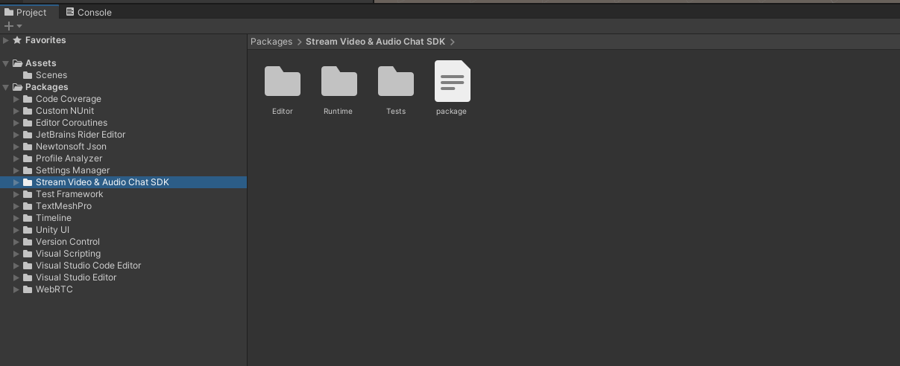
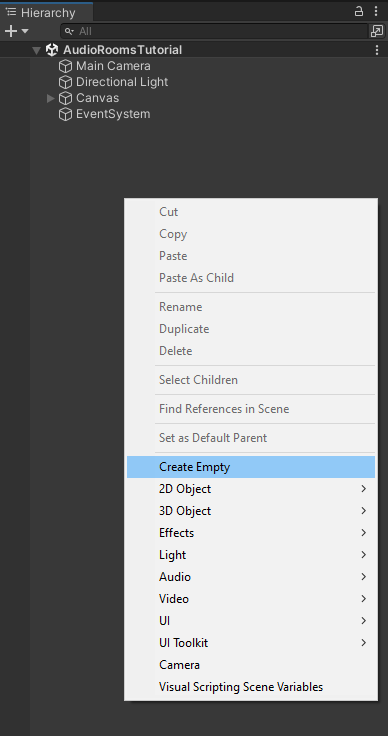
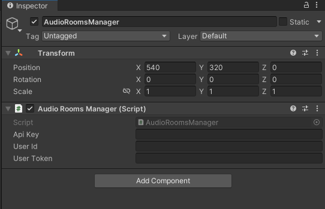
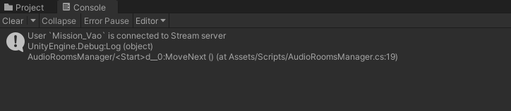
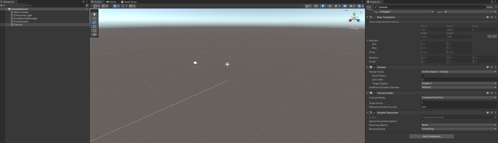
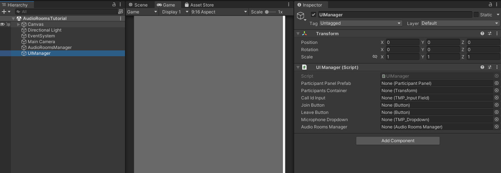
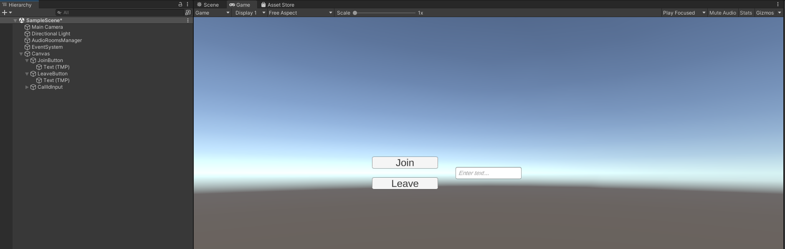
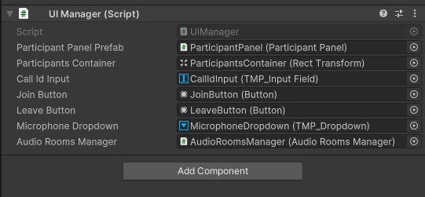

import { TokenSnippet } from '../../../shared/_tokenSnippet.jsx';

# Introduction


Although we called our product "Video SDK" please note that you can use audio only if you wish so.

This is exactly what we'll be doing in this tutorial - we'll setup Audio Rooms to which users can join and talk to each other. This is a very similar use case to when you'd want to implement a Voice Chat for a game session participants.

---

# Project Setup

Create new Unity Project. For this tutorial we'll be using the 2021.3.0f1 LTS version but any newer version should work fine as well.

Install Stream's Video SDK for Unity

TODO: repeat content from install section

After completing this step you should now see "Stream Video & Audio Chat SDK" package in Project->Packages



---

# Initialize StreamVideoClient

1. Go to Project window
2. Create new folder called Scripts in your Assets folder
3. Inside the Scripts folder, create a new script file and call it AudioRoomsManager.cs
4. Open AudioRoomsManager.cs in your IDE and replace it with the following script:
```csharp
using System;
using StreamVideo.Core;
using StreamVideo.Libs.Auth;
using UnityEngine;

public class AudioRoomsManager : MonoBehaviour
{
    async void Start()
    {
        // Create Client instance
        _client = StreamVideoClient.CreateDefaultClient();

        var credentials = new AuthCredentials(_apiKey, _userId, _userToken);

        try
        {
            // Connect user to Stream server
            await _client.ConnectUserAsync(credentials);
            Debug.Log($"User `{_userId}` is connected to Stream server");
        }
        catch (Exception e)
        {
            // Log potential issues that occured during trying to connect
            Debug.LogException(e);
        }
    }

    [SerializeField]
    private string _apiKey;
    
    [SerializeField]
    private string _userId;
    
    [SerializeField]
    private string _userToken;

    private IStreamVideoClient _client;
}
```

Let's go through this script step by step to understand what we're doing.

This part defines variables for the **api key**, **user id** and the **user token** . These 3 variables are essential to establish a connection for a user.
```csharp
    [SerializeField]
    private string _apiKey;
    
    [SerializeField]
    private string _userId;
    
    [SerializeField]
    private string _userToken;
```

Here we instantiate a default client for the Stream's Video SDK:
```csharp
_client = StreamVideoClient.CreateDefaultClient();
```
Next, we wrap the authorization credentials in a convenient structure:
```csharp
var credentials = new AuthCredentials(_apiKey, _userId, _userToken);
```
And finally, we call the ConnectUserAsync that will attempt to establish a connection:
```csharp
await _client.ConnectUserAsync(credentials);
```
Please note that we're using .NET's modern async/await syntax, this makes writing asynchronous code that wait for server response very easy.

After the `await` completes, we should now be connected to the stream server.

Please also note that we've wrapped the asynchronous `ConnectUserAsync` method in a try/catch block. Unless you're proficient with .NET's async/await syntax and understand how to properly handle exceptions for asynchronous methods, we advise you to always wrap awaited methods in a try/catch block in order to catch any thrown exceptions and therefore be notified about any errors that occured during async operation.

Now go to Scene Hierarchy Window and create an empty game object and call it `AudioRoomsManager`:



Next, drag in the newly created `AudioRoomsManager.cs` script onto the AudioRoomsManager game object and save the scene.

You should now have a game object with our `AudioRoomsManager.cs` script attached. Once you select this game object you should see `Api Key`, `User Id`, and the User Token fields exposed in the Inspector Window.



---

# Connect a user to Stream server

To actually run this script we need a valid user token. The user token is typically generated by your server side API. When a user logs in to your app you return the user token that gives them access to the call. To make this tutorial easier to follow we'll generate a user token for you:

<TokenSnippet sampleApp='audio-rooms' />

Copy `api key`, `user id`, and the `user token` from the window above and paste them into `AudioRoomsManager` exposed fields:



After you run the project, you should now see a log confirming that the user is connected to the stream server

---

# Create UI scripts

1. In Scripts folder create new script and call it AudioRoomsUI.cs
2. Open this script in your IDE and paste the following content:
```csharp
using System;
using TMPro;
using UnityEngine;
using UnityEngine.UI;

public class AudioRoomsUI : MonoBehaviour
{
    // Awake is called automatically by Unity Engine
    private void Awake()
    {
        _joinButton.onClick.AddListener(OnJoinButtonClicked);
        _leaveButton.onClick.AddListener(OnLeaveButtonClicked);
    }

    private async void OnLeaveButtonClicked()
    {
        try
        {
            await _audioRoomsManager.LeaveCallAsync();
        }
        catch (Exception e)
        {
            Debug.LogException(e);
        }
    }

    private async void OnJoinButtonClicked()
    {
        if (string.IsNullOrEmpty(_callIdInput.text))
        {
            Debug.LogError("Please provide call ID");
            return;
        }

        try
        {
            await _audioRoomsManager.JoinCallAsync(_callIdInput.text);
        }
        catch (Exception e)
        {
            Debug.LogException(e);
        }
    }
    
    [SerializeField]
    private TMP_InputField _callIdInput;

    [SerializeField]
    private Button _joinButton;
    
    [SerializeField]
    private Button _leaveButton;

    [SerializeField]
    private AudioRoomsManager _audioRoomsManager;
}
```

Let's break this down.

Here we've defined fields that will hold references to:
- Join & Leave buttons
- Input that we'll use to provide a call ID to connect
- reference to our AudioRoomsManager
```csharp
    [SerializeField]
    private TMP_InputField _callIdInput;

    [SerializeField]
    private Button _joinButton;
    
    [SerializeField]
    private Button _leaveButton;

    [SerializeField]
    private AudioRoomsManager _audioRoomsManager;
```

Here, in Unity's Awake special event method, we subscribe OnJoinButtonClicked callback method to the join button click event and the OnLeaveButtonClicked to the leave button click event:
```csharp
    private void Awake()
    {
        _joinButton.onClick.AddListener(OnJoinButtonClicked);
        _leaveButton.onClick.AddListener(OnLeaveButtonClicked);
    }
```

The `OnJoinButtonClicked` triggered when user clicks the Join button checks if the call id is set in the input and if it is it then calls the `JoinCallAsync` on our `AudioRoomsManager`:
```csharp
    private async void OnJoinButtonClicked()
    {
        // Validate input
        if (string.IsNullOrEmpty(_callIdInput.text))
        {
            Debug.LogError("Please provide call ID");
            return;
        }

        try
        {
            await _audioRoomsManager.JoinCallAsync(_callIdInput.text);
        }
        catch (Exception e)
        {
            Debug.LogException(e);
        }
    }
```

The `OnLeaveButtonClicked` triggered when user clicks the Leave button calls the `LeaveCallAsync` on our `AudioRoomsManager`:
```csharp
    private async void OnLeaveButtonClicked()
    {
        try
        {
            await _audioRoomsManager.LeaveCallAsync();
        }
        catch (Exception e)
        {
            Debug.LogException(e);
        }
    }
```

# Create UI scene objects

Go to scene hierarchy window and create the `Canvas` game object. One way to do this is by clicking the `GameObject -> UI -> Canvas` from the top menu.



Now, create these UI elements as a children of the `Canvas` game object:
- Button
 - name the Game Object as `JoinButton`
 - on the `RectTransform` component set the `Pos X` to `-200` and the `Pos Y` to `25`
 - click on the inner game object, and on the `TextMeshPro - Text(UI)` component, change the text to `Join`
- Second Button
 - name the Game Object as `LeaveButton`
 - on the `RectTransform` component set the `Pos X` to `-200` and the `Pos Y` to `-25`
 - click on the inner game object, and on the `TextMeshPro - Text(UI)` component, change the text to `Leave`
- Input Field 
 - name the GameObject as `CallIdInput`

One way to do this is to right-click on the `Canvas` object and select those items from the `UI` submenu.



After completing this step you should see the newly created UI elements when switching over to the `Game` window:



Now attach the `AudioRoomsUI.cs` script to the `Canvas` game object and in the Inspector window drag references to the:
* Join Button
* Leave Button
* Call Id Input
* AudioRoomsManager

After completing this step you should now have a `Canvas` object with `AudioRoomsUI` component and all references attached:



**Save the scene.**

Now, open the `AudioRoomsManager.cs` script again, and add the missing `JoinCallAsync` and the `LeaveCallAsync` methods:
```csharp
    public async Task JoinCallAsync(string callId)
    {
        _activeCall = await _client.JoinCallAsync(StreamCallType.AudioRoom, callId, create: true, ring: false, notify: false);
    }

    public async Task LeaveCallAsync()
    {
        if (_activeCall == null)
        {
            Debug.LogWarning("Leave request ignored. There is no active call to leave.");
            return;
        }

        await _activeCall.LeaveAsync();
    }
```


### Other built-in features

There are a few more exciting features that you can use to build audio rooms:

- ** Requesting Permissions **: Participants can ask the host for permission to speak, share video etc
- ** Query Calls **: You can query calls to easily show upcoming calls, calls that recently finished etc
- ** Call Previews **: Before you join the call you can observe it and show a preview. IE John, Sarah and 3 others are on this call.
- ** Reactions & Custom events **: Reactions and custom events are supported
- ** Recording & Broadcasting **: You can record your calls, or broadcast them to HLS
- ** Chat **: Stream's chat SDKs are fully featured and you can integrate them in the call
- ** Moderation **: Moderation capabilities are built-in to the product
- ** Transcriptions **: Transcriptions aren't available yet, but are coming soon

### Recap

It was fun to see just how quickly you can build an audio-room for your app.
Please do let us know if you ran into any issues.
Our team is also happy to review your UI designs and offer recommendations on how to achieve it with Stream.

Calls run on Stream's global edge network of video servers.
Being closer to your users improves the latency and reliability of calls.
For audio rooms we use Opus RED and Opus DTX for optimal audio quality.

The SDKs enable you to build audio rooms, video calling and livestreaming in days.

We hope you've enjoyed this tutorial, and please do feel free to reach out if you have any suggestions or questions.
