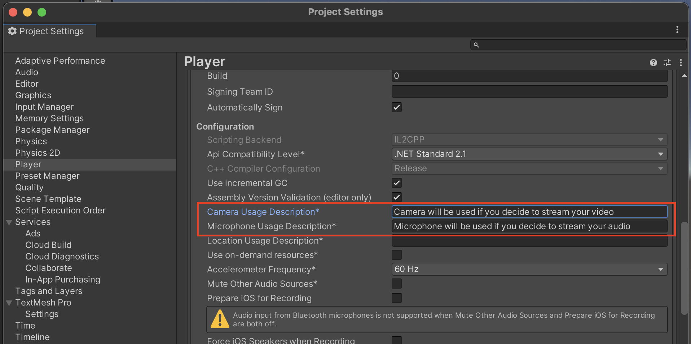

This page describes additional steps required when building for the **iOS** platform.

#### Prerequisites
- Install IOS Module in Unity HUB
- Change the target platform to **iOS** in Unity Editor (File -> Build Settings -> Platform)

#### Requirements for IOS Build
1. Set the descriptions for **Camera** and **Microphone** usage. This setting appears after you change the target platform to **iOS**. (Build Settings -> Player Settings -> Other Settings)
2. Open the **Xcode project** generated by Unity when you build your project for **iOS** platform. In the Xcode Editor, go to **Build Settings** tab, in the **Build Options** group, set **Enable Bitcode** to **No**.

Stream's **Video & Audio SDK** internally uses Unity's webRTC library, following the exact requirements and limitations. For more information, please refer to Unity's [webRTC package documentation](https://docs.unity3d.com/Packages/com.unity.webrtc@3.0/manual/requirements.html).